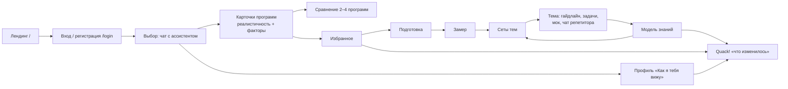
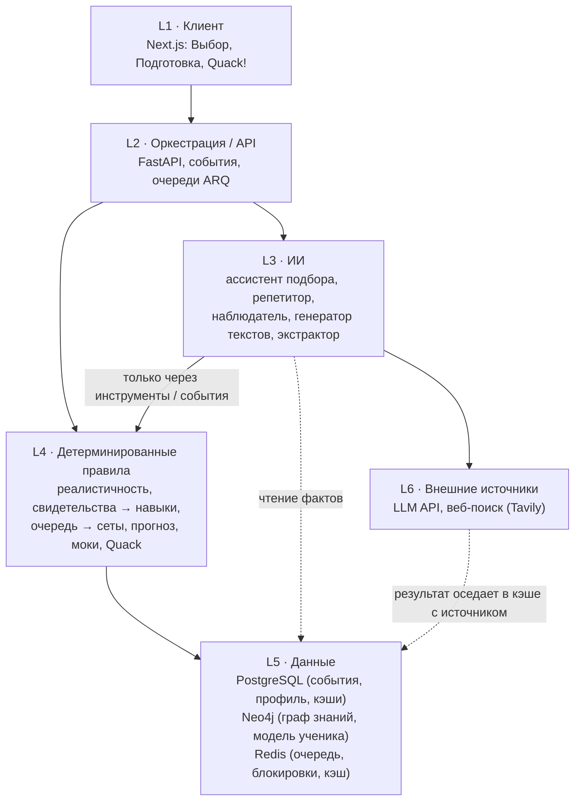
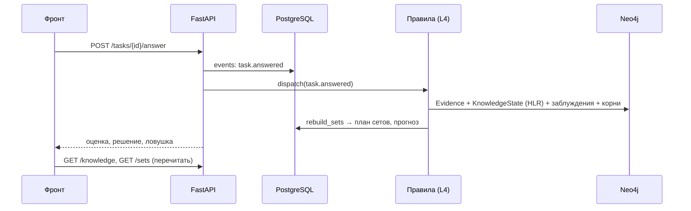
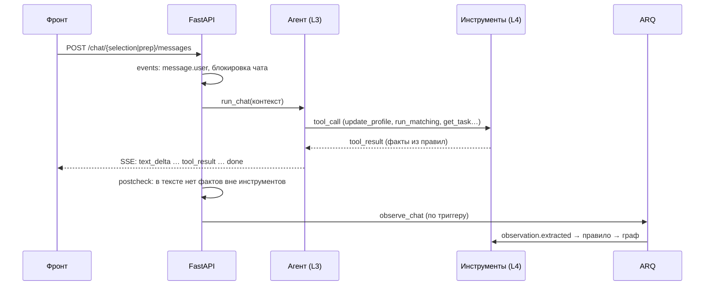
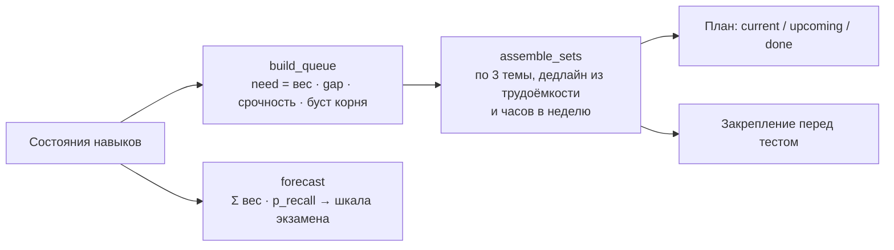
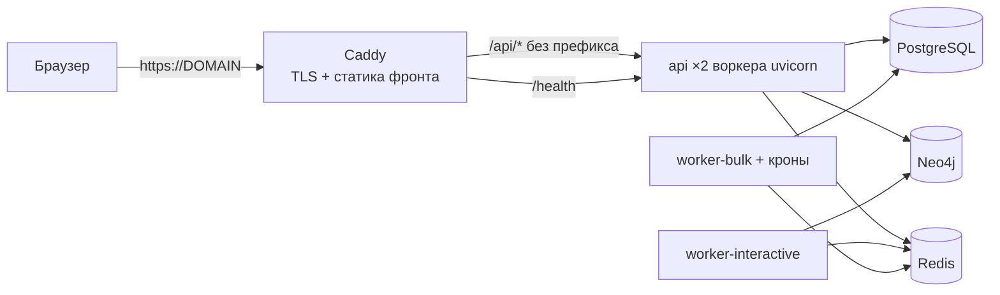

# Quack!

**Quack!** — сервис для школьников 10–11 класса Казахстана, который делает две вещи и связывает их между собой:

1. **Подбор** — ассистент в чате понимает ученика из разговора, собирает профиль и подбирает программы вузов с честной оценкой реалистичности («реалистично / стоит попробовать / маловероятно»).
2. **Подготовка** — строит персональный маршрут к экзаменам, которые требуют сохранённые программы (SAT Math, ЕНТ математика): замер, сеты тем, задачи, моки, репетитор в чате и модель знаний, которая помнит, что ученик умеет и где ошибается.

Между разделами работает **Quack!** — лента «что изменилось и почему»: решил задачи плохо — просела тема и сдвинулся прогноз; поменял бюджет — изменились шансы на программы.

> **Главное правило системы.** Языковая модель *понимает и объясняет*, но не является источником правды. Всё, что считается (реалистичность, состояние навыков, сеты, прогноз, конфликты дедлайнов), считают детерминированные правила. Модель пишет в данные только через инструменты, события и правила — никогда напрямую.

> **Статус:** MVP. Бэкенд — фазы 1–5 (правила, агенты, фон и Quack, отказоустойчивость, демо и деплой). Фронтенд подключён к API; без бэкенда он запускается в демо-режиме на данных в браузере.

---

## Содержание

- [Путь ученика](#путь-ученика)
- [Архитектура](#архитектура)
  - [Шесть слоёв](#шесть-слоёв)
  - [Как проходит запрос](#как-проходит-запрос)
  - [Реактивность: «изменил → изменилось»](#реактивность-изменил--изменилось)
  - [Деградация при отказах](#деградация-при-отказах)
- [Архитектура памяти](#архитектура-памяти)
  - [Четыре слоя памяти](#четыре-слоя-памяти)
  - [События — источник правды](#события--источник-правды)
  - [Граф знаний](#граф-знаний)
  - [Состояние навыка: HLR, уверенность, ярусы доверия](#состояние-навыка-hlr-уверенность-ярусы-доверия)
  - [Заблуждения и корни ошибок](#заблуждения-и-корни-ошибок)
  - [Пути записи](#пути-записи)
  - [От модели знаний к сетам и прогнозу](#от-модели-знаний-к-сетам-и-прогнозу)
- [ИИ-слой: агенты и фоновые задачи](#ии-слой-агенты-и-фоновые-задачи)
- [Технологический стек](#технологический-стек)
- [Структура репозитория](#структура-репозитория)
- [Запуск](#запуск)
- [Связка фронта и бэкенда](#связка-фронта-и-бэкенда)
- [Прод и деплой](#прод-и-деплой)
- [Тесты и CI](#тесты-и-ci)
- [Демо](#демо)
- [Источники, ИИ и ограничения](#источники-ии-и-ограничения)
- [Документы](#документы)
- [Как работаем](#как-работаем)

---

## Путь ученика



1. **Лендинг → вход.** Регистрация по почте и паролю (`/auth/register`), сессия — httpOnly-cookie `quack_token`.
2. **Выбор.** Ученик пишет в чат как есть («хочу IT в Европе, SAT 650, бюджет до 9000»). Ассистент подбора через инструменты записывает поля анкеты (`update_profile`) и запускает подборку (`run_matching`). Каждое поле профиля помечено: *сказал / предположили / по умолчанию*.
3. **Подборка.** Правила считают жёсткие факторы (баллы, бюджет, грант, сроки, страна, язык), выводят уровень реалистичности и ранжируют по приоритетам ученика. Карточка раскрывает, из чего сложилась оценка, с источником и датой проверки.
4. **Избранное.** Сохранённые программы — это то, от чего строится подготовка: их требования сливаются в список экзаменов с целевым баллом (самая высокая планка), вехами и конфликтами дедлайнов.
5. **Подготовка.** Короткий замер задаёт стартовую модель знаний, дальше сеты по 3 темы. В теме — гайдлайн, задачи четырёх типов, мок и чат репетитора. Каждый ответ — свидетельство; модель знаний, очередь сетов и прогноз пересчитываются сразу.
6. **Quack!** Сравнивает текущее положение с тем, что ученик видел в прошлый раз, и показывает только разницу: шансы, темп, темы, дедлайны — с причиной («задачи: Линейные уравнения — не изучено → слабо»).

---

## Архитектура

### Шесть слоёв



| Слой | Что делает | Где в коде |
|---|---|---|
| **L1 Клиент** | Экраны «Выбор», «Подготовка», «Quack!»; пометки происхождения данных («демо», «по твоей оценке», «сохранённая версия») | `frontend/src/components/*` |
| **L2 Оркестрация** | HTTP API, журнал событий, диспетчер правил, outbox и очереди фоновых задач | `backend/app/api`, `app/events`, `app/workers` |
| **L3 ИИ** | Понимает текст и пишет текст: агенты, наблюдатель, генерация гайдлайнов и объяснений, извлечение программ | `backend/app/agents`, `app/llm`, `app/search` |
| **L4 Правила** | Всё, что считается: подбор, модель знаний, сеты, прогноз, моки, вехи, конфликты, планировщик Quack | `app/matching`, `app/knowledge`, `app/sets`, `app/tasks`, `app/roadmap`, `app/quack`, `app/apply` |
| **L5 Данные** | Источники правды и проекции | `app/db`, `app/graph`, `data/` |
| **L6 Внешнее** | LLM-провайдер (OpenAI-совместимый API), веб-поиск программ | `app/llm/client.py`, `app/search` |

### Как проходит запрос

**Ответ на задачу** (синхронный путь, правило):



**Реплика в чате** (стрим + асинхронный наблюдатель):



Стрим — Server-Sent Events поверх `POST` (`text/event-stream`), кадры `text_delta | tool_call | tool_result | done | error`. Постпроверка отзывает ответ, если в нём есть числа или факты, которых нет в результатах инструментов.

### Реактивность: «изменил → изменилось»

Любое изменение источника правды детерминированно пересчитывает производное — без обращения к модели.

| Что изменилось | Что пересчитывается (L4) | Что видит ученик |
|---|---|---|
| Анкета: бюджет, страна, грант, баллы | жёсткие факторы, реалистичность, порядок подборки | новый порядок и статусы; сигнал в Quack! |
| Сохранил / убрал программу | экзамены, целевой балл, вехи, конфликты, сеты | появление экзамена в «Подготовке» |
| Ответ на задачу, мок, замер | свидетельства → состояние навыков, заблуждения, очередь → сеты, прогноз | состояние темы, новый порядок сетов, «тема проседает» в Quack! |
| Реплика в чате подготовки | асинхронно: наблюдатель → событие → правило | «модель обновлена» через несколько секунд |
| Выбор сета, дедлайн | очередь навыков, прогноз | предупреждение, если план стал нереалистичным |
| «Не согласен» с заблуждением | статус заблуждения, сеты, контекст репетитора | заблуждение скрыто до новых свидетельств |

### Деградация при отказах

| Отказал | Что продолжает работать | Что помечено |
|---|---|---|
| LLM | подборка, реалистичность, сеты, задачи, моки, прогноз, свидетельства из задач | чат: `503 llm_unavailable`; тексты — «сохранённая версия» |
| Neo4j | вход, анкета, избранное, вехи, приём ответов (копятся как события) | сеты в статическом порядке карты, прогноз скрыт; после восстановления события доприменяются |
| Redis | API работает, блокировки и очередь — мягко | фоновые задачи ждут в `job_outbox` |
| Веб-поиск | подборка по проверенным программам | «показаны только проверенные программы» |
| PostgreSQL | — | сервис недоступен: это единственный жёсткий источник правды |

Отложенная работа лежит в `job_outbox` и в `events.processed_at IS NULL` и доделывается сама после восстановления (`app/events/recovery.py`, крон `recovery_sweep`). Подробно — [docs/runbook.md](docs/runbook.md).

---

## Архитектура памяти

Полная спецификация — [memory-architecture-quack.md](memory-architecture-quack.md). Ниже — суть.

**Шесть тезисов:**

1. **Хранится модель ученика, а не история.** Ценность — что извлечено из событий: состояние навыков, активные заблуждения, корни ошибок, скорость забывания.
2. **События — источник правды, граф — проекция.** Append-only лог в PostgreSQL; Neo4j можно пересобрать из него (replay), и модель для этого не нужна.
3. **Репетитор учит, наблюдатель запоминает.** Модель, отвечающая ученику, в граф не пишет. Извлечение — отдельный асинхронный процесс со своим промптом и версией.
4. **Чат — самый частый источник, но младший по доверию.** Закрыть навык или подтвердить заблуждение одним чатом нельзя.
5. **Всё, что можно посчитать правилом, считается правилом.**
6. **Ничего без доказательства.** Любое утверждение раскрывается до конкретного сообщения или задачи; ученик может оспорить одним действием.

### Четыре слоя памяти

| Слой | Что | Где | Кто пишет | Кто читает |
|---|---|---|---|---|
| **Episodic** | сырые события | PostgreSQL `events` | API | наблюдатель, replay, активность, провенанс |
| **Semantic** | навыки, состояния, свидетельства, заблуждения, корни | Neo4j | правила | контекст репетитора, сеты, прогноз, выбор задач, отчёты |
| **Procedural** | как ученик учится: часы, темп, классы ошибок | PostgreSQL (агрегаты) + анкета | ежедневная агрегация | контекст, Quack! |
| **Working** | контекст топика + строка сессии | Redis / память | сборщик контекста | репетитор |

### События — источник правды

Таблица `events` (`student_id`, `session_id`, `exam_id`, `set_id`, `topic_skill_id`, `chat_id`, `type`, `payload`, `occurred_at`, `processed_at`, `extractor_version`, `source_event_ids`). Основные типы:

| Событие | Меняет модель знаний |
|---|---|
| `task.answered` | да, синхронно |
| `observation.extracted` | да, правилом (выход наблюдателя) |
| `diagnostic.completed`, `mock.completed` | да, пересборка сетов |
| `profile.updated` | приоры, подборка |
| `program.saved` / `program.removed` | требования, вехи, сеты |
| `set.opened`, `set.switched_by_user`, `set.completed` | сеты, контекст |
| `misconception.disputed` / `.undisputed` | статус заблуждения |
| `message.user` / `message.assistant` | нет — только через наблюдателя |

Инвариант — **идемпотентность по `event_id`**: `MERGE (e:Evidence {event_id, skill_id})`, поэтому повторное применение события не создаёт дублей. На этом стоят replay и восстановление после сбоев.

### Граф знаний

```mermaid
flowchart LR
    subgraph Канонический слой — общий для всех
        Exam -->|HAS_AREA| Area -->|HAS_SKILL w| Skill
        Skill -->|REQUIRES| Skill
        TaskTemplate -->|TESTS| Skill
        TaskTemplate -->|TRAPS| Misconception
        Exam -->|HAS_DATE| TestDate
    end
    subgraph Персональный слой — на ученика
        Student -->|HAS_STATE| KnowledgeState -->|FOR| Skill
        KnowledgeState -->|HAS_EVIDENCE| Evidence
        Evidence -->|SUPPORTS| Skill
        Student -->|HAS_MISC_STATE| MisconceptionState -->|OF| Misconception
        Evidence -->|ROOT_CAUSE| Skill
    end
```

- **Канонический слой** фиксирован и одинаков для всех: экзамены, области, ~30 навыков на экзамен с весами и зависимостями, библиотека заблуждений, шаблоны задач. SAT Math и ЕНТ делят общие навыки `math.*` — у навыка два ребра `HAS_SKILL` со своим весом.
- **Персональный слой** растёт под учеником: состояния навыков по экзаменам, свидетельства со ссылкой на событие, статусы заблуждений, корни ошибок.
- **База знаний о поступлении** — экзамены, форматы и шкалы (`ExamFormat`), маршруты и требования; модель читает её только через инструменты.
- **Векторный индекс** Neo4j — эмбеддинги заблуждений (`multilingual-e5-small`, локально) для канонизации персональных заблуждений.

### Состояние навыка: HLR, уверенность, ярусы доверия

**Забывание — half-life regression.** Для навыка хранятся период полураспада `h` и момент последнего наблюдения; вероятность вспомнить считается при чтении:

```
p_recall(now) = 2 ^ ( −Δt / h )

correct:    h ← h · (1 + α · weight · difficulty_factor)
incorrect:  h ← h · max(0.25, 1 − β · weight)
            h ← clamp(h, h_min, h_max)
```

Никакой фоновой джобы пересчёта: «просядет ли навык к дате теста» — арифметика, а закрытый навык сам возвращается в план, когда `p_recall` опускается ниже цели.

**Уверенность** — по сумме весов свидетельств, а не по их числу:

```
confidence = 1 − exp(−Σweight / k) · g(разброс)
```

**Ярусы доверия:**

| Ярус | Источник | Вес | Может закрыть навык |
|---|---|---|---|
| 1 | замер, мок | 1.0 | да |
| 2 | задача в топике, задача от репетитора | 0.8 | да |
| 2 | решение, присланное в чат | 0.7 | да |
| 3 | реплика в чате: объяснил / «не понимаю» | 0.5 / 0.6 | нет |
| 3 | самооценка в анкете | 0.1 | нет |

**Цель и закрытие.** Целевой балл экзамена — максимум порогов сохранённых программ, из него единый `p_target`. Разрыв `gap = max(0, p_target − p_recall)`. Навык закрыт, когда `p_recall ≥ p_target`, `confidence ≥ c_close` и есть сильное свидетельство. При `confidence < c_vis` навык помечается «мало данных» и в прогноз не входит.

На экране это четыре состояния: **не изучено → слабо → шатко → уверенно**.

### Заблуждения и корни ошибок

- Дистракторы шаблонов размечены заблуждениями (`TRAPS`). Выбор такого варианта — свидетельство о заблуждении.
- Статусы: **подозрение → подтверждено → исправлено (под наблюдением)**. Подтвердить можно только сильным свидетельством; одного чата мало.
- **Триггеры** — при каких условиях заблуждение проявляется (тип задачи, время, после гайдлайна).
- **ROOT_CAUSE** — ошибка в навыке X, вызванная пробелом в навыке Y; корни получают буст в очереди сетов.
- **Персональные заблуждения**, которых нет в библиотеке, предлагает наблюдатель; канонизация по эмбеддингам сводит их к существующим.

### Пути записи

| Тип | Как | Когда |
|---|---|---|
| **R** — правило | синхронно, в транзакции события, миллисекунды | `task.answered`, `profile.updated`, замер, мок |
| **L** — модель | асинхронно в фоне; результат сначала становится событием, потом применяется правилом R | наблюдатель чата, персональные узлы, тексты |
| **O** — загрузка | один раз при сиде | канонический слой, шаблоны, эмбеддинги |

**Наблюдатель** (`observe_chat`) запускается каждые N сообщений, при закрытии топика, сета или по кнопке «обновить модель знаний». Он читает окно чата с разметкой репетитора и возвращает структурированные наблюдения (`ObservationOut`), которые становятся событием `observation.extracted` и применяются правилом.

**Контекст репетитора** собирается из графа на весь топик: состояние навыка, активные заблуждения с триггерами, корни, последние свидетельства, уровень подсказок из профиля. Репетитор только читает (`explain_belief`, `get_task`) и не пишет в граф.

### От модели знаний к сетам и прогнозу



- **Очередь** ранжирует навыки по потребности; навыки без данных тоже идут в сеты — после известных тем, поэтому план есть с первого визита.
- **Сборка** режет очередь на сеты по `set_size` тем, считает дедлайн каждого из трудоёмкости и часов в неделю, не позже `дата теста − consolidation_days`; последний сет — закрепление.
- **Текущий сет не пересобирается**: выбор сета сначала делает его текущим, затем план перестраивается вокруг него.
- **Пересборка** (`rebuild_sets`) срабатывает на каждый ответ, замер, мок, наблюдение, изменение профиля и избранного.
- **Прогноз**: `predicted_raw = Σ weight · p_recall` по навыкам с достаточной уверенностью, через шкалу экзамена; дата готовности — из суммарной трудоёмкости разрывов.

---

## ИИ-слой: агенты и фоновые задачи

| Агент | Промпт | Инструменты | Пишет в данные |
|---|---|---|---|
| **Ассистент подбора** | `selection_v4.md` | `update_profile`, `run_matching`, `compare`, `save_program`, `get_program_facts`, `get_admission_route`, `get_exam_format`, `query_dataset` | только через инструменты → события |
| **Репетитор** | `tutor_v3.md` | `explain_belief`, `get_task` | нет, только читает |
| **Наблюдатель** | `observer_v1.md` | structured output `ObservationOut` | событие `observation.extracted` |

Промпты лежат в `backend/app/agents/prompts/`; загрузчик берёт старшую версию. Политика подбора: не больше двух вопросов за ход. Постпроверка (`app/agents/postcheck.py`) не пускает к ученику текст с фактами вне инструментов.

**Две очереди ARQ** (Redis), чтобы долгие генерации не задерживали то, чего ученик ждёт:

| Очередь | Задачи |
|---|---|
| `interactive` | `observe_chat`, `canonize_misconception`, `set_summary` |
| `bulk` | `pregenerate_set` (гайдлайны и объяснения тем), `soft_match` (мягкое соответствие программ), `extract_program`, `search_programs`, `realism_texts`, `compare_text` |
| кроны (`bulk`) | `daily_aggregates` (03:00 UTC), `recommendations_batch`, `outbox_replay` (каждые 10 мин), `recovery_sweep` |

Задачи ставятся через **outbox** (`job_outbox`) только после коммита транзакции — задача не уйдёт в очередь, если запрос откатился.

**LLM-провайдер** — любой OpenAI-совместимый API; сейчас Together AI (DeepSeek V4 Flash на чат, V4 Pro на фон). Слоты `chat` и `bulk` настраиваются в `.env`, выбор и замеры описаны в [backend/docs/decisions/llm-provider.md](backend/docs/decisions/llm-provider.md).

---

## Технологический стек

| Слой | Выбор |
|---|---|
| Фронтенд | Next.js 16 (App Router, статический экспорт), React 19, TypeScript, CSS Modules, типы API из OpenAPI (`openapi-typescript`) |
| API | Python 3.12, FastAPI, Pydantic v2, SQLAlchemy 2 (async), Alembic, uv |
| Фон | ARQ поверх Redis, две очереди + кроны |
| Реляционная БД | PostgreSQL 16 |
| Граф + вектор | Neo4j 5 Community (vector index встроен) |
| Кэш, очередь, блокировки | Redis 7 |
| Языковая модель | OpenAI-совместимый API (Together AI) |
| Эмбеддинги | локально, `sentence-transformers` `intfloat/multilingual-e5-small` (384) |
| Поиск программ | Tavily, фоллбек без ключа |
| Деплой | Docker Compose, Caddy (TLS, один origin для фронта и API), GitHub Actions |

---

## Структура репозитория

```
.
├── frontend/                   Next.js-приложение
│   └── src/
│       ├── app/                страницы: / (лендинг), /login, /choice (приложение), /pricing
│       ├── api/                client.ts (fetch + ApiError), stream.ts (SSE поверх POST),
│       │                       backend.ts (типизированные вызовы), schema.d.ts (из OpenAPI)
│       └── components/
│           ├── account/        вход, сессия (AuthGate), store.ts — состояние ученика (/state)
│           ├── choice/         «Выбор»: ChoiceApp, чат, профиль, карточки, сравнение;
│           │                   catalog.ts и remoteChat.ts — адаптеры к /matching и чату
│           ├── prep/           «Подготовка»: обзор, сеты, тема, замер, мок, граф навыков;
│           │                   remote*.ts — адаптеры к /sets, /tasks, /knowledge, /diagnostic
│           ├── dashboard/      Quack!: шансы, экзамены, календарь, лента изменений
│           ├── quack/          пересчёт «что изменилось»: standing, planner, source
│           ├── home/           лендинг
│           ├── transition/     переходы между страницами с пиксельной уткой
│           └── duck/           PixelDuck
├── backend/
│   ├── app/
│   │   ├── main.py             фабрика FastAPI, lifespan (Postgres, Neo4j, Redis, ARQ, LLM), CORS
│   │   ├── config.py           настройки и все числовые параметры модели знаний (KnowledgeParams)
│   │   ├── api/                HTTP-маршруты (auth, profile, programs, saved, matching, chat, sets,
│   │   │                       tasks, knowledge, diagnostic, mocks, overview, prep, quack, texts, state)
│   │   ├── events/             журнал событий (store), диспетчер (dispatch), обработчики (handlers),
│   │   │                       outbox, восстановление (recovery), версия знаний
│   │   ├── apply/              применение событий: task_answered, observation, sets, matching, quack…
│   │   ├── knowledge/          HLR, уверенность, свидетельства, заблуждения, корни, замер
│   │   ├── sets/               очередь навыков, сборка сетов, прогноз, темп, отчёт по сету
│   │   ├── matching/           жёсткие факторы, реалистичность, ранжирование, сравнение
│   │   ├── roadmap/            требования, вехи, конфликты дедлайнов
│   │   ├── tasks/              генерация задач из шаблонов, проверка ответа, моки
│   │   ├── quack/              планировщик рекомендаций
│   │   ├── agents/             ассистент подбора, репетитор, наблюдатель, постпроверка, промпты
│   │   ├── llm/                клиент LLM, цикл инструментов, structured output, rate limit
│   │   ├── graph/              драйвер Neo4j, схема, запросы (canonical, personal, kb)
│   │   ├── db/                 модели SQLAlchemy и репозитории
│   │   ├── workers/            ARQ: реестр задач, две очереди, кроны
│   │   ├── search/             поиск и извлечение программ
│   │   ├── seed/               загрузчики данных, демо-аккаунты
│   │   └── schemas/            общие Pydantic-контракты (заморожены, меняются через sync-log)
│   ├── alembic/                миграции PostgreSQL
│   ├── tests/                  unit и интеграционные тесты (~1000)
│   └── docs/tz/                ТЗ фаз 1–6 и контракты
├── data/                       сид-данные
│   ├── skills/                 карта навыков SAT Math и ЕНТ
│   ├── templates/              шаблоны задач (JSON с выражениями)
│   ├── misconceptions/         библиотека заблуждений по областям
│   ├── exam_formats/           формат и шкала экзаменов
│   ├── knowledge_base/         экзамены, маршруты поступления, календари
│   ├── programs_floor/         проверенные демо-программы
│   ├── demo/manifest.json      демо-аккаунты
│   └── users.json
├── deploy/
│   ├── docker-compose.yml      локально: Postgres, Neo4j, Redis
│   ├── docker-compose.prod.yml прод: api, два воркера, Caddy
│   ├── Dockerfile              образ API и воркеров
│   ├── Dockerfile.web          статический фронт внутри образа Caddy
│   ├── Caddyfile               /api/* → API, /health → API, остальное — фронт
│   └── .env.example            все переменные окружения
├── scripts/
│   ├── seed.py                 валидация и загрузка данных, демо, покрытие шаблонов
│   ├── gen_types.sh            OpenAPI → frontend/src/api/schema.d.ts
│   └── check_release.py        smoke-проверка релиза
├── docs/                       runbook, план связки фронт↔бэк, sync-log
├── product-logic.md            продуктовая логика
├── arch-logic.md               архитектура по слоям
├── memory-architecture-quack.md архитектура памяти и ИИ
├── tech-stack.md               стек и инфраструктура
├── DESIGN.md                   дизайн-система и ключевые экраны
└── Makefile                    up, down, api, worker-*, seed, test, types, lint
```

**Владение кодом** (параллельная работа трёх бэкенд-разработчиков): B1 — движок и граф (`knowledge`, `sets`, `matching`, `tasks`, `apply`, `graph`), B2 — ИИ (`agents`, `llm`, `roadmap`), B3 — платформа (`api`, `db`, `events`, `workers`, деплой). Контракты в `app/schemas/*`, `events/dispatch.py`, `events/handlers.py`, `keys.py` заморожены: изменение — через [docs/sync-log.md](docs/sync-log.md).

---

## Запуск

### Что нужно

- Docker и Docker Compose
- Python 3.12 и [uv](https://docs.astral.sh/uv/)
- Node.js 20+
- Ключ OpenAI-совместимого LLM-провайдера (без него сервис работает в деградированном режиме)
- Для Neo4j и модели эмбеддингов — около 4 ГБ свободной памяти. На Windows с маленьким файлом подкачки `seed.py` может падать на загрузке модели эмбеддингов (`os error 1455`) — увеличьте файл подкачки.

### С нуля на чистой машине

```bash
git clone <repo> && cd Quack

# 1. Инфраструктура: PostgreSQL 16, Neo4j 5, Redis 7
make up

# 2. Бэкенд
cd backend
uv sync --frozen
cp ../deploy/.env.example .env           # заполнить LLM_BASE_URL, LLM_API_KEY, MODEL_CHAT, MODEL_BULK
uv run --frozen alembic upgrade head
uv run --frozen python ../scripts/seed.py            # граф навыков, шаблоны, заблуждения, программы
uv run --frozen python ../scripts/seed.py --demo     # демо-аккаунты
cd ..

# 3. API и воркеры (каждый в своём терминале)
make api                                 # http://127.0.0.1:8000, документация /docs
make worker-interactive
make worker-bulk

# 4. Фронтенд
cd frontend
npm install
printf 'NEXT_PUBLIC_DATA_SOURCE=remote\nNEXT_PUBLIC_API_URL=http://localhost:8000\n' > .env.local
npm run dev                              # http://localhost:3000
```

Проверка: `curl localhost:8000/health` → `{"status":"ok", ...}`, затем вход на http://localhost:3000/login под `demo@quack.kz` / `quack-demo`.

### Только фронтенд, без бэкенда

```bash
cd frontend && npm install && npm run dev
```

Без `.env.local` (или с `NEXT_PUBLIC_DATA_SOURCE=local`) аккаунты, ассистент, программы и подготовка работают в браузере на демо-данных.

### Команды Makefile

| Команда | Что делает |
|---|---|
| `make up` / `make down` | поднять / остановить Postgres, Neo4j, Redis |
| `make api` | API с hot reload |
| `make worker-interactive` / `make worker-bulk` | воркеры двух очередей |
| `make seed` | загрузить сид-данные |
| `make test` | unit-тесты (`-m "not integration"`) |
| `make test-int` | все тесты, включая интеграционные (нужна поднятая инфраструктура) |
| `make types` | сгенерировать `frontend/src/api/schema.d.ts` из OpenAPI |
| `make lint` | ruff check + format --check |

### `scripts/seed.py`

| Флаг | Что делает |
|---|---|
| без флагов | полный сид в порядке users → skills → exam_formats → misconceptions → templates → knowledge_base → calendars → programs |
| `--only a,b` | только указанные шаги (например `--only users,calendars,programs`) |
| `--validate` | проверить данные без записи в БД |
| `--coverage` | таблица «навык → число шаблонов», помечает навыки с < 2 шаблонами |
| `--demo` / `--demo-check` | создать демо-аккаунты / проверить их готовность (только чтение) |
| `--reset-clean` | сбросить чистый демо-аккаунт |

### Переменные окружения

Полный список — [deploy/.env.example](deploy/.env.example). Основные:

| Переменная | Назначение |
|---|---|
| `DATABASE_URL`, `NEO4J_URI` / `NEO4J_USER` / `NEO4J_PASSWORD`, `REDIS_URL` | хранилища (по умолчанию — локальный compose) |
| `JWT_SECRET`, `JWT_TTL_DAYS` | подпись сессии (в прод — не короче 32 байт) |
| `CORS_ORIGINS` | origin'ы фронта для локальной разработки (по умолчанию `localhost:3000`, `127.0.0.1:3000`, `localhost:3001`) |
| `LLM_BASE_URL`, `LLM_API_KEY`, `MODEL_CHAT`, `MODEL_BULK` | провайдер и модели двух слотов |
| `LLM_RPM_CHAT`, `LLM_RPM_BULK`, `LLM_TIMEOUT_*`, `LLM_FORCE_DOWN` | лимиты, таймауты, принудительный отказ модели для проверки деградации |
| `TAVILY_API_KEY` | веб-поиск программ |
| `EMBEDDING_MODEL`, `EMBEDDING_DIM` | локальная модель эмбеддингов |
| `KNOWLEDGE__*` | любой параметр модели знаний (`KNOWLEDGE__SET_SIZE=4` и т. п.) |

Фронтенд:

| Переменная | Значение |
|---|---|
| `NEXT_PUBLIC_DATA_SOURCE` | `remote` — работать с API; `local` — демо в браузере |
| `NEXT_PUBLIC_API_URL` | `http://localhost:8000` локально, `/api` в проде |
| `NEXT_PUBLIC_QUACK_SOURCE` | `local` (по умолчанию) — Quack! считается в браузере из данных API; `remote` — серверный источник |

---

## Связка фронта и бэкенда

| Экран | Эндпоинты |
|---|---|
| Вход и регистрация | `POST /auth/register`, `POST /auth/login`, `GET /auth/me`, `POST /auth/logout` |
| Состояние интерфейса | `GET / PATCH / DELETE /state` — ширины панелей, вкладки, подсказки |
| Профиль | `GET /profile`, `PATCH /profile {path, value, by}` |
| Подборка и избранное | `GET /matching`, `GET /matching/compare?ids=`, `GET/POST/DELETE /saved` |
| Чат подбора | `POST /chat/selection/messages` (SSE), `GET /chat/selection/messages` |
| Обзор подготовки | `GET /overview`, `POST /overview/milestones/{key}` |
| Сеты | `GET /sets?exam_id=`, `POST /sets/switch`, `GET/PATCH /sets/{id}`, `POST /sets/{id}/topics/{skill}/open|complete` |
| Задачи и моки | `POST /tasks`, `POST /tasks/{id}/answer|skip`, `GET /tasks/{id}/solution`, `/mocks/*` |
| Модель знаний | `GET /knowledge`, `GET /knowledge/explain/{node}`, `POST /knowledge/refresh`, `POST /knowledge/misconceptions/{id}/dispute` |
| Замер | `POST /diagnostic`, `GET /diagnostic/active`, `POST /diagnostic/{id}/answer|finish` |
| Чат репетитора | `POST /chat/prep/messages` (SSE), `POST /chat/prep/observe`, `GET /chat/prep/observations` |
| Инвалидация | `GET /prep/knowledge/version`, заголовок `X-Knowledge-Version` |

Принципы клиента:

- **Типы из OpenAPI.** `make types` → `schema.d.ts`; CI падает, если файл разошёлся с бэкендом.
- **Адаптеры, а не переписанный UI.** Экраны работают с моделью фронта; `choice/catalog.ts`, `choice/remoteChat.ts`, `prep/remote*.ts` переводят ответы API в неё. Локальные правила остаются офлайн-фолбэком.
- **Ошибки** — единый формат `{"error": {"code", "message"}}`; клиент ветвится по `code` (`unauthorized`, `conflict`, `validation_failed`, `llm_unavailable`, `too_many_requests`).
- **Quack!** пересчитывается в браузере из данных API: профиль, избранное и реалистичность — с сервера, состояние тем — из модели знаний; сигналы появляются сразу после ответа, изменения профиля или избранного.

План и статус связки — [docs/frontend-backend-integration.md](docs/frontend-backend-integration.md).

---

## Прод и деплой



- Фронт и API отдаются **с одного домена**: cookie сессии работает без CORS. `deploy/Dockerfile.web` собирает статический экспорт Next.js с `NEXT_PUBLIC_API_URL=/api` прямо в образ Caddy.
- Caddy проксирует `/api/*` на API с `flush_interval -1`, чтобы стрим чата шёл без буферизации.
- API применяет миграции при старте (`alembic upgrade head`); воркеры стартуют после API.

```bash
cp deploy/.env.example deploy/.env    # DOMAIN, JWT_SECRET (≥ 32 байт), LLM_*, пароли баз
docker compose -f deploy/docker-compose.yml -f deploy/docker-compose.prod.yml --profile prod up -d --build
```

Автодеплой: push в `main` → `.github/workflows/deploy.yml` → SSH на VPS → сборка точного коммита → `scripts/check_release.py` проверяет `https://DOMAIN/health` и SHA релиза. Нужны секреты `VPS_HOST`, `VPS_USER`, `VPS_SSH_KEY`, `VPS_KNOWN_HOSTS`, `DOMAIN`.

Ориентир по ресурсам: 4 vCPU / 8 ГБ (Neo4j — 2 ГБ heap, эмбеддинги — ~0.5 ГБ).

Релиз, отказы, восстановление и откат — [docs/runbook.md](docs/runbook.md).

---

## Тесты и CI

```bash
cd backend
uv run --frozen pytest -m "not integration"     # ~1000 unit-тестов, без внешних сервисов
uv run --frozen pytest                          # + интеграционные (нужен make up)
uv run --frozen ruff check . ../scripts/seed.py ../scripts/check_release.py
uv run --frozen ruff format --check . ../scripts/seed.py ../scripts/check_release.py
cd ../frontend && npx tsc --noEmit
```

CI (`.github/workflows/ci.yml`) на каждый PR: ruff (включая форматирование Python-блоков в Markdown), pytest по фазам, `seed.py --validate`, проверка секретов, `tsc` и сверка `schema.d.ts` с OpenAPI бэкенда.

---

## Демо

```bash
cd backend
uv run --frozen python ../scripts/seed.py --demo        # два демо-аккаунта
uv run --frozen python ../scripts/seed.py --demo-check  # готовность, только чтение
```

Учётные данные — в [data/demo/manifest.json](data/demo/manifest.json). Это специально заведённые тестовые аккаунты, не администраторы.

- **Подготовленный** (`demo@quack.kz` / `quack-demo`) — заполненная анкета, три сохранённые программы и настоящий конфликт дедлайнов. Конфликт не записан руками: он выводится из дат в `data/programs_floor/programs.json`, и `seed --validate` падает, если перестал выводиться.
- **Чистый** (`demo-clean@quack.kz`) — для живого пути: регистрация, замер из шести задач, первая тема.

`--demo` идемпотентен; сброс чистого аккаунта — `--reset-clean`.

**Сценарий показа:** войти → написать в чат «хочу IT в Европе, SAT 650, бюджет до 9000» → увидеть, как заполняется профиль и приходят карточки → сохранить программу → «Подготовка»: замер и сеты → решить мок плохо → Quack!: «тема проседает», сдвиг прогноза.

---

## Источники, ИИ и ограничения

- **Данные о программах и календарях — демонстрационные.** Записи в `data/programs_floor/` и `data/knowledge_base/` помечены `is_demo: true`, `source_url` ведёт на `example.invalid`. Стоимости, пороги и дедлайны не пригодны для реальных решений о поступлении.
- **Модель не назначает факты.** Числа, даты и требования берутся из источников с `checked_at`; постпроверка отзывает текст, в котором есть данные вне результатов инструментов.
- **Оценки знаний — правила, а не модель.** HLR, уверенность, реалистичность, подборка и темп считаются детерминированно; модель пишет только через инструмент, событие или правило.
- **Что не обещается:** круглосуточного мониторинга нет; `exactly-once` между PostgreSQL, Neo4j и Redis не гарантируется — гарантия «хотя бы один раз» с идемпотентными эффектами; программы с флагом исключены до ручной перепроверки.
- **Известные ограничения MVP:** если закрыть вкладку во время ответа ассистента, чат занят до `CHAT_LOCK_TTL_S` (2 мин); Google-вход отключён.
- **Что осталось за рамками MVP.** Эти части бэкенд уже отдаёт, но интерфейс до них пока не дотянулся: экраны считают их сами, сценарий показа проходится целиком.
  - **Quack! фазы 4** (`/quack`, `/quack/pace`, `/quack/activity`, `/quack/history`) — лента, темп и активность собираются в браузере из профиля, избранного и модели знаний.
  - **Живой поиск программ** (`/programs/search`) и отметка «неверно» (`/programs/{id}/flag`) — подборка идёт по проверенному полу программ.
  - **Гайдлайны тем** (`/texts/{set}/{skill}`) — в теме показывается подготовленный текст, а не сгенерированный под ученика.
  - **Отчёт по сету** (`/sets/{id}/summary`) — собирается на фронте по локальной модели.
  - **Состояние интерфейса** (`/state`) — ширины панелей, вкладки и подсказки живут в браузере и не переезжают между устройствами.
- **Сознательно сузили скоуп:** чат уровня сета не делали — остался чат темы; контракт `/chat/prep/messages` его поддерживает, так что он добавляется позже без изменений на бэкенде. На графе сета темы показаны без связей между собой: канонической карты предпосылок API пока не отдаёт — есть диагностированные корни ошибок в `/knowledge`.

---

## Документы

| Файл | О чём |
|---|---|
| [product-logic.md](product-logic.md) | Разделы «Подбор» и «Подготовка»: профиль, подборка, сравнение, сеты, данные, поведение при отказах |
| [arch-logic.md](arch-logic.md) | Шесть слоёв системы, реактивность, схема графа, деградация |
| [memory-architecture-quack.md](memory-architecture-quack.md) | Модель знаний: события, граф, HLR, заблуждения, наблюдатель, контекст репетитора |
| [tech-stack.md](tech-stack.md) | Стек, очереди, инфраструктура, CI |
| [DESIGN.md](DESIGN.md) | Цели, дизайн-система, ключевые экраны |
| [docs/runbook.md](docs/runbook.md) | Релиз, отказы, восстановление, откат, демо |
| [docs/frontend-backend-integration.md](docs/frontend-backend-integration.md) | Связка фронта и бэкенда: план, статус, ограничения |
| [docs/sync-log.md](docs/sync-log.md) | Согласованные решения по контрактам между B1/B2/B3 |
| [backend/docs/tz/](backend/docs/tz/) | ТЗ фаз 1–6 и общие контракты |
| [backend/docs/decisions/llm-provider.md](backend/docs/decisions/llm-provider.md) | Выбор LLM-провайдера и замеры |
| [frontend/README.md](frontend/README.md), [backend/README.md](backend/README.md) | Подробности по каждой части |

---

## Как работаем

- Ветка `main` — стабильная, из неё идёт деплой. Работа — в отдельных ветках, вливается через pull request с зелёным CI.
- В названии ветки и PR — область: `frontend/...`, `backend/...`, `docs/...`, `feat/...`.
- Один PR — одна область. Изменение контракта API — сначала договорённость и запись в `docs/sync-log.md`, потом код, потом `make types`.
- Общие документы в корне правятся с согласия обеих сторон.
