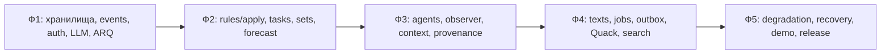

# ТЗ Фазы 5 Quack — отказы, восстановление, предгенерация, демо и деплой

Версия 0.1 · 19.09.2026 · статус: проект ТЗ, с явными решениями для согласования.

Документ подготовлен по пользовательскому промту `phase 3 (1).md`: внутри него запрошена именно **Фаза 5**. Это техническое задание, а не отчёт о выполненной реализации или успешном деплое.

Обозначения источников:

- **BP** — приложенный `backend-phases (1).md`, прежде всего §5 и §7.
- **PL** — `product-logic (2).md`, §6.2–6.5, §9, §10.
- **MA** — `memory-architecture-quack.md`, §1–3, §8, §9, §10, §11.4.
- **TS** — `tech-stack.md`, §2.3–2.5, §3, §4.7, §5.
- **P3** — `phase3-agents.md`, §1.4, §2, §3, §5, §7–9.
- **P4** — `40-phase4-background-quack.md`, §0–2, §3–7, §10–17.
- **C1/C2** — контракты в `backend/docs/tz/00-contracts.md` и `backend/docs/tz/00-contracts-phase2.md`.

Приоритет: продуктовый смысл задают PL/MA/BP; точные действующие интерфейсы — согласованные контракты и дельты P3/P4. При противоречии оно не разрешается молча: см. §24. Ссылки на разделы — трассировка требований, а не утверждение, что все описанные компоненты уже реализованы.

Пути адаптированы к репозиторию: `backend/`, `frontend/`; старые `apps/api`, `apps/web` не создаются повторно. Ни один файл реализации B1/B2 этим документом не изменяется.

## 1. Цель Фазы 5

Сохранить функциональность правил и пользовательские данные при отказах LLM, Neo4j и поиска; после восстановления автоматически завершить отложенную работу без повторного применения знаний. Подготовить два демо-аккаунта и воспроизводимый пяти­минутный сценарий, проверить предгенерацию и обеспечить работающий HTTPS-деплой до окончания защиты. Источник: BP §5, PL §6.3, §9, §10.5.

Фаза не меняет формулы HLR, confidence, реалистичности, подборки и темпа. Она завершает эксплуатационное поведение уже существующих возможностей. Критерий успеха — измеряемые сценарии §21, включая сбой между двумя записями, а не только зелёный `/health`.

## 2. Что уже существует после Фаз 1–4

### 2.1 Целевая входная база по документации

| Слой | Компоненты, которые Ф5 переиспользует |
| --- | --- |
| Foundation Ф1 | FastAPI factory/lifespan, Settings, JWT-cookie, ошибки, request-id, SQLAlchemy async, Alembic, событийный лог, Redis, ARQ, шаблоны задач, Neo4j, LLMClient, search client, seed |
| Business logic Ф2 | `knowledge`, `tasks`, `sets`, `matching`, B1 `apply/*`, B2 `roadmap/*`; диагностические замеры, моки, состояния, пересборка сетов, прогноз, ручные изменения |
| Агенты Ф3 | selection/tutor, инструменты, postcheck, observer, canonization, контекст и история; модель пишет только через инструмент/событие/правило |
| Фон Ф4 | pregeneration, summary, soft match, search/extract, тексты сравнения и реалистичности, Quack, дневные агрегаты, outbox, cron, версии кэшей |
| Infrastructure | Один compose на VPS: API, два ARQ worker, PostgreSQL 16, Neo4j 5 Community, Redis 7, Caddy; фронт отдельно через same-origin rewrite |

PostgreSQL: `users`, `profiles`, `saved_programs`, `programs_cache`, `events`, `messages`, `task_templates`, `task_instances`, `seen_templates`, `generated_texts`, `set_summaries`, `recommendations`, `daily_aggregates`, `sets`, `set_topics`, `diagnostic_runs`, `mock_runs`, `milestone_marks`, `forecast_cache`; после P4 — также `student_aggregates`, `soft_matches`, `job_outbox`. Ф5 не создаёт вторые версии этих таблиц.

Neo4j: канонические навыки, области, зависимости `REQUIRES`, форматы/шкалы экзаменов, шаблоны, библиотека заблуждений и KB; персональные Student, Evidence, KnowledgeState с PREVIOUS, MisconceptionState, ROOT_CAUSE. Точные labels и связи берутся из B1 queries/MA, а не переименовываются по этому описанию.

События: сообщения; `task.issued/answered/skipped/timed_out`; профиль и сохранённые; `set.*`, `topic.*`; `diagnostic.*`, `mock.*`; вехи; disputes; `observer.requested`, `observation.extracted`, результаты канонизации; события решений по рекомендациям; `job.failed`. Используется существующий EventType, без создания дублирующих «phase5.*» событий.

Очереди по P4: interactive — observer, canonization, set_summary; bulk — pregenerate_set, soft_match, search_programs, extract_program, realism_texts, compare_text, daily_aggregates, recommendations_batch, outbox_replay. `ping` сохраняется. `propose_personal_nodes` остаётся вне MVP.

API: auth/profile/saved/programs/chat/health, tasks/sets/diagnostic/mocks/knowledge/matching/overview, версии знаний; после Ф4 — texts, summary, program search/flag, Quack. Ф5 использует их, а не строит новый service API поверх них.

### 2.2 Что подтверждено в предоставленном checkout

Проверен локальный HEAD `cbe91a6`, ветка `codex/phase2-b3-prompt17`; рабочее дерево было чистым на момент начала подготовки ТЗ. Это не подтверждение актуального remote/main и не аудит продакшена.

- Есть API `/health`, production compose и `.github/workflows/deploy.yml`, SQL- и событийная база Ф1/Ф2.
- `workers/registry.py` содержит только `ping` в обеих очередях.
- `RuleDeps` в checkout ещё не содержит `jobs` из P4.
- `events.store.list_unprocessed` выбирает по chat_id: это не готовая очередь восстановления графа всех учеников.
- `/health.checks.search` сейчас константно `skipped`; `graph_pending` считает все необработанные события только за последний час, что непригодно как полный backlog графа.
- Production compose ожидает healthy Neo4j при старте API/worker; это нужно проверить против требования запуска в деградированном режиме.

Следовательно, реализация и приёмка Ф3/Ф4 являются входным gate Ф5. Их отсутствие в этой версии нельзя выдавать за «технический долг Ф5» и реализовывать заново в обход владельцев.

## 3. Scope

| ID | Требование | Источник |
| --- | --- | --- |
| F5-01 | Единая политика деградации LLM и выдачи сохранённых текстов | BP §5.2–5.3; PL §6.3 |
| F5-02 | Долговечная отложенная работа и автоматический recovery после восстановления | BP §5.2–5.3; P4 §17.3 |
| F5-03 | При отказе Neo4j — сохранение ответов, статические сеты, недоступный прогноз, безопасное последующее применение | MA §11.4; BP §5.2 |
| F5-04 | Поиск через кэш/пол и честная маркировка; authoritative факты только из источников | PL §6.2–6.3 |
| F5-05 | Проверенный прогрев существующих генераторов перед демо | PL §6.3; BP §5 |
| F5-06 | Подготовленный и чистый аккаунты, замер из 6 задач параметром | BP §5.2; PL §9 |
| F5-07 | Конфигурация, CI, HTTPS-деплой, сохранность данных, README/техсправка | TS §5; BP §5.3 |
| F5-08 | Live-provider checklist и ручной eval наблюдателя на ≥10 фрагментах | BP §5.3 |

## 4. Out of scope

Новые продуктовые функции; второй движок рекомендаций/поиска/LLM; новые scoring rules; персональные узлы навыков; полный SAT-мок; смена extractor с полным пересчётом модели; replay всей истории и удаление проекций; Kafka/Celery/Kubernetes; Sentry; внешние напоминания; настройка пользовательских timezone; очистка старых текстов «заодно»; автоматическое исправление непроверенных фактов моделью.

Ф5 восстанавливает **неприменённые события**. Полная реконструкция графа с новой версией экстрактора из MA §8.8 остаётся Ф6/вне MVP (BP §5.4, P4 §17.3). Скриншоты, видео и презентация — поставки F1/F2; B3 предоставляет работающее API и технический сценарий.

## 5. Dependencies

| Вход | Gate перед кодом Ф5 | Владелец |
| --- | --- | --- |
| Ф1 | Работают миграции, cookie и изоляция; `LLMLike`, `AppError`, `StreamEvent`, два worker не заменены | B3/B2 |
| Ф2 | Все используемые B1 apply и B2 roadmap реализованы; работают реальные интеграционные сценарии | B1/B2/B3 |
| Ф3 | Применение наблюдений идемпотентно; Evidence имеет `(event_id, skill_id, ordinal)`; определено использование processed_at | B1/B2 |
| Ф4 | Jobs, hash/cache DTO, outbox, Quack и cron смержены; приняты конфликты §24 | B1/B2/B3 |
| Deployment | Известны домен, VPS, способ secrets, разрешённый провайдер/лимит | B3/B2 |

Входные frozen contracts: `EventIn/Event`, `dispatch`, `RuleDeps`, `GraphUnavailable`, `keys.*`, schemas/DTO, SSE, `LLMLike`, `apply.*`, `repo.*`. Любая дельта перечислена в §23 и до реализации согласуется владельцами в sync-log.

## 6. Requirements

| ID | Входы → выходы | Правила / участники / flow | Persist / events / интерфейсы |
| --- | --- | --- | --- |
| F5-01 | Статус LLM + текущий hash + доступный текст → актуальный/сохранённый текст или явное отсутствие | Синхронное чтение policy; генерация только существующей job; chat — единственное интерактивное LLM-исключение | `generated_texts`, `set_summaries`; нет нового доменного события; health/texts/chat |
| F5-02 | Durable job intent + состояние зависимости → запуск той же job | Recovery асинхронный; не требуется новый пользовательский запрос; invalid output не считается outage | Расширение `job_outbox`; существующий `job.failed`; workers/outbox |
| F5-03 | AnswerIn + экземпляр + event → Grade сейчас, projection позже | B1 grade детерминирован; PG хранит факт; recovery не создаёт новый ответ и не меняет occurred_at | `events`, `task_instances`, затем graph/read-model; task API, dispatch |
| F5-04 | Запрос поиска + кэш + состояние провайдеров → имеющиеся программы/статус | Tavily → ddgs по существующему клиенту; flagged не возвращается; никаких придуманных данных | `programs_cache`, search status; существующие endpoints P4 |
| F5-05 | Аккаунт, сет, кандидаты и хэши → готовность кэшей | Существующие jobs P4; не ждать генерации в read API | Те же кэши/outbox; CLI seed/demo manifest |
| F5-06 | `data/users.json`, проверенные программы/календари, события сценария → 2 аккаунта | Только подготовительный сценарий, никаких поддельных результатов знаний | Users через seed; доменные изменения через events/apply; manifest выполнения |
| F5-07 | Release SHA + env → проверенный release | Деплой только одобренного main, CI блокирует ошибки, health проверяет версию и фактические зависимости | Persist volumes; release/runbook; не новый API |
| F5-08 | Версия промпта/модели + размеченные фрагменты → отчёт eval | Precision/recall по (kind, skill); нет выдуманного проходного порога | Отчёт в docs; секреты/сырые персональные диалоги не публикуются |

## 7. Architecture

Сохраняется цепочка `api → agents/apply → domain → graph/db`, при этом `knowledge/tasks/sets/matching/quack` остаются чистыми. Recovery — infrastructure orchestration, не новая бизнес-логика.

- API проверяет права, валидирует вход, фиксирует действия и читает read-модели. Вызов модели/поиска в read API запрещён.
- B3 policy выбирает режим обслуживания по статусам зависимостей; B2 LLMClient остаётся единственным владельцем provider transport, breaker, structured retry и RPM.
- B1 apply — единственный писатель персонального графа. Infrastructure job может вызвать apply/dispatch для накопленных событий; запрет P4 «текстовые jobs не пишут граф» сохраняется для генераторов.
- PostgreSQL хранит authoritative события и durable job intents; Neo4j — проекция; Redis — доставка, ускорение, status/locks. Нельзя считать три хранилища одной атомарной транзакцией.
- ARQ interactive/bulk сохраняются. Outage ожидание не должно исчерпывать число попыток самой генерации.

Проблема исходного P4 outbox: запись только при ошибке enqueue не покрывает crash между DB commit и enqueue. **Предложение D01**: intent записывается в PG в той же транзакции, что событие/read-model; после commit он доставляется в ARQ. Это усиление существующего outbox, не второй брокер.

Проблема PG→Neo4j: граф может закоммититься, а PG — откатиться. **D02** требует согласовать durable ingestion перед projection и B1 marker применения в транзакции Neo4j (§9, §11). До согласования нельзя обещать exactly-once или закрывать recovery acceptance.

## 8. Components

Ниже новые пути — предлагаемые места реализации, а не существующие модули.

| Компонент / owner | Интерфейс и ответственность | Reads / writes / callers |
| --- | --- | --- |
| `app/fallbacks.py`, B3, новый | `select_text(current, last_ready, current_hash, llm_status) -> GeneratedTextOut`; чистая политика без LLM-вызовов | Читает переданные DTO; ничего не пишет; вызывают api/texts и адаптеры matching/summary |
| `events/outbox.py`, B3, расширение P4 | Существующий `JobOutbox.enqueue`; durable запись и commit-before-delivery; wrapper не допускает произвольный fn_name | `job_outbox`; API, tools, handlers и worker завершение |
| `db/repo/outbox.py`, B3 | `claim_due(session, now, limit)`, `mark_started`, `mark_waiting`, `mark_done`, `mark_failed`; точные подписи заморозить в skeleton | Строки intents с lease/attempts; только workers/outbox |
| `workers/jobs_infra.py`, B3 | Расширить `outbox_replay`; добавить `recover_graph_events(ctx, request_id, student_id, through_event_id)` | Читает backlog, вызывает B1 apply, пишет delivery status; только registry/операторский CLI |
| `events/recovery.py`, B3, новый | Выбрать recoverable события по student и id; соблюдать границу snapshot; не запускать observer по сырым сообщениям | Events/read-model; работает в job, не в API |
| `apply/*`, `graph/queries/*`, B1 | Идемпотентное применение конкретного event; атомарный graph marker; статический fallback наборов | Персональный граф, read-модели; вызывается обычным dispatch и recovery |
| `sets/*`, B1 | Статический порядок канонических навыков при недоступном графе — поверх существующих схем | Канонический snapshot из versioned данных; никаких фиктивных KnowledgeState |
| `agents/jobs.py`, B2 | Добавить общий recovery wrapper, сохранить генераторы, prompts, JSON schemas | Кэши P4/observer P3; только разрешённые очереди |
| `scripts/seed.py`, B3 | Предлагаемые флаги `--demo`, `--demo-check`, без изменения обычного seed | Users, доменные события, outbox; только оператор/CI в test env |
| deploy/CI/docs, B3 | Проверка конфигурации, smoke, runbook, техническая справка | Не имеют публичного endpoint управления отказами |

Новые use-case wrappers не импортируют `app.api`. B1 не импортирует LLM/ARQ. Изменения чужих файлов выполняет их owner.

## 9. Data model

### 9.1 Что не меняется

Нет новых доменных сущностей для пользователя. Не изменяются значения оценок и профильные поля. Event payload сохраняется, `occurred_at`, `ingested_at`, extractor_version и source_event_ids не переписываются recovery. Нет soft delete.

`generated_texts`: lifecycle `generating → ready | failed`; `stale` вычисляется при чтении, не новый сохранённый статус. `set_summaries`: те же состояния, статистика доступна без текста. `events.processed_at`: NULL до полного завершения назначенной обработки; не используется как универсальный флаг для любых произвольных consumers.

### 9.2 D01 — расширение существующего job_outbox

Предлагаемая дельта после миграций Ф3/Ф4; имя/номер новой Alembic revision выбрать по реальному head. Не редактировать `0001/0002/0003` задним числом.

Сохранить `id BIGSERIAL PK`, `queue`, `fn_name`, `job_id`, `kwargs JSONB`, `defer_by`, `created_at`, `enqueued_at`. Добавить:

| Поле | Тип / ограничение | Назначение |
| --- | --- | --- |
| status | TEXT NOT NULL, CHECK pending/enqueued/running/waiting_dependency/succeeded/failed/cancelled | Durable lifecycle, не пользовательский статус текста |
| dependency | TEXT NULL, CHECK llm/graph/search/redis | Только для ожидания; иначе NULL |
| attempts | INT NOT NULL DEFAULT 0 CHECK ≥0 | Число фактических неуспешных выполнений; отсутствие зависимости не увеличивает |
| not_before | TIMESTAMPTZ NOT NULL | Backoff/defer, из текущей политики job |
| lease_until | TIMESTAMPTZ NULL | Обнаружить зависший dispatcher/worker |
| lease_token | UUID NULL | Оградить поздний ответ прежнего владельца строки |
| updated_at | TIMESTAMPTZ NOT NULL | Диагностика возрастов и изменений |
| last_error_code | TEXT NULL | Нормализованный код; без промптов/секретов/provider body |

Индексы: `(status, not_before, id)` для pending/waiting; `(lease_until, id)` для enqueued/running; частичный UNIQUE `(queue, job_id)` для активных состояний pending/enqueued/running/waiting_dependency. Завершённая строка не запрещает новый batch той же рекомендации через сутки. Поля queue и fn_name валидируются allowlist registry до записи; kwargs — существующим payload validator.

Lifecycle: `pending → enqueued → running → succeeded`; outage → `waiting_dependency → pending`; transient failure → pending с backoff; исчерпание attempts → failed; удалённая цель/устаревший ненужный intent → cancelled. Истёкший lease возвращает к проверке результата, затем к pending, а не сразу повторяет side effect.

Wrapper получает внутренний `outbox_id` и lease token через transport metadata; сам генератор получает прежние domain kwargs. Это явная дельта job transport (§23). Logical job_id P4 сохраняется; `enqueue_job` вернул None — проверить существующий ARQ job, не считать задачу завершённой. Retention ARQ `keep_result=60` не заменяет PG lifecycle.

Для recovery добавляется partial index events `(student_id, id) WHERE processed_at IS NULL`; запрос всегда ограничивает допустимые EventType. FK новых доменных таблиц не нужны. У job_outbox нет FK на одну сущность: задачи адресуют разные существующие сущности, валидируемые при исполнении.

### 9.3 D02 — marker графового применения (предложение B1)

Для graph-mutating обработчиков нужен атомарный признак успешного применения `(student_id, event_id, handler)` в **той же Neo4j transaction**, что Evidence/state/misconception/root. Только MERGE Evidence недостаточно: процесс может упасть после Evidence, но до KnowledgeState.

Предлагается технический label `AppliedEvent` с полями `student_id`, `event_id`, `handler`, `applied_at`; composite UNIQUE по первым трём. Не новая бизнес-сущность, не пользовательские данные знаний. Если после Ф3 у B1 уже есть эквивалентный marker — переиспользовать, второй не добавлять.

Queries B1: параметризованный `MATCH (st:Student {id:$student_id})`; проверка/создание marker и все записи в одной write transaction. Условный пример ключа: `MERGE (a:AppliedEvent {student_id:$student_id,event_id:$event_id,handler:$handler})`. Проверка повторного применения должна быть защищена transactional locking, а не отдельным read до write. Транзакция при ошибке откатывает и marker. Marker связан с конкретным обработчиком; domain ordinal внутри события сохраняется.

Не создаются новые Skill/REQUIRES или персональные узлы. PREVIOUS не удваивается при повторе. Изменение constraints/queries делает B1, синхронизируя пакет контрактов.

### 9.4 Migration strategy

Expand-only сначала: новые nullable/заполненные default поля, индексы, backfill status для старого outbox после сверки ARQ и целевых кэшей. Старое `enqueued_at` не доказывает успех. Не назначать всем старым строкам succeeded без проверки. Запуск новых worker только после migration gate; старые worker не должны одновременно писать по старому протоколу.

Backup перед обновлением; тест upgrade на копии данных. Downgrade недопустим при активных новых intents без экспорта/завершения очереди. Откат приложения — только на совместимую со схемой версию. Массовое удаление событий/графа/volumes не является rollback.

## 10. API contracts

Новых продуктовых endpoints не требуется. Административное выключение LLM/графа не публикуется в HTTP.

| Endpoint | Auth / input | Поведение Ф5 / errors / cache |
| --- | --- | --- |
| `GET /health` | Public; без пользовательских данных | Сохранить status/checks/llm_status/version. Реальный search status из последнего bounded результата, без внешнего поиска на каждый poll; graph_pending — полный recoverable backlog. Ответ не кэшируется публичным proxy |
| `POST /chat/{kind}/messages` | Cookie; существующий ChatMessageIn, текст ≤4000 | До SSE при LLM down — 503 llm_unavailable; после начала — существующий StreamError, затем закрытие. Не выдавать частичный ответ как Done. Повтор текста — новый ход по P3, не «авто-retry чата» |
| `GET /texts/{set_id}/{skill_id}?kind=` | Cookie; UUID set_id, skill_id и kind=guideline/explanation; ownership сета | Current ready либо marked saved_version, либо text=None+reason. Это маршрут P4 §3.5; нового text endpoint нет |
| `POST /texts/{set_id}/{skill_id}/opened`, `/regenerate` | Cookie; ownership; opened принимает существующий `{kind}` | opened пишет существующее событие открытия; regenerate возвращает 202 только после durable intent. Идемпотентность генерации по inputs_hash; квоты и scope P4 сохраняются |
| `GET /matching`, `/matching/compare` | Cookie; прежние limit и 2–4 program ids | Hard factors/таблица доступны; новые soft/text могут отсутствовать; stale soft не влияет на rank. Source metadata сохраняются |
| `POST /programs/search`, read status P4 | Cookie; прежняя query schema | 202 только после durable intent; ошибка поиска не стирает кэш/пол; existing status отражает unavailable. Не вызывать fetch/LLM в HTTP |
| Task answer endpoints Ф2 | Cookie; существующий AnswerIn; instance принадлежит student/run | Grade/solution из правил; при graph down сохранить факт и явно сообщить pending projection. Повтор instance — прежний 409, без второго события. Дельта pending DTO — D03 |
| `GET /sets`, `/knowledge`, `/overview`, `/quack` | Cookie; прежние фильтры и pagination | Static/cached данные только с явной пометкой; недоступный прогноз не превращать в 0. Quack не применяет устаревший вариант темпа |
| `/auth/*`, `/profile`, `/saved`, milestones | Существующие cookie/ownership/validation | Доступность при graph down проверяется отдельно, включая `/auth/me` и startup; недоступный Redis не обходится отключением auth/rate-limit |

### Pydantic-дельты для согласования

**D03** — добавить к затронутым read DTO необязательную `availability: AvailabilityOut | None = None`, а к `AnswerResult` — `projection_status: Literal["applied","pending"] = "applied"`. Существующие поля не удаляются; `state_after=None` и честный `state_words` при pending. Предложение AvailabilityOut:

- `mode: Literal["live","cached","static","unavailable"]`, обязательно;
- `reason: Literal["graph_unavailable","projection_pending","search_unavailable"] | None`, необязательно;
- `as_of_event_id: int | None`, необязательно, ≥0; только известная версия, не «последнее событие» по догадке.

P4 §3.5 запрещает DB writes в GET, но одновременно ставит генерацию при cache miss. Durable intent для такого GET требует короткой внутренней транзакции outbox после вычисления read-response; доменное состояние GET не меняет. Это уточнение D01, а не молчаливое сохранение прежнего ненадёжного enqueue без commit.

Для прогнозов использовать существующую optional форму, а если frozen DTO требует ForecastOut — согласовать nullable контейнер, не конструировать фальшивый прогноз. D03 блокирует окончательный OpenAPI для этой ветки; фронт должен подтвердить отображение.

`GeneratedTextOut` сохраняет P4 поля: kind/subject/input_hash обязательны; set_id UUID nullable; status ready/generating/stale/failed; text/mark/prompt_version/generated_at/reason nullable. У сохранённого текста при outage `mark=saved_version`, даже если hash ещё актуален; status остаётся ready. Для другого hash — stale. Это **явное уточнение** связи mark/status P4.

Health остаётся 200 для совместимости; даже при status=degraded это не успешный release smoke. PG outage обычного API — существующий 500 internal. Решение добавить 503 readiness отдельно не требуется этим ТЗ. Ошибки — только `{error:{code,message}}`, request-id в header; SSE использует свой frozen StreamError.

Pagination/sorting/rate-limit остаются у существующих endpoints. Новых квот для read API не вводится. Логин — 10/min/IP по C1. Recovery не использует публичные пользовательские лимиты, но подчиняется worker concurrency и LLM RPM. Idempotency создания чата не добавляется без требования; idempotency answer и jobs — §15.

## 11. Business logic

### A1. Выбор текста и общий статус

Trigger: read endpoint/переход LLM состояния. Input: scope, current input_hash, current/last_ready, llm.status. Preconditions: ownership проверен до поиска last_ready. Steps: current ready → отдать; при outage пометить saved_version; иначе last_ready того же scope допустим только с stale/saved_version и запрещением использовать устаревшие факты как текущие. Если текста нет — text=None и явная reason; ready никогда не выставляется для заглушки.

DB: чтение существующего кэша; missing intent записать через outbox по правилам P4. External: нет. Events: нет. Failure: ошибка кэша не скрывает PG outage; malformed stored DTO логируется и не отдаётся как ready. Summary без текста показывает существующую статистику. LLM down не изменяет deterministic rank/forecast при доступном графе.

### A2. Отложенный ответ и восстановление графа

Trigger: ответ во время graph outage или найденный recovery backlog. Inputs: student_id, исходный event_id/payload, экземпляр/шаблон, occurred_at, версии правил. Preconditions: вход валиден; экземпляр принадлежит студенту; B1 умеет grade без графа; D02 согласован.

1. Сериализовать ответ одного instance через PG row lock; проверить answered/skipped; вычислить Grade штатным `tasks.answer`.
2. Зафиксировать событие и authoritative SQL-результат ответа. Схема durable ingestion против прежнего «commit после dispatch» — D02; не применять graph write к событию, которое может исчезнуть после PG rollback.
3. При доступном графе выполнить projection до окончания запроса, если укладывается в существующий бюджет; иначе явно pending. Не терять принятый ответ из-за graph failure.
4. Recovery берёт student lock и события до through_event_id в порядке id. Только allowlist graph-mutating событий; raw message.*, job.failed и служебные события не диспатчатся как наблюдения.
5. B1 в одной Neo4j transaction применяет ещё не применённые эффекты и marker. Уже applied → пропустить только graph-часть, затем восстановить недостающий SQL read-model.
6. Пересобрать сеты/forecast существующим apply; сохранить processed_at после успешных необходимых частей. Поднять knowledge_version штатным helper и инвалидировать context/forecast/pace.
7. При ошибке оставить durable работу; не продвигаться мимо сбойного события этого ученика, если следующий обработчик зависит от состояния. Другие ученики продолжают работать.

Новый live event того же ученика не обгоняет старый pending event: обычный dispatch проверяет backlog под тем же student lock и либо догоняет его, либо оставляет новое событие pending. Упорядочить только recovery job, сохранив обход в обычном API, недостаточно.

External: только локальные PG/Neo4j/Redis; LLM не вызывается. Output: projection converges, Grade не меняется. Failure: poison event становится явным blocker с event_id, а не бесконечным тихим retry. Replay не меняет время прошлого ответа; decay при чтении использует текущее now по B1 правилам.

Инвалидация Redis после commit может повториться: версия монотонна, но не обещается ровно один INCR при crash. При Redis loss старые контексты не признаются актуальными только потому, что версия снова 0; необходима согласованная SQL revision/watermark проверка или полная инвалидация персональных кэшей при recovery (D04).

### A3. Static fallback

Trigger: Neo4j down. Input: проверенная каноническая карта из versioned seed данных, сохранённые SQL-сеты и профиль. B1 строит порядок зависимостей тем же deterministic алгоритмом; не сохраняет его как новое знание и не придумывает mastery. Не менять пользовательский current set и закрытые темы только из-за outage. Forecast недоступен; интерфейс показывает static/cached mode. Если snapshot отсутствует/повреждён — явное unavailable и действие восстановления; не пустой успешный список.

Порядок map при нескольких допустимых вершинах и источник persisted snapshot — D05: использовать стабильный порядок существующих данных, окончательное правило закрепляет B1. Для моков/замера подтвердить наличие ExamFormat вне графа либо явно ограничить доступность: PL/MA неоднозначны для новых запусков при graph outage.

### A4. Восстановление генеративной работы

Trigger: периодический outbox_replay/startup и завершение circuit-breaker probe. Прочитать due rows; доступность зависимости проверяется существующим client/status, а не вызовом генерации на health. Обновить входы задачи: актуальна → тот же генератор; устарела → cancelled и один intent актуальной версии. Готовый результат по hash → succeeded без LLM. Redis enqueue только после commit. Модель получает тот же validated structured input, что P3/P4; новых prompts нет.

Invalid structured — один встроенный retry LLMClient, затем failed с reason invalid_output; не парковать навсегда как llm down. Postcheck — существующая одна исправляющая попытка, затем failed. 429 — defer, не глобальный «всё сломалось». 5xx/timeout — существующий breaker и ожидание зависимости. Чат автоматически заново не отправлять: side effects tools могли уже произойти.

### A5. Seed и предгенерация демо

Trigger: операторский `seed --demo`. Preconditions: обычный seed и валидация данных пройдены, имена двух demo users закреплены, активный release/version manifest. Создать пользователей штатным seed; подготовительный аккаунт получает профиль, исходные traits и три проверенные сохранённые программы через существующие events/apply. Реальный конфликт выводится roadmap из календарей; нельзя вручную записать «есть конфликт», если входы не конфликтуют. Чистый аккаунт не получает ответов/KnowledgeState/пройденного замера.

Для предотвращения дубликатов предложить versioned manifest шагов с детерминированными ключами и транзакционной фиксацией шага (D06). Повторный seed сверяет фактическое состояние и безопасно пропускает выполненное; не сбрасывает работу жюри. Reset чистого аккаунта — отдельная явная команда с проверкой demo allowlist, не часть обычного seed.

Готовые тексты получают через P3/P4 generators с реальными provenance; не вставлять фиктивный ответ модели с model/prompt_version. Предгенерация прогревает выбранные current/next set, matching/compare для подготовленного аккаунта по существующим jobs. На clean account — только общий кэш, без имитации личных знаний. `--demo-check` выводит состояние аккаунтов, требований/конфликта, кэшей и очередей без паролей. Замер 6 задач задаётся существующим n_tasks, не глобальным уменьшением diag_max.

## 12. Events

Новых доменных событий Ф5 не вводит. Сохраняются event_id BIGINT, student_id UUID, entity references (instance_id/run_id/set_id в действующем payload), occurred_at/ingested_at aware timestamps, source_event_ids/extractor_version. Новое универсальное поле event.version не добавляется без потребителя.

| Цепочка | Producer / consumer | Ordering / duplicate behavior |
| --- | --- | --- |
| Answer → task.answered → dispatch/apply → Evidence/state → set/forecast | API или предусмотренный task_in_chat P3 / B1 | По ученику/id; один исходный ответ, graph marker и idempotent SQL |
| message → observer.requested → observe_chat → observation.extracted → apply.observation | Chat transport / B2 / B1 | Сохранять window/source ids P3; recovery не вызывает модель повторно для уже сохранённого ObservationOut |
| set.opened → outbox → pregenerate_set → generated_texts | API/apply / B2 | Hash входов, ready skip, несколько доставок безопасны |
| set.completed → stats + intent → set_summary | B1 / B2 | UNIQUE(set_id), stats не обнуляются при повторе |
| profile/program changes → intent → soft_match/recommendations | Существующие handlers / B1/B2 | Перепроверка input version перед сохранением |
| final job failure → job.failed | Worker / операторский разбор | Existing payload; dedupe по durable execution, без секретных args |

`processed_at` используется P3 также для окна сообщений наблюдателя. Recovery не выбирает все NULL подряд. B1/B2/B3 утверждают таблицу recoverable event types и последовательность нескольких handlers; отсутствие такой таблицы — D02 blocker. Ни один retry не создаёт новую копию исходного события. Производные события имеют существующий causal key; иначе их дедупликация входит в D02 до включения восстановления.

## 13. Background jobs

### 13.1 Общая политика выполнения

Приоритет — прежняя queue, без третьей очереди. `outbox_replay` расширяется, не создаётся ещё один cron-доставщик. Для outage хранится waiting_dependency без расхода failure attempts. Для фактической transient ошибки — максимум 3 исполнения (исходное + 2), если согласованный P4 job не задаёт более строгий лимит. Число business attempts хранится долговечно; ARQ max_tries ограничивает delivery, но не означает бессрочную сохранность работы.

Деферы из P4: LLM down 120 s; provider/local 429 30 s; search 60 s; fetch transient 30 s. Invalid input/output не ретраится бесконечно. `Retry`/timeout семантику закрепить тестом на locked версии arq, не предполагать retry любого Python exception. Не умножать встроенный structured retry, внешний job retry и provider retry без верхней границы.

### 13.2 Расширяемые jobs — индивидуальные контракты

Все kwargs ниже существуют в P3/P4; student_id/UUID транспортируются строкой и валидируются worker. `request_id` обязателен. Для каждой job: target отсутствует → cancelled; ready по актуальному ключу → succeeded; crash после записи → проверка результата до нового внешнего вызова; failure → нормализованный код + job.failed при terminal. Детали, отличающиеся по job:

| Job / queue / бюджет | Payload и trigger | Ключ / запись / recovery |
| --- | --- | --- |
| observe_chat / interactive / P3 observer timeout | `chat_id: UUID, student_id: UUID, trigger: Literal["every_n","topic_completed","set_completed","requested"]="every_n"`; N сообщений, переход топика, кнопка | `observe:{chat_id}`; ObservationOut/events, окно source ids; повтор после outage продолжает необработанное окно, не отмечает сообщения без сохранённого результата |
| canonize_misconception / interactive / P3 canon timeout | `student_id: UUID, observation_event_id: int, ordinal: int` | `canon:{observation_event_id}:{ordinal}`; событие канонизации через B1; при недоступных embeddings ожидает, не создаёт случайное заблуждение |
| pregenerate_set / bulk / 90 s | student_id,set_id; set.opened и demo warmup | `pregen:{set_id}:{inputs_hash[:12]}`; generated_texts; checkpoint по каждому ready тексту, повтор только missing; out-of-date input не становится current |
| set_summary / interactive / 30 s, LLM ≤25 s | student_id,set_id; set.completed | `summary:{set_id}`; set_summaries.text/status; stats всегда сохранены; UNIQUE(set_id), ошибка текста не повторяет закрытие сета |
| soft_match / bulk /90 s, ≤20 s на программу | student_id,program_ids; profile/candidates | `softmatch:{sid}:{summary_hash[:12]}`; soft_matches; проверка резюме и данных программы; нельзя повторно использовать старый score при изменении environment_text |
| search_programs / bulk /30 s | `query: str, student_id: UUID \| None, warm: bool=False`; search API/profile warmup | `search:{sha1(normalized_query)[:16]}`; search status, intents extract; повтор внешнего поиска может расходовать квоту, это не exactly-once |
| extract_program / bulk /60 s | url,student_id?,query?; search hit | `extract:{sha1(normalized_url)[:16]}`; programs_cache; fresh checked_at skip, источник проверяется; 4xx/невалидная страница terminal rejection, не endless retry |
| realism_texts / bulk /90 s | student_id,program_ids; cache miss | `realism:{sid}:{profile_hash[:12]}`; generated_texts(kind=realism); actual facts/hash check, postcheck |
| compare_text / bulk /60 s | student_id,program_ids (2–4); cache miss | `compare:{sid}:{ids_hash[:12]}`; generated_texts(kind=compare); job key одних ids недостаточен для смены профиля — D07; reader hash обязателен |
| daily_aggregates / bulk /90 s | student_id,day?,force; cron/Quack | `aggr:{sid}:{day}`; полный детерминированный upsert окна; не блокируется LLM down, graph-зависимые поля не заполняются фиктивно |
| recommendations_batch / bulk /90 s | student_id,urgent; cron/события | `recs:{sid}`; reconcile reason_hash и повторная проверка причины; занятый lock → defer 10 s по P4 review, не потеря urgent |
| outbox_replay / bulk /90 s | Без domain kwargs; P4 cron каждые 10 min, startup | claim due intents, восстановление lost deliveries/leases; не генерирует контент; дубли доставки допустимы, дубли эффектов запрещены |

**Конфликт timeout:** P3 задаёт observer 100 s и canon 30 s, P4 в обзорных таблицах снова 30/15 s. Действующие утверждённые P3 бюджеты сохраняются; registry должен задавать per-function budget, совместимый с клиентом. Уменьшение не допускается без D08. Таблица выше не объявляет class timeout 30 достаточным для observer.

### 13.3 Новый recovery job — предложение

`recover_graph_events(ctx, request_id: str, student_id: str, through_event_id: int)` в `workers/jobs_infra.py`, bulk, без LLM. Trigger: найденный pending графовый backlog после bounded probe, startup sweep. Logical job_id `graph-recover:{student_id}`. through_event_id — зафиксированный верхний watermark, >0, чтобы непрерывный поток новых ответов не держал job бесконечно.

Flow: validate → student lock → select bounded ordered batch → B1 apply → verify/read-model/version → commit → следующий batch через тот же durable механизм. Max job time — 90 s; размер batch и безопасный запас до timeout — конфигурация с проверкой в нагрузочном тесте (D09). Не пересекать границу timeout внутри многошаговой неатомарной graph операции.

При graph/Redis unavailable — waiting_dependency. При transient обработке — максимум 3 фактических попытки с backoff 30/60 s (**предлагаемые технические defaults**, D09); после — failed + job.failed + backlog остаётся видимым. После исправления оператор возобновляет тот же незавершённый intent; обработанные event ids не пересоздаются. Worker crash после Neo4j commit → marker предотвращает повтор HLR, SQL часть достраивается. Этот job единственное новое зарегистрированное имя, если эквивалента нет после Ф4.

### 13.4 Защита interactive

Bulk concurrency P4 `BULK_MAX_JOBS=2`; LLM RPM раздельные chat/bulk. Recovery не занимает interactive queue. Не выполнять все просроченные jobs одновременно после восстановления. Пределы на provider выбраны из фактического договора, а не из устаревшего заявления «бюджет ноль». Ожидание lock должно укладываться в job budget; release только по собственному token; TTL не считается гарантией exactly-once.

## 14. Cache

| Cache | Key / inputs | TTL / invalidation / fallback |
| --- | --- | --- |
| Generated text | PG UNIQUE(kind,input_hash); hash включает scope, subject, inputs, prompt version по P4 | TTL не вводится; изменение hash → stale; last_ready только того же owner/subject; single durable intent + unique row против stampede |
| Summary | set_summaries UNIQUE(set_id), snapshot stats/prompt | Сохранённый отчёт; при LLM down stats доступны; повтор set.completed не переписывает историю |
| Soft match | P4 `(summary_hash,program_id,prompt_version)` | Инвалидировать при environment/source change; stale score не ранжирует; общая строка допустима лишь для идентичных неидентифицирующих входов P4 |
| Forecast | forecast_cache и `quack:forecast:{sid}:{exam}`; as_of_event_id | Политика Ф2; при graph outage не показывать старое значение как live; TTL не выдумывается |
| Topic context | `quack:ctx:topic:{sid}:{skill}`; knowledge_version + set_id | P3 3600 s; mismatch → rebuild; version reset — D04 |
| Pace | `quack:pace:{sid}`; as_of_event_id | P4 600 s; invalidate after changed inputs/recovery; stale action перед accept пересчитывается |
| Text job | `quack:text:job:{kind}:{hash}` | 600 s P4, индикатор, не source of truth job; expired → сверка PG/ARQ |
| Search status | `quack:search:status:{id}` | 3600 s P4; потеря ключа не стирает programs_cache; lost status не выдаётся за success |
| LLM status/probe/RPM | `quack:llm:*`, существующие helpers | Политика клиента; нет второго независимого breaker |

**Если результат рассчитан до изменения входов:** reader вычисляет текущую версию/hash. Старый текст получает stale/saved_version или исключается, если содержит уже неверные authoritative факты. Старый soft score/forecast не влияет на новые решения. Job, закончившийся поздно, сохраняет результат под старым hash, но не заменяет current pointer; актуальный intent создаётся однократно. Redis error для read-cache = miss с логом; для lock/rate-limit нельзя автоматически считать «разрешено» (D10).

## 15. Concurrency / consistency

| Сбой / race | Защита и наблюдаемый результат |
| --- | --- |
| Два answer одного instance | PG row lock + existing answered check; один event, второй 409 |
| Два jobs / два worker | Active unique outbox key + lease token; consumer idempotency; поздний worker не меняет status нового lease |
| Duplicate event | Исходный event_id, B1 atomic marker, idempotent SQL; не второй PREVIOUS/HLR |
| Profile меняется во время LLM | Snapshot/hash перед вызовом и сверка перед current публикацией; старый текст stale |
| Simultaneous mutations ученика | Согласованный student lock B1 + PG row locks; SQL lock order единый; timeout → явный retry/conflict |
| Redis down и исчезли lock | Отложить graph-mutating операцию или использовать согласованный authoritative lock; P4 fail-open lock не гарантирует корректность (D10) |
| PG write откатился | Нет committed job intent; не должно остаться orphan graph effect — D02 |
| Commit PG, crash до enqueue | Intent уже в PG; outbox_replay поставит после восстановления |
| Enqueue принят, crash до enqueued_at | Повтор доставка с тем же logical key; consumers проверяют результат |
| Worker crash после LLM call | Ответ может потеряться, повтор может стоить ещё один вызов; published result защищён hash/unique; финансовый exactly-once не обещается |
| Graph commit, crash до PG processed_at | Marker skip графовой мутации, достройка SQL, version invalidation |
| PG processed, crash до Redis invalidation | Durable recovery obligation до подтверждения invalidation; stale cache не используется как current |
| Poison payload | Failed с event/job id; не skip с фиктивным processed_at; последующие зависимые события ждут |
| Старый recommendation accept | Повторно проверить причину/версию и current status; не применять устаревшее изменение профиля |
| Одновременно urgent и cron | P4 reason_hash reconcile, lock contention retry; последняя причина проверяется перед write |

Это at-least-once delivery с идемпотентными эффектами. «Одна транзакция PostgreSQL» не означает атомарность PostgreSQL+Neo4j+Redis.

## 16. Error handling

| Error | Где / причина | HTTP / job behavior | Retry | User-visible result | Logging |
| --- | --- | --- | --- | --- | --- |
| Validation | API/kwargs, неверные поля | 400 validation_failed / terminal bad payload | Нет | Исправить ввод | field/code без значения |
| Unauthorized | Cookie/JWT | 401 unauthorized | Нет | Войти | request_id, code |
| Forbidden/IDOR | Scope | 403 forbidden либо 404 not_found по existing contract | Нет | Доступ запрещён/нет объекта | hashed/redacted context |
| Missing entity | Удалён set/program | 404 / cancelled job | Нет | Обновить экран | job_skipped reason |
| Invalid transition | Ответ повторён, run closed | 409 conflict | Нет автоматически | Действие уже выполнено | entity/event id |
| PostgreSQL | Connection/commit | 500 internal, не success / transient failure | Bounded | Сервис недоступен | sqlstate, без SQL values |
| Neo4j | Connection/session | Pending/static/unavailable по D03 / waiting_dependency | После восстановления | Ответ сохранён, знания обновятся | event id, graph_pending |
| Redis | Lock/queue/status | Cache miss либо отказ операции с unsafe lock / durable wait | Bounded/sweeper | Явная недоступность операции | redis_unavailable |
| Cache corruption | Stored schema/hash | Не отдавать ready; isolate bad cache row | Только rebuild | Текст временно отсутствует | kind/subject/hash/code |
| ARQ delivery | Нет worker/ошибка enqueue | Durable intent, не «готово» | Sweeper | Генерация ожидается | backlog age, queue |
| Timeout | Internal/external | Отменить вызов, освобождать owned lock / waiting или transient | По классу ошибки | Общий статус/кэш | duration, timeout source |
| Duplicate | Request/job/event | Existing 409 либо idempotent no-op | Не нужен | Без двойного эффекта | duplicate_skipped |
| Stale input | Profile/entity changed | Stale text / cancelled superseded job | Актуальная версия | Маркированный кэш | input hash mismatch |
| Search/fetch | Оба search down; URL errors | Floor/cache; search unavailable; 4xx rejected | 60 s search, 30 s fetch transient | Проверенные программы | provider/status без body |
| LLM timeout | Provider/model | Chat 503/StreamError; job wait; cache | Client+job bounded | Ассистент недоступен | slot/model/version/ms |
| LLM 429 | Quota/rate limit | Отложить; не глобальный down от одного bulk 429 | 30 s/Retry-After в утверждённом лимите | Ожидание/кэш | quota bucket |
| LLM 5xx | Provider outage | Existing breaker, wait | 120 s | Общий статус | breaker transitions |
| Invalid structured | JSON/schema mismatch | Client один retry → failed invalid_output | Не outage loop | Нет недостоверного текста | validation code |
| Postcheck failed | Факты выдуманы | Не публиковать; одна regeneration → failed | Ограничено P3/P4 | Данные без текста | mismatch count |
| Partial authoritative data | Нет источников | P4 dropped_fields/rejected; не дополнять догадкой | Только новый источник | Unknown с provenance | verified field count |

Silent failure запрещён. Финальная job.failed записывается, если PG доступен; если PG недоступен, обязательно structured error в stdout и последующее восстановление из durable intent, а не притворное успешное событие.

## 17. Security

Все пользовательские scope из JWT, не из body. Worker student_id сверяется с владельцем set/run/event при исполнении, даже если задача получена из внутреннего Redis. Canonical/floor данные общие, персональные cache и last_ready изолированы.

URL extraction сохраняет существующую валидацию P4; дополнительно проверить loopback/private/link-local и каждый redirect, DNS rebinding, ограничение размера и timeout. Никакие user kwargs не выбирают произвольное имя Python-функции, shell command или файл. Восстановление работает по registry allowlist.

Prompt injection из страницы/чата не меняет системную инструкцию и не даёт write tools. LLM не назначает стоимость, даты и authoritative exam rules без подтверждённого источника. Секреты только env/CI secret store; `/health`, events, logs их не содержат. JWT secret в prod ≥32 bytes, Secure/HttpOnly cookie; существующая CSRF/JSON политика не ослабляется.

Demo credentials публикуются только для специально предназначенных тестовых аккаунтов, не production admin. Outbox kwargs могут содержать внутренние IDs, но не API keys и полные provider responses. Failure simulation — env только в тестовом/локальном окружении или санкционированном demo, не публичный toggle endpoint.

## 18. Performance

Сохранить бюджеты P3/P4, не объявлять новые продуктовые SLA вместо ориентиров PL §6.5. Health — bounded probes, без model generation и платного поиска. Checkout health имеет 2 s на check; parallel checks сохраняются, backlog count должен иметь индекс и timeout.

Recovery: keyset pagination по event id; snapshot through_event_id; конфиг batch size/lease TTL в D09; никакого чтения всей истории в память. Graph/SQL операции короткие, LLM/fetch вне SQL транзакций. Для graph recovery единственная межсервисная критическая секция ограничена timeout и студенческим lock.

P4 лимиты сохраняются: 5 URL/search, одна страница/extract job, 20 s/soft candidate, BULK_MAX_JOBS=2, 14-дневное окно агрегатов; размеры кэшей и текста — существующие validators. Противоречие P4 «≤8» и «≤10» LLM вызовов/pregen выносится в D08: job должен checkpoint/continue по бюджету независимо от числа топиков.

Прогрев идёт теми же bulk RPM; перед защитой отчёт pending/ready, а не снятие лимитов. Раздельные очереди не изолируют CPU/RAM автоматически: нагрузочный smoke запускает recovery+pregeneration рядом с chat и фиксирует задержку/память.

## 19. Observability

JSON structlog, сквозной request_id; для cron — новый correlation id. Поля: job_id, outbox_id, event_id, student_id при допустимости, entity_id, queue, fn_name, attempt, lease_token (не секрет), input_hash, duration_ms, dependency, error_code, model/prompt_version.

Нужны диагностируемые записи: outage transition; job parked/resumed/failed; expired lease; duplicate skipped; graph batch begin/end; processed watermark; invalidation pending; stale served; cache hit/miss; enqueue failure; external latency; release SHA и smoke result.

Метрики допускаются как агрегируемые JSON logs/SQL-запросы без нового monitoring сервиса: pending count и oldest age по зависимости/queue; graph_pending и oldest event; job retries/failures/duration; provider latency/429/5xx; cache hit/stale/miss; recovery lag. `graph_pending` не ограничивается последним часом и не включает raw chat/job.failed.

Порог тревоги остатка LLM credits, канал и ответственный — D11, не придумываются. До решения — обязательный операторский pre-demo check с отчётом. Нельзя называть отсутствие алерта круглосуточным monitoring.

## 20. Testing

Тесты Ф5 помечаются `phase5`; `integration` требует живые тестовые PG/Neo4j/Redis/ARQ. Unit fake LLM допустим для ошибок/валидации; acceptance recovery не подменяет apply/graph/dispatch.

| ID / уровень | Given → When → Then |
| --- | --- |
| T01 unit/API | Current ready → LLM down → тот же текст с saved_version; grade/rank не меняются |
| T02 unit/API | Только чужой last_ready → запрос ученика → чужой текст не возвращается |
| T03 unit/cache | Старый hash → profile change + поздний job → stale, не current; soft score не участвует |
| T04 API/SSE | LLM down до первого токена → chat → 503; после начала → один StreamError, нет Done |
| T05 LLM | Valid/invalid JSON, missing/extra forbidden values → structured → валидный DTO либо bounded failure, без публикации ложных фактов |
| T06 LLM | Timeout/429/5xx → job → правильный defer/breaker/wait, без бесконечного расходования попыток |
| T07 integration | PG commit intent → kill API до enqueue → sweeper → job выполняется |
| T08 integration | Redis принял job → kill dispatcher до ack → повтор доставки → один persisted эффект |
| T09 integration | LLM down дольше 3 ARQ deliveries → восстановить → parked job автоматически исполняется без нового HTTP |
| T10 integration | Graph down → answer → событие и grade в PG, pending projection; knowledge не выдуман |
| T11 crash | Graph commit → kill до processed_at → recovery → один Evidence/PREVIOUS/HLR эффект, SQL достроен |
| T12 crash | PG event append откатился → запуск projection запрещён → нет orphan graph mutation |
| T13 concurrency | Два worker одного student/event → одновременный apply → marker один, состояние идентично последовательному |
| T14 integration | Старое unprocessed событие >1h + raw message/job.failed → health/recovery → учтено первое, остальные обработчикам графа не переданы |
| T15 integration | Redis flush/restart → восстановить status/version → старый context не считается current |
| T16 API | Одновременный answer одного instance → один 200, второй 409, один event |
| T17 API/security | Другой JWT и чужие set/run/instance → запросы/recovery payload → 404/отказ scope без утечки |
| T18 graph fallback | Graph down и validated snapshot → sets/tasks → static marker и честный unavailable forecast |
| T19 search | Tavily+ddgs down → search/matching → кэш/пол, flagged отсутствуют, источник/пометка сохранены |
| T20 background | Worker crash после external call → recovery → возможен повтор вызова, но unique current result и bounded attempts |
| T21 recommendations | Изменилась причина пока job/accept выполняется → commit → stale action не меняет профиль |
| T22 demo | Seed выполнен → повтор seed → нет дополнительных ответов/сохранений и не сброшена работа аккаунта |
| T23 demo | Clean user → замер n_tasks=6 → шесть задач по согласованному алгоритму, живое обновление знаний |
| T24 deploy | Чистое test окружение → migrate/seed/test-int → green; volumes переживают restart |
| T25 deploy | Release SHA A → deploy → health.version=A; ложный degraded 200 не проходит smoke |
| T26 quality | ≥10 размеченных фрагментов → observer текущей версии → precision/recall и ошибки записаны, gate утверждён |
| T27 recovery | Poison event → повтор до лимита → failed виден, событие не marked processed и не потеряно |
| T28 security | Внешняя страница с injection/private redirect → extract → запрет доступа/валидированные факты, credentials не раскрыты |

Команды при реализации: `make test`, `make test-int`, `cd backend && uv run pytest -m phase5`, `make lint`, `make types`, seed validation и frontend typecheck по текущему CI. Отдельно live-provider checklist B2; тесты без ключа не доказывают работу провайдера.

## 21. Acceptance criteria

| AC | PASS только если | Доказательство |
| --- | --- | --- |
| AC01 | Ф1–Ф4 смержены/приняты, нет используемых stubs/fake integration | SHA, contracts matrix, реальные test results |
| AC02 | LLM_FORCE_DOWN сохраняет все deterministic сценарии BP §5.2; один общий статус и маркированные тексты | T01–T06 + UI checklist |
| AC03 | Outage дольше retry budget не теряет jobs; восстановление запускает их без действий пользователя | T07–T09 с timestamps |
| AC04 | Graph outage не теряет принятый ответ; recovery не удваивает знания при injected crash | T10–T17 |
| AC05 | Статические сеты и недоступный прогноз честно отображаются, source snapshot проверен | T18 |
| AC06 | Search outage показывает разрешённые cached/floor данные и явную пометку | T19 |
| AC07 | Late jobs/Redis restart не публикуют stale state как актуальный и не применяют stale action | T03,T15,T21 |
| AC08 | Demo seed повторяем, два аккаунта изолированы; подготовлены 3 сохранённых и настоящий конфликт; чистый путь работает | T22–T23 + manifest |
| AC09 | Пяти­минутный сценарий реально пройден: 1–5 ≤1.5 min, затем замер/топик/чат/веха; мобильный smoke | Тайминг прогона и checklist PL §9 |
| AC10 | CI проверяет данные, tests/lint/types и секреты; HTTPS health содержит ожидаемый SHA, deploy не пропущен | CI URL + T24–T25 |
| AC11 | README/техсправка дают воспроизводимый запуск, демо, sources/AI/ограничения и recovery/rollback | Clean-machine walkthrough |
| AC12 | B2 подтвердил model/credits/RPM/fallback и eval ≥10 фрагментов | Отчёт T26, принятые D11/D12 |

Необязательные stretch функции не блокируют PASS; открытые решения, влияющие на AC, блокируют соответствующий AC. Утверждение «деплой живёт до 24.09» подтверждается доступностью в этот период, а не разовым запуском контейнера.

## 22. Implementation order

| Шаг | Что / файлы / owner | Gate | Проверка |
| --- | --- | --- | --- |
| 0 | Сверить release Ф1–Ф4, contracts, sync-log; закрыть D01–D12 по owner | Все исходники/merged SHA доступны | Dependency matrix |
| 1 | Заморозить только утверждённые DTO/transport/config дельты; docs + schemas/keys, B3 | Решения §24 | OpenAPI diff/types |
| 2 | Durable outbox migration/repo + atomic marker B1, если утверждён; не duplicate existing solution | D01/D02 | Upgrade/backfill/idempotency tests |
| 3 | B1 recovery-safe apply, static snapshot и deterministic fallback | Ф2/Ф3 + schema | T10–T18 |
| 4 | Outbox wrapper и recovery worker/cron, B3; B2 jobs подключают wrapper | Steps 2–3 | T07–T09,T20,T27 |
| 5 | Единая fallback policy/API маркировка; B2 status adapter | D03,D08,D10 | T01–T06, auth/ownership |
| 6 | Cache validation/invalidation, health и observability | D04,D07 | T03,T14,T15,T21 |
| 7 | `seed --demo`, manifest, прогрев существующих jobs | D06 + действующие генераторы | T22–T23 |
| 8 | Live-provider eval, failure matrix и API integration | Полный stack | AC01–AC08 |
| 9 | CI/deploy/readme/runbook, clean machine test, release через PR | D11/D12, secrets вне git | AC09–AC12 |

Тесты и логи добавляются вместе с каждым шагом, а не откладываются до конца. Миграции предшествуют запуску нового worker. Push/main и deployment — отдельные разрешённые действия при реализации; это ТЗ ничего не публикует.

### Release/runbook минимум

Сохранить существующие compose и Caddy. В prod наружу только 80/443; PG/Neo4j/Redis не публикуют host ports. Один migration gate до API/worker старта; убрать гонку миграций между репликами. Restart policy, Redis persistence, volumes и bounded reconnect проверяются; отказ Neo4j не должен мешать cold start SQL-only функций.

CI deployment принимает точный SHA, проверяет SSH known_hosts, env и health.version. Успешный CI с «secrets отсутствуют — skip deploy» не является выполненным деплоем Ф5. До release выбрать режим строгой ошибки для обязательного production environment.

Документировать backup PG/Neo4j/Redis до схемных изменений, расположение и команду восстановления в изолированном окружении; секретные пути/ключи не публиковать. Нельзя делать `down -v` как часть обновления. Rollback — предыдущий image/SHA при совместимой схеме; иначе restore проверенного backup с зафиксированной границей событий и согласованным окном потерь, не произвольный downgrade. Публичный URL, demo login, preflight credits, контроль queues и failure simulation/restore steps включить в README/техсправку.

## 23. Contract delta

| Дельта | Старое → предлагаемое | Совместимость / owner |
| --- | --- | --- |
| D01 outbox semantics | PG запись только после enqueue error → intent атомарен с authoritative write; durable lifecycle | Поведенческая, schema/worker rollout требуется; B3/B2 |
| Job transport | Старые domain kwargs → те же kwargs + внутренняя delivery metadata wrapper | Domain signatures сохранить; transport delta тестируется; B3/B2 |
| D02 ingestion/projection | Commit после dispatch → согласованный durable event-before-graph protocol | Не считать backward-compatible автоматически; B1/B3, все tools/API |
| Graph idempotency | MERGE отдельных объектов → atomic per-handler applied marker при необходимости | Новая technical constraint/query; B1 |
| D03 DTO | Добавить availability и projection_status; nullable forecast только где согласовано | Additive defaults, но frontend rendering обязательно; B3/F1/F2 |
| TextMark | saved_version только stale → также ready при outage | Уточнение P4 validator/renderer; B2/B3/F1/F2 |
| Health | Search не константный skipped; pending полный и типизированный по назначению | Имена основных полей сохранены; не выдавать счётчик observer за graph backlog |
| D04 version recovery | Redis-only counter → согласованный способ безопасной invalidation после Redis loss | Не менять формат ключей/версию молча; B1/B3 |
| New job | recover_graph_events — только при отсутствии эквивалента | Private worker registry; B3 |
| D07 job ids | Keys, не учитывающие новую версию результата, уточняются после sync | Нужна совместимость active queue; B2/B3 |

Новых пользовательских events, иных схем structured output, новых моделей LLM и публичных recovery/reset endpoints нет. `EventIn/Event`, StreamEvent, cookie, AppError и формулы правил сохраняются, кроме явно требующей решения семантики D02. Дельты из этого проекта не считаются уже frozen: сначала sync-log/owner review, затем реализация и OpenAPI generation.

## 24. OPEN QUESTIONS

| ID | OPEN QUESTION / DECISION REQUIRED | Предлагаемое направление / owner / что блокирует |
| --- | --- | --- |
| D01 | P4 outbox не покрывает crash commit→enqueue; как сохранять intent при длительном outage и после истечения ARQ retries? | Durable job_outbox §9.2; B3/B2; AC03 |
| D02 | PostgreSQL/Neo4j не атомарны; processed_at разделяется observer и dispatch; как фиксировать event до graph и не дублировать вложенные события? | Durable ingestion + recoverable-type registry + atomic B1 marker; согласовать нормальный и recovery пути; B1/B2/B3; AC04 |
| D03 | В frozen DTO нет единого явного static/pending признака, а прогноз может быть обязательным | Additive availability/projection_status, точный список DTO/routes после merge P4; B3/F1/F2; AC02/04/05 |
| D04 | После Redis loss knowledge_version может повторить старое значение | Durable revision либо safe invalidation protocol, не просто reset=0; B1/B3; AC07 |
| D05 | Где живёт canonical/ExamFormat snapshot без Neo4j; можно ли стартовать новые diagnostic/mocks при graph outage? | Versioned seed snapshot; не имитировать graph знания; B1/product; AC05 |
| D06 | Точные demo identities, программы/даты реального конфликта, идемпотентный manifest и политика повторного запуска | Утвердить fixture manifest и существующий способ marker либо минимальную seed-only запись; B3/B1/F1; AC08 |
| D07 | P4 job_id compare только по ids, soft_match только summary; добавление candidates/смена environment может потеряться при active job | Version-aware intent и follow-up актуальных входов, без переноса scoring в B3; B2/B3; AC07 |
| D08 | P3/P4 конфликт timeout observer/canon; P4 invalid-output retry описан противоположно в §3.7 и §11; 8/10 pregen calls | P3 budgets + per-function caps; invalid output terminal после предусмотренной коррекции; checkpoint batches; B2/B3; AC02/03 |
| D09 | Recovery batch size, lease duration, resume-lag и fairness не заданы источниками | Подобрать технические defaults на VPS; указанные 30/60 s — предложение, не продуктовый SLA; B3/B1; performance acceptance |
| D10 | P4 при Redis error считает lock свободным и rate-limit пропускает; Ф5 требует safe concurrency | Разделить cache miss и safety gate, fail-closed для unsafe mutations/LLM budget либо согласованный durable lock; B1/B2/B3; AC04/07 |
| D11 | TS говорит бюджет ноль/provider OPEN, поздние P3/BP — Together paid; fallback model, кредитный порог/канал не зафиксированы | Подтвердить provider decision, models, текущие лимиты/credits, permitted fallback; B2/B3; AC12 |
| D12 | Какие VPS/domain доступны, какой release Ф3/Ф4 принят, каков проходной порог eval observer? | Deployment evidence + ≥10 размеченных примеров, threshold от владельца качества; не придумывать 90%; B3/B2; AC01/10/12 |
| D13 | P4 §1.5 относит полную перепроверку flagged programs к Ф5, BP §5 запрещает новые функции и не описывает такой workflow | Нужны правила источников, ручного/авто подтверждения, снятия flag и invalidation; до решения flagged остаётся исключённым, автоматическое unflag запрещено; product/B2/B3 |
| D14 | P4 review предлагает ent_date и исключение hours_per_week из guideline hash, но не утверждает | Сверить фактические решения Ф4; Ф5 не вводит поля/изменённый hash сама; B1/B2/B3 |

Решения, влияющие на семантику и безопасность, нельзя заменять «разумным default» в коде. При этом подготовку тестовых сценариев, source mapping и неизменяемых частей инфраструктуры можно выполнять независимо.

## 25. Final architecture review

| Проверка | Результат проекта ТЗ |
| --- | --- |
| Нет дублирования | Используются LLMClient, ARQ, existing jobs/outbox/repositories; нового брокера/LLM gateway нет |
| Слои и ownership | B3 orchestration/DTO/infra; B1 graph/rules/apply; B2 prompts/agents/generators; чужие тела не переписываются |
| Контракты | Все предлагаемые изменения в §23, blocking decisions в §24; исходные документы не объявлены кодом |
| Heavy API work | Только chat LLM; прочие генерации/search/recovery фоновые |
| Idempotency / crash | Указаны PG intents, graph atomicity и consumer checks; exactly-once между системами не обещан |
| Retry/replay | Outage не теряет работу после max_tries; full replay исключён; invalid output отличён от unavailable |
| Stale/cache | Version/hash сверка и owner scope; reset Redis отдельно блокирует приёмку до решения D04 |
| LLM honesty | Формулы только deterministic; structured/postcheck/provenance переиспользованы; authoritative данные не придумываются |
| External calls | Ограниченные бюджеты; конфликты P3/P4 таймаутов выделены, новые произвольные лимиты не представлены как требования |
| Recovery/rollback | Нет down -v и пересоздания истории; миграции/backup/recovery тестируются, не объявлены готовыми |
| Тестируемость | T01–T28 и AC01–AC12 покрывают success, permission, outage, duplicate, stale и crash windows |
| Возможность реализации | Неизменяемые части конкретизированы; критические решения D01–D12 надо утвердить до frozen skeleton. До этого документ не считается безусловно готовым production contract |

Итог review: продуктовый scope Ф5 определён источниками. Основные риски — незавершённая входная база Ф3/Ф4, долговечность фоновой работы и согласованность PG/Neo4j/Redis. Они вынесены явно, вместо утверждения, что существующие MERGE, TTL и ARQ retries уже закрывают все окна отказа.
