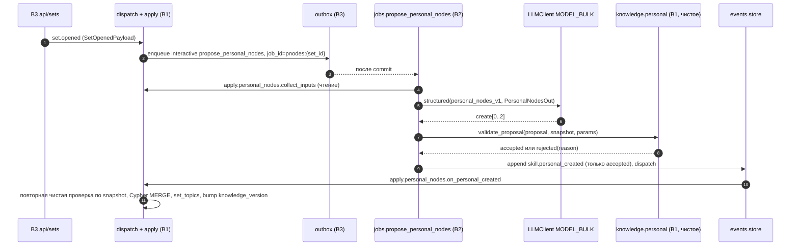
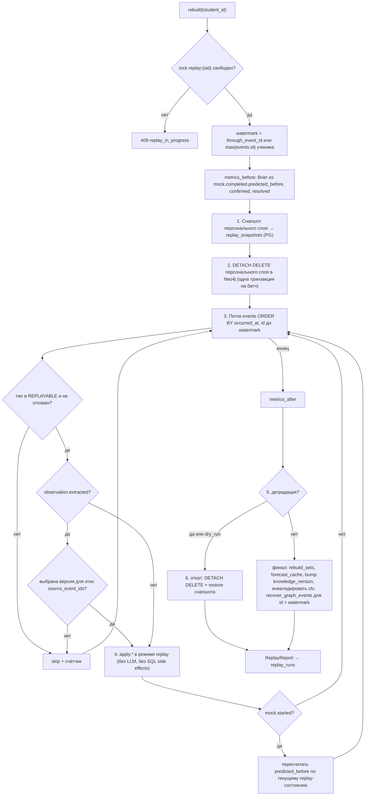
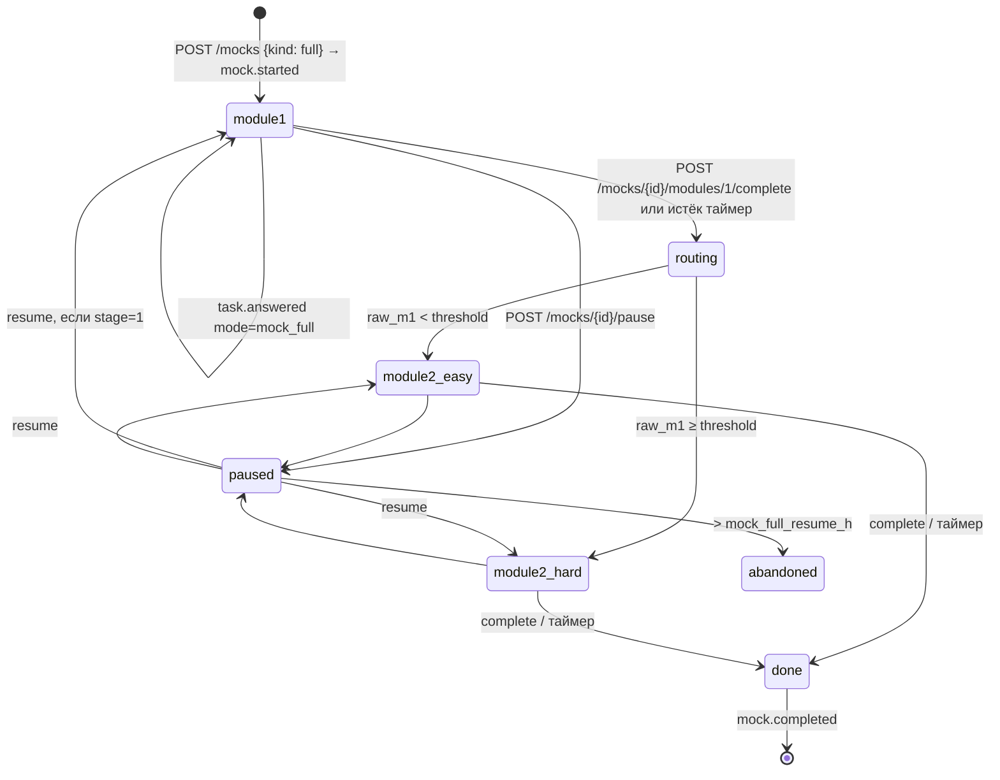
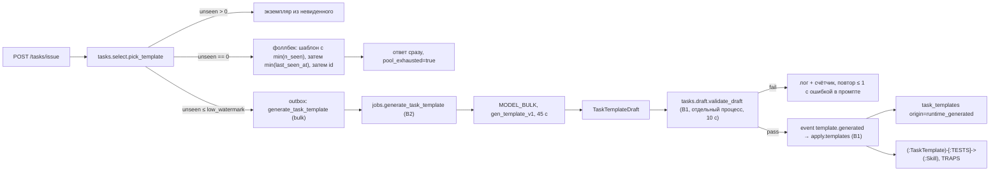
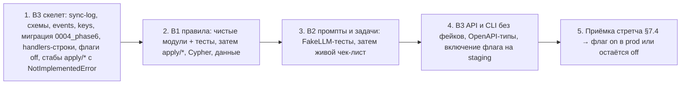

# ТЗ Фазы 6 Quack — стретчи

Версия 0.1 · 19.09.2026 · статус: проект ТЗ для согласования. Один документ на троих: дельта контрактов и задания B1/B2/B3 по восьми стретчам. Это не отчёт о реализации: ни одна строка кода этим документом не меняется.

Обозначения источников:

- **BP**: `backend-phases.md` v0.1, §6 (список стретчей) и §7 (сквозные правила).
- **MA**: `memory-architecture-quack.md`, §2, §3, §4.6, §5.4, §7, §8 (8.1, 8.3, 8.7, 8.8), §10.2, §11, §12.
- **PL**: `product-logic.md`, §3.1–3.4, §3.6, §5.2, §5.4, §6.2–6.5, §8.3–8.4, §9, §10.2–10.3, §10.6.
- **TS**: `tech-stack.md`, §2.5, §3.3–3.4, §4.1–4.3.
- **C1/C2**: `backend/docs/tz/00-contracts.md`, `00-contracts-phase2.md`.
- **P3/P4/P5**: `phase3-agents.md`, `40-phase4-background-quack.md`, `50-phase5.md`.

Приоритет источников: продуктовый смысл задают PL и MA, границы фазы задаёт BP §6, точные интерфейсы берутся из действующих контрактов C1/C2 и дельт P3–P5. Противоречия не разрешаются молча: они собраны в §8.

Пути даны по репозиторию: `backend/app/...`, `data/...` (корень монорепо), `backend/scripts/...`. Старые пути `apps/api` не создаются.

---

## 1. Метаданные, цель и границы фазы

### 1.1 Цель

Расширить продукт за пределы MVP восемью независимыми стретчами так, чтобы ни один из них не ухудшил то, что жюри проверяет по PL §9. Требования ко всем стретчам:

1. **Детерминированность.** Всё, что меняет модель знаний, проходит путь «событие → чистое правило». Модель только предлагает, решает правило.
2. **Надёжность.** Каждый стретч выключается одним флагом (§1.5). При выключенном флаге продукт работает ровно как после Фазы 5.
3. **Производительность на защите.** Ни один стретч не добавляет вызов модели или внешней сети в HTTP-запрос. Исключение из P4 §1.1 одно, чат, и оно не расширяется.

### 1.2 Состав фазы и порядок

Порядок взят из BP §6: по цене и эффекту на защите. Стретчи независимы. Порядок ниже задаёт очерёдность начала работ, но не запрещает параллельную работу.

| # | Стретч | Владелец | Эффект на защите | Оценка трудоёмкости |
| --- | --- | --- | --- | --- |
| S1 | Персональные узлы навыков | B2 + B1 | «сет подстроился под тебя»: подзаголовок топика, свои задачи | M |
| S2 | Replay модели знаний | B1 + B3 | «ложное наблюдение откатывается», Brier до/после | L |
| S3 | Эвал наблюдателя как релизный гейт | B2 | качество наблюдателя в цифрах, гейт версии промпта | S |
| S4 | Полный мок SAT с адаптивным модулем | B1 | мок в формате реального Digital SAT | M |
| S5 | Генерация шаблонов моделью в рантайме | B2 + B1 | пул не исчерпывается | L |
| S6 | ЕНТ информатика, третий предмет | B1 + B3 | профильная пара «математика — информатика» | L (данные) |
| S7 | Наука и мобильность в `query_dataset` | B2 + B3 | ответ «где есть обмен и наука» цифрами | S |
| S8 | Напоминания вне Quack | B3 | вехи не пропускаются | M |

> [!IMPORTANT]
> Фаза 6 начинается только после прохождения AC01–AC12 Фазы 5 (P5 §21) и формальной заморозки MVP. Стретч, не доведённый до DoD (§7.4) к 23.09 18:00, остаётся выключенным флагом на демо. Незавершённый стретч не блокирует релиз, но его код не должен ломать MVP.

### 1.3 Входные гейты

Общие гейты для всех стретчей:

| ID | Условие | Проверка |
| --- | --- | --- |
| G0 | P5 AC01–AC12 PASS, релиз помечен тегом `mvp-frozen` | тег в `main`, отчёт P5 |
| G1 | Все графовые обработчики идемпотентны по `event_id`: маркер `AppliedEvent` из P5 D02 или его эквивалент существует | P5 T11, T13 зелёные |
| G2 | CI зелёный: ruff, pytest (unit), `seed --validate`, `make types` | CI на `main` |

Гейты по стретчам:

| Стретч | Гейт входа | Источник | Как проверяется |
| --- | --- | --- | --- |
| S1 | ≥ `min_templates_personal` (3) шаблонов на навык **с тегами**. Для каждого навыка сета хотя бы один тег встречается ≥ 3 раза | BP §6, MA §7 | `scripts/seed.py --report-tags`: отчёт «навык → тег → число шаблонов», в CI как предупреждение |
| S2 | G1 плюс аудит: **каждая** запись в персональный граф достижима из обработчика, зарегистрированного на сохраняемом событии (включая корни `diagnostic` 0.8 и косвенные свидетельства замера) | BP §6, MA §8.8 | B1 публикует в `docs/sync-log.md` таблицу «запись в граф → событие → обработчик». Пустых строк нет |
| S3 | ≥ 10 размеченных фрагментов из Ф5 (P5 F5-08), живой ключ провайдера | BP §6, P5 T26 | отчёт P5 T26 в `docs/` |
| S4 | ≥ 5 шаблонов на навык SAT в областях `area_shares`, по сложностям 1–4. ScaleTable по двум веткам с источником или пометкой `is_demo` | BP §6, PL §5.4 | `seed --report-pool SAT_MATH`: хватает на 44 задачи без повторов для обеих веток |
| S5 | Офлайн-генератор Фазы 2 стабилен: ≥ 80 % черновиков проходят `validate_template` за 50 сидов. Принято решение по бюджету рантайм-вызовов (§8, K1) | BP §6, TS §3.4 | отчёт офлайн-скрипта за последние ≥ 30 черновиков |
| S6 | Формат ЕНТ информатики сверен с testcenter.kz (иначе `is_demo=true`). Согласовано расширение `ExamId` (§4.1) | BP §6 | запись в sync-log |
| S7 | Для ≥ 10 программ пола заполнены поля науки и мобильности с источником | — | `seed --validate` + отчёт покрытия |
| S8 | Решено, какие каналы включены. Есть бот и SMTP-учётка (секреты в `.env`). Принята политика приватности адресата | — | запись в `docs/decisions/notifications.md` |

### 1.4 Вне фазы

Не делается ни при каких условиях:

- смена основного стека: FastAPI, Postgres 16, Neo4j 5 Community, Redis 7, ARQ, Next.js;
- распределённые брокеры (Kafka, RabbitMQ, Celery), Kubernetes, третья очередь ARQ;
- изменение формул HLR, confidence, статусов заблуждений, ярусов доверия, реалистичности (MA §4–§5, PL §3.3), а также значений параметров MA §12 по умолчанию;
- кросс-ученический слой: объединение персональных узлов между учениками (PL §10.3, MA §7);
- генерация и рендер рисунков на лету (PL §5.4); SVG сверх датасета остаётся стретчем вне этого ТЗ;
- проценты шансов где бы то ни было (MA §11.1);
- файнтюн, внешние эмбеддинги, платные сервисы уведомлений (SMS, push-провайдеры);
- публичные эндпоинты сброса или пересборки без роли оператора;
- правка чужих модулей в обход владельца (CLAUDE.md, «Frozen shared contracts»).

### 1.5 Флаги включения (`Settings`, B3)

| Флаг | По умолчанию | Выключен — поведение |
| --- | --- | --- |
| `FEATURE_PERSONAL_NODES` | `false` | `set.opened` не ставит `propose_personal_nodes`; существующие узлы читаются, новые не создаются |
| `FEATURE_REPLAY` | `false` | CLI работает только с `--allow-disabled` в `ENV=local`; API 404 |
| `OBSERVER_GATE_ENFORCED` | `true` | при `false` CI только предупреждает |
| `FEATURE_SAT_FULL_MOCK` | `false` | `POST /mocks {kind:"full"}` → 409 `feature_disabled` |
| `FEATURE_RUNTIME_TEMPLATES` | `false` | исчерпание пула → повтор (PL §6.3), без генерации |
| `FEATURE_ENT_CS` | `false` | `ENT_CS` не выдаётся в подборе и подготовке; данные загружены, но скрыты |
| `FEATURE_PROGRAM_DIMENSIONS` | `true` | поля читаются всегда; флаг выключает только новые фильтры `query_dataset` |
| `FEATURE_EXTERNAL_NOTIFICATIONS` | `false` | крон не отправляет, API подписки 409 |

Флаги — поля `Settings`, а не `KnowledgeParams`: это переключатели функций, а не параметры модели знаний (BP §7).

---

## 2. Базовое состояние системы после Фаз 1–5

### 2.1 Компоненты по слоям

Таблица фиксирует **целевую** базу после Ф5, на которую опирается Ф6. Строки с пометкой «в checkout» проверены в локальной ветке `local/seed-data` на 19.09. Остальное описано документами P3–P5 и должно быть подтверждено гейтом G0.

| Слой | Компонент | Где | Статус |
| --- | --- | --- | --- |
| B3 | Лог событий: `events.store.append`, `dispatch`, `RuleDeps(graph, redis, params, now)`, `GraphUnavailable` | `app/events/*` | в checkout; `RuleDeps.jobs` (outbox) из P4 |
| B3 | Воркеры: `INTERACTIVE`, `BULK`, таймауты на функцию `_JOB_TIMEOUTS`, `JOB_TIMEOUT_MAX_S=300` | `app/workers/registry.py` | в checkout; `propose_personal_nodes` уже в `_JOB_TIMEOUTS` с таймаутом слота chat (см. K2) |
| B3 | Outbox с долговечным lifecycle (P5 D01), `outbox_replay`, `recover_graph_events` | `app/events/outbox.py`, `workers/jobs_infra.py` | P5 |
| B3 | API: auth, profile, saved, programs, chat, health, tasks, sets, diagnostic, mocks, knowledge, matching, overview, prep; после Ф4: texts, quack, programs/search | `app/api/*` | в checkout: всё до `prep`; texts/quack — P4 |
| B1 | Чистые модули: `knowledge.{hlr,weights,misconceptions,reconcile,roots,diagnostic,words}`, `tasks.{generate,evaluate,select,mocks,answer,render,generators}`, `sets.{queue,assemble,forecast}`, `matching.{hard,realism,rank,compare,shift,brief,directions}`, `roadmap.*` | `app/*` | в checkout |
| B1 | Apply-обёртки: `apply.{task_answered,diagnostic,dispute,knowledge,mocks,profile_updated,sets,targets,tasks}` | `app/apply/*` | в checkout; `apply.observation`, `apply.quack`, `apply.summary_stats` — P3/P4 |
| B1 | Graph queries: `personal.{ensure_student,get_state(s),upsert_state,merge_evidence,evidence_id,get_misc_states,upsert_misc_state,add_root_cause,list_evidence,list_root_causes,get_state_history}`, `canonical.*`, `kb.*` | `app/graph/queries/*` | в checkout |
| B2 | `LLMClient` (слоты chat и bulk, breaker, RPM), `load_prompt`, `FakeLLMClient`, агенты selection, tutor, observer, jobs P3/P4, `postcheck` | `app/llm/*`, `app/agents/*` | в checkout: каркас; P3/P4: реализации |

### 2.2 Хранилища

**PostgreSQL** (миграции `0001_init`, `0002_phase2` в checkout; `0003_phase4` и ревизия Ф5 по P4 §1.7 и P5 §9.2): `users`, `profiles`, `saved_programs`, `programs_cache`, `events`, `messages`, `task_templates`, `task_instances`, `seen_templates`, `generated_texts`, `set_summaries`, `recommendations`, `daily_aggregates`, `sets`, `set_topics`, `diagnostic_runs`, `mock_runs`, `milestone_marks`, `forecast_cache`, `student_aggregates`, `soft_matches`, `job_outbox`.

**Neo4j** (MA §2):

- канонический слой: `Exam`, `Area`, `Skill {scope:'canonical'}`, `Misconception {scope:'library'}`, `TaskTemplate`, связи `HAS_AREA`, `HAS_SKILL`, `REQUIRES`, `ABOUT`, `TESTS`, `TRAPS`;
- KB: `Section`, `TestDate`, `ScaleTable`, `AdmissionRoute`, `Requirement`, `Program`, `Deadline`, `Fact`;
- персональный слой: `Student`, `KnowledgeState` (с цепочкой `PREVIOUS`), `MisconceptionState`, `Evidence`, `ROOT_CAUSE`, персональные `Misconception`;
- технический: `AppliedEvent` (P5 D02).

**Redis** (`app/keys.py`, заморожен): `session`, `llm_status`, `llm_ratelimit`, `llm_errors`, `llm_probe`, `login_ratelimit`, `knowledge_version`, `forecast`, `ctx_topic`, `lock`, плюс ключи P4 §1.8.

**ARQ.** В очереди `interactive`: `ping`, `observe_chat`, `canonize_misconception`, `set_summary`. В очереди `bulk`: `ping`, `pregenerate_set`, `soft_match`, `extract_program`, `search_programs`, `daily_aggregates`, `recommendations_batch`, `realism_texts`, `compare_text`, `outbox_replay`, `recover_graph_events`. Кроны P4 §1.2.

### 2.3 Стабы и расширения, которые закрывает Ф6

| Стаб или расширение | Сейчас | Закрывает |
| --- | --- | --- |
| `agents.jobs.propose_personal_nodes(ctx, request_id, set_id, student_id)` | `NotImplementedError("phase 2")`, зарегистрирован в `_JOB_TIMEOUTS` | S1 |
| `Skill {scope:'personal'}` + `PART_OF` (MA §2.2) | схема описана, запросов нет | S1 |
| `EventType.skill_personal_created` | enum есть, payload и обработчика нет | S1 |
| `apply.replay.rebuild` (MA §8.8) | нет; P5 §4 явно оставил его за Ф6 | S2 |
| Гейт `extractor_version` (MA §11.3 `[OPEN: стретч]`) | ручной eval ≥ 10 фрагментов в P5 | S3 |
| `Section.adaptive` | поле есть, в SAT Module 2 `adaptive: true`, сборщик его игнорирует | S4 |
| `ExamFormat.scale_table` | `null` в `data/exam_formats/sat_math.json` | S4 (данные) |
| «исчерпание пула → генерация» (PL §5.4) | повтор с перемешанными вариантами | S5 |
| `ExamId = Literal["SAT_MATH","ENT_MATH"]` | продублирован в `schemas/common.py` и `schemas/knowledge.py` | S6 |
| `matching_priority_weights["research"]`, `["mobility"]` | ключи есть, данных в `Program` нет | S7 |
| Напоминания вне Quack (PL §10.2) | нет | S8 |

---

## 3. Спецификация стретчей

Для каждого стретча описаны продуктовая логика, алгоритм, архитектура, владельцы, данные, отказы и тесты. Все параметры добавляются в `KnowledgeParams` (B3, `app/config.py`) **и** в MA §12 одновременно (BP §7).

### 3.1 S1 — Персональные узлы навыков [B2 + B1]

#### 3.1.1 Продуктовая логика

При входе в сет система решает, нужен ли под каноническим навыком сета узел «суженной» подтемы: предпосылка внутри навыка, на которой ученик стабильно ошибается; ловушка, проявляющаяся на определённом типе задач. Узел — это **фильтр по шаблонам родителя**, а не новая сущность знаний.

Узел создаётся, только если выполнены все три условия PL §5.2:

1. по нему будут задачи (фильтр даёт ≥ `min_templates_personal` невиденных шаблонов);
2. по нему нужно копить свидетельства во времени;
3. он влияет на состав сета (топик получает подзаголовок и свои задачи).

Ученик видит в топике: «Модуль и уравнения — **отрицательная ветвь** (по твоим ошибкам в 3 задачах)». В модели знаний узел раскрывается до свидетельств так же, как канонический навык (MA §10.5).

Чего узел не делает: не входит в прогноз балла сам по себе, не создаёт своих заблуждений, не переносится между экзаменами, не объединяется между учениками.

#### 3.1.2 Поток



#### 3.1.3 Триггер и задача

- Обработчик `apply.personal_nodes.on_set_opened_enqueue(session, event, deps)` (B1, однострочник, регистрирует B3). Если `settings.FEATURE_PERSONAL_NODES` и `llm_status != "down"` на момент события, он кладёт в outbox:
  `deps.jobs.enqueue("interactive", "propose_personal_nodes", job_id=f"pnodes:{set_id}", set_id=..., student_id=...)`.
  При `llm_status == "down"` задача всё равно ставится. Решение об отказе принимается в самой задаче по правилу «протухания» ниже.
- Сигнатура задачи сохраняется из Ф1: `async def propose_personal_nodes(ctx: dict, request_id: str, set_id: UUID, student_id: UUID) -> None`.
- Очередь `interactive`, **таймаут задачи 30 с**, слот `MODEL_BULK`, промпт `personal_nodes_v1`. Бюджет вызова модели — `personal_nodes_llm_timeout_s = 25` через `asyncio.wait_for`, а не общий `LLM_TIMEOUT_BULK_S=90` (конфликт K2). Реестр получает явную строку `("propose_personal_nodes", "interactive", 30)`.
- Протухание: если к моменту исполнения сет уже `done` или `switched`, или с `set.opened` прошло больше `personal_nodes_max_delay_h = 24`, задача завершается `job_skipped(reason="stale_set")`. Персональные узлы — для нового сета, догонять старые не нужно (PL §6.3).
- `LLMUnavailable` при `down` или rate limit → P5 wrapper `waiting_dependency`. Невалидный structured после встроенного ретрая → `failed` + `job.failed`, узлов нет, сет остаётся каноническим.

#### 3.1.4 Вход модели — `PersonalNodesInput` (B2, `app/agents/personal_nodes.py`)

Сборка входа — B1 `apply.personal_nodes.collect_inputs(session, driver, student_id, set_id) -> PersonalNodesInput`. Это только чтение. Словари `MisconceptionState.triggers` берутся готовыми (MA §5.3).

```python
class TagStat(BaseModel):
    tag: str
    n_templates: int          # всего шаблонов родителя с этим тегом
    n_unseen: int             # из них с n_seen = 0 у ученика
    difficulties: list[int]   # встречающиеся сложности

class SkillSlice(BaseModel):
    skill_id: str
    name: str
    level: SkillLevel         # knowledge.words — словами, без p/conf
    n_incorrect_30d: int
    tag_stats: list[TagStat]  # только теги с n_templates >= 1, сортировка по n_unseen desc
    existing_personal: list[str]   # id уже существующих узлов под этим родителем

class RootCauseRef(BaseModel):
    from_skill_id: str
    root_skill_id: str
    confidence_sum: float     # Σ за root_window_days
    sources: list[Literal["diagnostic", "observer", "rule"]]

class MiscTriggerRef(BaseModel):
    misconception_id: str
    name: str
    skill_ids: list[str]
    by_tag: dict[str, float]  # доли из triggers.by_tag, только n >= trigger_min_n
    by_difficulty: dict[str, float]

class PersonalNodesInput(BaseModel):
    exam_id: ExamId
    set_id: UUID
    skills: list[SkillSlice]                  # навыки сета, ≤ set_size + проверки
    root_causes_30d: list[RootCauseRef]       # ROOT_CAUSE за root_window_days
    confirmed_triggers: list[MiscTriggerRef]  # только confirmed (MA §5.2)
    max_nodes: int                            # = personal_nodes_max_per_set
```

`suspected` и `disputed` во вход не попадают (MA §5.2: сборщику сетов — нет).

#### 3.1.5 Схема ответа (B2, `app/schemas/llm.py`, frozen → дельта §4.2)

```python
class TaskFilter(BaseModel):
    model_config = ConfigDict(extra="forbid")
    tags: list[str] = Field(min_length=1, max_length=3)
    difficulty: list[int] | None = Field(default=None, max_length=4)

class PersonalNodeProposal(BaseModel):
    model_config = ConfigDict(extra="forbid")
    parent_skill_id: str
    name: str = Field(min_length=3, max_length=60)
    description: str = Field(min_length=10, max_length=300)
    task_filter: TaskFilter
    reason: str = Field(min_length=10, max_length=300)   # на что опирается: теги триггеров, корни

class PersonalNodesOut(BaseModel):
    model_config = ConfigDict(extra="forbid")
    create: list[PersonalNodeProposal] = Field(default_factory=list, max_length=2)
```

Правила промпта `personal_nodes_v1.md` (B2):

- пустой список — нормальный и частый ответ;
- `parent_skill_id` только из `skills[].skill_id`;
- теги только из `tag_stats` этого навыка;
- фильтр обоснован триггером confirmed-заблуждения или корнем, а не общими соображениями;
- не создавать узел под определение, формулу или разовое непонимание (MA §7 «что не становится узлом»);
- `name` на русском, без процентов и оценок ученика («слаб в …» запрещено);
- `extractor_version` = `personal_nodes_v1`.

#### 3.1.6 Валидация B1 — чистая функция

`app/knowledge/personal.py` (новый, чистый, без I/O):

```python
@dataclass(frozen=True)
class ProposalSnapshot:
    parent_skill_id: str
    exam_id: ExamId
    parent_templates: list[TaskTemplateSpec]      # шаблоны родителя (канонические + одобренные runtime, §3.5)
    seen: dict[str, int]                           # template_id -> n_seen ученика
    existing: list[PersonalSkillRef]               # активные узлы ученика под этим родителем
    known_skill_ids: frozenset[str]                # навыки текущего сета

class Verdict(BaseModel):
    accepted: bool
    reason: Literal["ok", "unknown_parent", "unknown_tag", "too_few_unseen",
                    "duplicate", "overlap", "limit_parent", "empty_filter"]
    template_ids: list[str]        # все шаблоны родителя, прошедшие фильтр
    unseen_template_ids: list[str] # из них n_seen = 0
    node_id: str

def filter_templates(templates: list[TaskTemplateSpec], f: TaskFilter) -> list[TaskTemplateSpec]:
    """Шаблон проходит, если tags ⊆ template.tags (все теги фильтра) и
    difficulty is None или template.difficulty ∈ difficulty."""

def personal_node_id(student_id: UUID, parent_skill_id: str, f: TaskFilter) -> str:
    """ps.{student_id.hex[:12]}.{parent_skill_id}.{sha1(canonical_json(sorted tags, sorted difficulty))[:8]}"""

def validate_proposal(student_id: UUID, p: PersonalNodeProposal,
                      snap: ProposalSnapshot, params: KnowledgeParams) -> Verdict: ...
```

Правила `validate_proposal`, по порядку, первое сработавшее даёт отказ:

1. `parent_skill_id ∉ known_skill_ids` → `unknown_parent`.
2. Какой-то тег фильтра не встречается ни в одном шаблоне родителя → `unknown_tag`.
3. `filter_templates(...)` пуст → `empty_filter`.
4. `len(unseen) < params.min_templates_personal` → `too_few_unseen`. Это главное правило MA §7 и §8.7.
5. `node_id` уже существует у ученика → `duplicate` (идемпотентность: повторная задача ничего не создаёт).
6. Коэффициент Жаккара по множествам `template_ids` с любым активным узлом того же родителя ≥ `personal_node_overlap_max = 0.8` → `overlap`.
7. Активных узлов под родителем ≥ `personal_nodes_max_per_parent = 2` → `limit_parent`.

Задача валидирует каждое предложение и пишет событие **только для принятых**. Отклонения попадают в structlog `personal_node_rejected {set_id, parent, reason}`: в модель знаний они не входят, событие не нужно. Сверх `personal_nodes_max_per_set = 2` принятые отбрасываются по порядку ответа модели.

#### 3.1.7 Событие `skill.personal_created`

```python
class SkillPersonalCreatedPayload(_Payload):
    node_id: str
    parent_skill_id: str
    exam_id: ExamId
    set_id: UUID
    name: str
    description: str
    task_filter: TaskFilter
    reason: str
    template_ids: list[str]          # снимок фильтра на момент создания
    unseen_template_ids: list[str]   # снимок n_seen = 0 — нужен для детерминированного replay
    prompt_version: str
```

Событие пишется с `extractor_version=prompt_version`, `set_id`, `exam_id`. Обработчик `apply.personal_nodes.on_personal_created(session, event, deps)` (B1) делает следующее:

1. Повторяет чистую проверку, но **по снимку** из payload: `len(unseen_template_ids) ≥ min_templates_personal`, родитель существует в каноническом слое, `node_id == personal_node_id(...)`. Текущий `seen_templates` не читается, потому что при replay он другой (§3.2).
2. Выполняет Cypher ниже в одной write-транзакции с маркером `AppliedEvent`.
3. Обновляет read-модель `set_topics.personal_nodes` (JSONB, §4.4) для топика родителя в сете `set_id`.
4. Поднимает `knowledge_version` и инвалидирует `ctx_topic` родителя.

#### 3.1.8 Cypher (B1, `app/graph/queries/personal_skills.py`)

> [!IMPORTANT]
> Neo4j не хранит словари (MAP) как свойства узла. `task_filter: MAP` из MA §2.2 хранится развёрнутым: `task_filter_tags: LIST<STRING>`, `task_filter_difficulty: LIST<INTEGER>` и `task_filter_json: STRING` (канонический JSON для чтения). Это уточнение MA §2.2, вносится в MA при мерже.

```cypher
// create_personal_skill — идемпотентно по node_id; маркер в той же транзакции
MATCH (st:Student {id: $student_id})
MATCH (parent:Skill {id: $parent_skill_id})
WHERE coalesce(parent.scope, 'canonical') = 'canonical'
MERGE (a:AppliedEvent {student_id: $student_id, event_id: $event_id, handler: 'personal_created'})
  ON CREATE SET a.applied_at = datetime($now)
WITH st, parent, a
MERGE (ps:Skill:PersonalSkill {id: $node_id})
  ON CREATE SET ps.scope = 'personal',
                ps.student_id = $student_id,
                ps.exam_id = $exam_id,
                ps.name = $name,
                ps.description = $description,
                ps.task_filter_tags = $tags,
                ps.task_filter_difficulty = $difficulty,
                ps.task_filter_json = $task_filter_json,
                ps.reason = $reason,
                ps.set_id = $set_id,
                ps.source_event_id = $event_id,
                ps.created_at = datetime($now)
MERGE (ps)-[:PART_OF]->(parent)
MERGE (st)-[:HAS_PERSONAL_SKILL]->(ps)
RETURN ps.id AS id
```

Требования к остальным запросам (аудит B1, входит в DoD S1):

- **Каждый** канонический запрос `MATCH (s:Skill ...)` в `canonical.py`, `context.py`, `sets`-адаптерах, `forecast` и seed явно исключает персональные узлы: `WHERE NOT s:PersonalSkill` либо `coalesce(s.scope,'canonical')='canonical'`. Тест `tests/graph/test_personal_isolation.py` проверяет, что карта навыков, прогноз и `list_exam_skills` не меняются от появления `PersonalSkill`.
- Индексы, идемпотентно в `schema.cypher`: `CREATE INDEX personal_skill_student IF NOT EXISTS FOR (p:PersonalSkill) ON (p.student_id)`, `CREATE CONSTRAINT personal_skill_id IF NOT EXISTS FOR (p:PersonalSkill) REQUIRE p.id IS UNIQUE`.
- Персональный запрос всегда начинается с `MATCH (st:Student {id:$student_id})` (MA §2.4).

#### 3.1.9 Выдача задач по узлу

- `tasks.select.pick_template(...)` получает необязательный аргумент `task_filter: TaskFilter | None = None`. При нём пул равен `knowledge.personal.filter_templates(parent_templates, task_filter)`. Остальные правила MA §10.2 (сложность на шаг, `n_seen = 0`, `TRAPS` при confirmed) не меняются.
- `POST /tasks/issue` (B3) принимает `personal_skill_id: str | None`. Роутер проверяет, что узел принадлежит ученику и родитель совпадает со `skill_id`.
- Правило топика: если у топика есть активные узлы, каждая `personal_task_share`-я выдача (параметр `personal_task_every_n = 2`: каждая вторая) идёт по узлу с наибольшим числом невиденных шаблонов. Если по узлу невиденные кончились, выдача идёт по родителю.
- `TaskIssuedPayload` получает необязательное поле `personal_skill_id: str | None = None` (дельта §4.2), `task_instances` — колонку `personal_skill_id` (§4.4).

#### 3.1.10 Проброс свидетельств на родителя

Обработчик `task.answered` (B1, `apply.task_answered`) после штатных шагов MA §8.2 для экземпляра с `personal_skill_id`:

1. **Родитель обновляется ровно так, как без узла.** Тот же `Evidence(event_id, parent_skill_id, 0)`, тот же вес, тот же HLR, заблуждения, корни, `transfer_cross_exam`. Инвариант: состояние родителя с узлом и без узла **побитово совпадает**. Проверяет тест T-S1-05.
2. Дополнительно создаётся `Evidence(event_id, personal_skill_id, 0)` с тем же `weight`, `direction`, `tier`, контекстом и полем `mirror_of = evidence_id(event_id, parent_skill_id, 0)`, а также свой `KnowledgeState` узла (`FOR` → `PersonalSkill`, `PREVIOUS`-цепочка). Коэффициент проброса `personal_to_parent_weight = 1.0` (MA §7) задаётся параметром и не меняется.
3. `MisconceptionState` для узла **не** ведётся: заблуждения `ABOUT` канонический навык.
4. `transfer_cross_exam` на узел не применяется: узел принадлежит одному `exam_id`.
5. Всё это одна транзакция Neo4j с маркером `AppliedEvent(handler='task_answered')`.

Свидетельства чата (`observation.extracted`) крепятся только к каноническим навыкам. Наблюдатель не видит персональные узлы (правило промпта MA §8.1: только существующие канонические id).

#### 3.1.11 Прогноз, сеты, UI

- `sets.forecast` и `sets.queue` работают только по каноническим навыкам. Узлы в прогноз входят **через родителя**: вес наследуется, но не суммируется (MA §7).
- `SkillStateOut` (дельта §4.2): у персональных узлов `parent_skill_id: str | None`, `scope: Literal["canonical","personal"]`. `GET /knowledge/states` отдаёт узлы вложенно под родителем.
- `TopicOut.personal_nodes: list[PersonalNodeOut]` (дельта), где `PersonalNodeOut{id, name, reason, level: SkillLevel, n_unseen_templates, status}`. Фронт показывает подзаголовок.
- Жизнь узла: `status` вычисляется при чтении и не хранится: `active`, пока есть свидетельство за `personal_node_idle_days = 30` или сет открыт; иначе `dormant`. `dormant` не показывается в сетах, но остаётся в модели знаний и провенансе. Удаления нет: удаление ломает провенанс и replay.

#### 3.1.12 Параметры

| Параметр | Значение | Где |
| --- | --- | --- |
| `min_templates_personal` | 3 (уже есть) | §3.1.6 п.4 |
| `personal_nodes_max_per_set` | 2 | ответ модели, задача |
| `personal_nodes_max_per_parent` | 2 | §3.1.6 п.7 |
| `personal_node_overlap_max` | 0.8 | §3.1.6 п.6 |
| `personal_to_parent_weight` | 1.0 | §3.1.10 |
| `personal_task_every_n` | 2 | §3.1.9 |
| `personal_node_idle_days` | 30 | §3.1.11 |
| `personal_nodes_max_delay_h` | 24 | §3.1.3 |
| `personal_nodes_llm_timeout_s` | 25 | `Settings`, §3.1.3 |

#### 3.1.13 Тесты S1

| ID | Given → When → Then |
| --- | --- |
| T-S1-01 unit | 2 невиденных шаблона по фильтру, `min_templates_personal=3` → `validate_proposal` → `too_few_unseen` |
| T-S1-02 unit | Тег, которого нет у родителя → `unknown_tag`; родитель вне сета → `unknown_parent` |
| T-S1-03 unit | Два фильтра с Жаккаром 0.85 → второй `overlap`; одинаковый фильтр → тот же `node_id`, `duplicate` |
| T-S1-04 agents | `FakeLLMClient` возвращает 3 предложения, из них 1 валидное → одно событие `skill.personal_created`, два лога отказа |
| T-S1-05 integration | Одна история ответов: а) без узла, б) с узлом → состояние, Evidence, заблуждения родителя идентичны; у узла свой `KnowledgeState` |
| T-S1-06 integration | Повтор `skill.personal_created` с тем же `event_id` → один `PersonalSkill`, одно ребро `PART_OF` |
| T-S1-07 graph | Появился `PersonalSkill` → `list_exam_skills`, `forecast`, карта навыков не изменились |
| T-S1-08 job | Сет `done` на момент исполнения → `job_skipped(stale_set)`, событий нет |
| T-S1-09 API | Чужой `personal_skill_id` в `POST /tasks/issue` → 404 |
| T-S1-10 fallback | `LLM_FORCE_DOWN=1`, `set.opened` → сет канонический, задача `waiting_dependency` и протухает через 24 ч |

---

### 3.2 S2 — Replay модели знаний [B1 + B3]

#### 3.2.1 Продуктовая логика

Replay пересобирает персональный слой ученика из лога событий без вызова модели (MA §8.1 «Почему выход — событие», §8.8). Сценарии:

1. **Откат ложного наблюдения.** Оператор помечает событие `observation.extracted` отозванным (§3.2.6), затем запускает replay: заблуждение, выведенное из него, исчезает с провенансом.
2. **Смена версии наблюдателя.** Фоновая задача B2 создаёт новые `observation.extracted` по старым сообщениям (вне этого ТЗ как массовая операция, для одного ученика — `jobs.reobserve_student`, §3.2.8). Replay применяет только актуальную версию.
3. **Изменение правила B1** (баг-фикс в HLR-обёртке, не в формулах) → пересчёт состояния.

Replay — операторский инструмент, а не функция ученика. На защите показывается как «механизм есть»: CLI плюс отчёт Brier до и после.

#### 3.2.2 Сигнатура

```python
# app/apply/replay.py (B1)
class ReplayReport(BaseModel):
    run_id: UUID
    student_id: UUID
    through_event_id: int
    dry_run: bool
    status: Literal["applied", "rolled_back", "dry_run_ok", "dry_run_degraded", "failed"]
    events_total: int
    events_applied: int
    events_skipped: dict[str, int]          # reason -> count: superseded_observation, retracted, not_replayable
    metrics_before: ReplayMetrics
    metrics_after: ReplayMetrics
    degradation: list[str]                  # сработавшие правила деградации
    duration_ms: int
    error: str | None = None

class ReplayMetrics(BaseModel):
    brier: float | None                     # None, если моков < replay_min_mocks_for_brier
    n_mocks: int
    n_confirmed: int
    n_resolved: int
    n_evidence: int
    n_personal_skills: int
    per_skill_p: dict[str, float]           # p_recall(now) по каноническим навыкам, для diff

async def rebuild(
    deps: ReplayDeps,
    student_id: UUID,
    *,
    through_event_id: int | None = None,
    dry_run: bool = False,
) -> ReplayReport: ...
```

`ReplayDeps` — наследник `RuleDeps` с режимом `mode="replay"` и `jobs=NullOutbox()` (дельта §4.2). В режиме replay обработчики:

- **пишут** граф;
- **не пишут** SQL read-модели: `seen_templates`, `forecast_cache`, `set_summaries`, `recommendations`;
- **не ставят** задачи (outbox — пустышка) и **не поднимают** `knowledge_version` до финала;
- **не пишут** новые события (`job.failed`, производные).

Каждый обработчик в `apply/*` получает проверку `if deps.mode == "replay": skip SQL side effects`. Это B1-правка своих файлов.

#### 3.2.3 Пайплайн



**Шаг 0 — блокировка и граница.** Redis-лок `keys.lock(f"replay:{sid}")`, TTL `replay_lock_ttl_s = 600`, продлевается каждые 60 с. Лок ставится с `NX`; при недоступном Redis replay не стартует (fail-closed, P5 D10). Одновременно в PG ставится `replay_runs.status='running'` с частичным уникальным индексом `(student_id) WHERE status='running'`. Это второй, долговечный барьер.

Живые события ученика во время replay: `dispatch` для графовых обработчиков видит флаг `replay_runs.status='running'` для `student_id` (одна индексная выборка, кэш в `RuleDeps` на запрос). Тогда он **не применяет** граф: событие остаётся с `processed_at IS NULL`, API отвечает как при недоступном графе (`projection_status="pending"`, P5 D03). После финала `recover_graph_events(student_id, through=max_id)` из P5 догоняет эти события по порядку `id`.

**Шаг 1 — снапшот.** `graph.queries.replay.export_personal_layer(driver, student_id) -> PersonalLayerSnapshot`:

```python
class SnapNode(BaseModel):
    key: str                      # локальный ключ в снапшоте (elementId не переносим)
    labels: list[str]
    props: dict[str, Any]

class SnapRel(BaseModel):
    type: str
    start: str                    # key узла снапшота или "canon:Skill:<id>" / "canon:TaskTemplate:<id>" / "canon:Misconception:<id>"
    end: str
    props: dict[str, Any]

class PersonalLayerSnapshot(BaseModel):
    student_id: UUID
    taken_at: datetime
    nodes: list[SnapNode]         # KnowledgeState, MisconceptionState, Evidence, PersonalSkill, Misconception{scope:personal}, AppliedEvent
    rels: list[SnapRel]           # HAS_STATE, FOR, PREVIOUS, HAS_MISC_STATE, OF, SUPPORTS, ROOT_CAUSE, FROM_TEMPLATE, PART_OF, ABOUT, HAS_PERSONAL_SKILL
    checksum: str                 # sha256 канонического JSON
```

Снапшот пишется в `replay_snapshots` (PG, JSONB, gzip при > 1 МБ) **до** удаления, в отдельной закоммиченной транзакции. Без записанного снапшота удаление запрещено.

**Шаг 2 — очистка.** Батчами по `replay_delete_batch = 500`:

```cypher
MATCH (st:Student {id: $student_id})
CALL {
  WITH st
  MATCH (st)-[:HAS_STATE|HAS_MISC_STATE|HAS_PERSONAL_SKILL]->(n)
  RETURN n
  UNION
  WITH st
  MATCH (e:Evidence {student_id: $student_id}) RETURN e AS n
  UNION
  WITH st
  MATCH (m:Misconception {scope: 'personal', student_id: $student_id}) RETURN m AS n
  UNION
  WITH st
  MATCH (a:AppliedEvent {student_id: $student_id}) RETURN a AS n
}
WITH n LIMIT $batch
DETACH DELETE n
RETURN count(*) AS deleted
```

Цепочки `PREVIOUS` удаляются через `(:KnowledgeState {student_id})`. B1 подтверждает, что `KnowledgeState` несёт `student_id` (индекс `ks_student`, MA §2.4), иначе добавляет обход через `PREVIOUS*`. Узел `Student` и канонический слой не трогаются. Проверка после очистки: ноль персональных узлов по `student_id`, иначе `failed` и restore.

**Шаг 3 — поток событий.** Keyset-пагинация по `(occurred_at, id)`, батч `replay_read_batch = 1000`, фильтр `student_id = $sid AND id <= $watermark`. Сортировка `occurred_at ASC, id ASC` (MA §8.8). При равном `occurred_at` решает `id`.

Типы, которые проигрываются (`REPLAYABLE`, B1 утверждает в sync-log как часть гейта S2):

| Тип | Обработчик в replay |
| --- | --- |
| `profile.updated` | приоры (MA §4.8) |
| `task.answered` | MA §8.2 шаги 2–8; шаги 9–10 (`seen_templates`, пересборка) пропускаются |
| `diagnostic.progress`, `diagnostic.completed` | корни `diagnostic` 0.8 и косвенные свидетельства, **если** они пишутся обработчиком события (гейт S2) |
| `mock.started` | пересчёт `predicted_before` для Brier (шаг 4) |
| `mock.completed` | пара для Brier |
| `observation.extracted` | `apply.observation` после выбора версии (шаг 3.5) |
| `misconception.personal_created` | создание персонального заблуждения; эмбеддинг — из payload, при отсутствии пересчитывается локальным эмбеддером (не LLM) |
| `misconception.disputed`, `misconception.undisputed` | статусы MA §5.1 |
| `skill.personal_created` | §3.1.7, проверка по снимку `unseen_template_ids` |

Не проигрываются: `message.*`, `task.issued`, `task.skipped`, `task.timed_out`, `set.*`, `topic.*`, `program.*`, `milestone.done`, `recommendation.*`, `guideline.opened`, `explanation.opened`, `job.failed`, `observer.requested`, `notification.sent`, `template.generated`, `mock.module_completed`, `mock.routed`. Они не меняют персональный граф или являются служебными.

**Шаг 3.5 — версии наблюдателя.** Функция `apply.replay.select_observations(events: list[Event], active_version: str) -> set[int]` (чистая, `app/knowledge/replay.py`):

1. Группа — `frozenset(source_event_ids)`.
2. В группе выбирается событие с `extractor_version == settings.OBSERVER_PROMPT_VERSION` (активная одобренная версия, §3.3). Если его нет, выбирается событие с наибольшим `id`.
3. Частичное пересечение групп разных версий (окна наблюдателя сдвинулись): сообщения, покрытые выбранным событием активной версии, исключаются из групп других версий. Событие другой версии проигрывается, только если **все** его `source_event_ids` не покрыты активной версией. Иначе оно `superseded_observation`.
4. События из `replay_retractions` (§3.2.6) → `retracted`.

**Шаг 4 — применение.** Для каждого события вызывается тот же зарегистрированный обработчик, что и в живом `dispatch`: не копия логики. `now` в `ReplayDeps` равно `event.occurred_at`. Так HLR считает `Δt` на момент события, а не на момент replay. Маркер `AppliedEvent` создаётся заново: после очистки он удалён. `mock.started`: `predicted_before_replay = sets.forecast.predicted_raw(...)` по текущему состоянию replay, хранится в памяти прогона, в события не пишется.

**Шаг 5 — сравнение.** `knowledge.replay.degradation(before, after, params) -> list[str]` (чистая):

| Правило | Условие деградации |
| --- | --- |
| `brier_worse` | оба `brier` не `None` и `after.brier > before.brier + replay_brier_tolerance` (0.01) |
| `confirmed_explosion` | `after.n_confirmed > before.n_confirmed + max(2, ceil(before.n_confirmed · replay_confirmed_growth_max))` (0.25) |
| `evidence_loss` | `after.n_evidence < before.n_evidence · (1 − replay_evidence_loss_max)` (0.2) и нет отозванных событий, объясняющих потерю |
| `apply_errors` | `events_failed > 0` |

`brier` считается при `n_mocks ≥ replay_min_mocks_for_brier = 2`. Иначе в отчёте «данных мало» (MA §11.3), и правило `brier_worse` не участвует. Формула MA §11.3: `mean((predicted_before/max − raw/max)²)`. Для `mock_full` (S4) используется нормированный шкальный балл (§3.4.7).

Сознательные откаты (отозванное наблюдение) могут уменьшить `n_confirmed`: это не деградация. Правила выше смотрят только на рост ошибок.

**Шаг 6 — откат.** `graph.queries.replay.restore_personal_layer(driver, snapshot)`: очистка (шаг 2), затем `UNWIND $nodes` → `CREATE` с метками, `UNWIND $rels` → `MATCH` концов по ключам или каноническим id → `CREATE` рёбер. Одна транзакция на ≤ `replay_restore_batch = 2000` элементов. После restore сверяется `checksum` повторного экспорта с исходным. При несовпадении статус `failed`, лок **не снимается**, оператор получает `replay_restore_mismatch` (ручное вмешательство, данные в `replay_snapshots` сохранены).

`dry_run=True` проходит шаги 1–5 и **всегда** откатывается (шаг 6). Результат: `dry_run_ok` или `dry_run_degraded`. Это честная цена: без теневого графа (§3.2.9) пробный прогон тоже на время блокирует ученика.

**Финал (не dry_run, без деградации).** В обычном режиме `RuleDeps`:

- `apply.sets.rebuild_sets` по всем экзаменам ученика, `forecast_cache` пересчитан;
- `knowledge_version` поднят один раз;
- `ctx_topic` ученика инвалидирован (`SCAN quack:ctx:topic:{sid}:*` + `DEL`);
- `replay_runs.status='applied'`, лок снят;
- поставлен `recover_graph_events(student_id, through_event_id=max_id)` для событий, пришедших во время прогона.

`seen_templates` replay не пересчитывает: это SQL-факт выдачи, а не проекция знаний.

#### 3.2.4 Идемпотентность и сбои

| Сбой | Поведение |
| --- | --- |
| Воркер упал после снапшота, до удаления | `replay_runs.status='running'`, лок истёк. `replay_sweeper` (крон, 10 мин) видит `running` старше `replay_lock_ttl_s` → повторяет с шага 2 по тому же снапшоту |
| Упал во время удаления или прогона | Sweeper → restore из снапшота → `status='failed'`, `error='interrupted'`. Автоматического повторного replay нет |
| Упал во время restore | Sweeper повторяет restore (очистка + вставка идемпотентны по `student_id`) |
| Два запуска одного ученика | Частичный UNIQUE `replay_runs(student_id) WHERE status='running'` → второй получает 409 |
| Обработчик бросил исключение на событии | `events_failed += 1`, прогон продолжается до конца ради полного отчёта, затем `apply_errors` → откат |

#### 3.2.5 CLI и API (B3)

CLI `backend/app/cli/replay.py`, запуск `uv run python -m app.cli.replay <student_id> [--through-event-id N] [--dry-run] [--json]`:

- работает в процессе, без ARQ; печатает `ReplayReport`;
- выход `0` — `applied` или `dry_run_ok`, `2` — деградация или откат, `1` — ошибка;
- в `ENV=prod` требует `--confirm <student_id>` для не-dry-run.

API оператора (роутер `app/api/admin.py`, новый):

| Метод | Путь | Вход | Выход |
| --- | --- | --- | --- |
| `POST` | `/admin/replay/{student_id}` | `ReplayRequest{through_event_id: int \| None, dry_run: bool = True}` | 202 `{run_id}`; 409 `replay_in_progress`; 404 при `FEATURE_REPLAY=false` |
| `GET` | `/admin/replay/runs/{run_id}` | — | `ReplayReport` |
| `POST` | `/admin/events/{event_id}/retract` | `RetractRequest{reason: str ≤ 300}` | 201; только `observation.extracted` |

Авторизация: `users.role == 'operator'` (колонка в миграции §4.4). Зависимость `require_operator` возвращает 403 для обычного JWT. `dry_run` по умолчанию `true`. Replay через API ставит задачу `replay_student(ctx, request_id, run_id, student_id, through_event_id, dry_run)` в `bulk` с таймаутом `JOB_TIMEOUT_MAX_S=300`, `max_tries=1`: повтор делает sweeper, а не ARQ.

#### 3.2.6 Отзыв наблюдения

Событие не удаляется: лог append-only (MA §1.2). Таблица `replay_retractions(event_id PK, student_id, reason, retracted_by, retracted_at)`. Отозванное событие replay пропускает, живой `dispatch` не применяет повторно. Отзыв без последующего replay ничего не меняет в графе. API отвечает `{"replay_required": true}`.

#### 3.2.7 Параметры

`replay_lock_ttl_s=600`, `replay_read_batch=1000`, `replay_delete_batch=500`, `replay_restore_batch=2000`, `replay_brier_tolerance=0.01`, `replay_confirmed_growth_max=0.25`, `replay_evidence_loss_max=0.2`, `replay_min_mocks_for_brier=2`. Все — `KnowledgeParams`, кроме TTL и батчей: они идут в `Settings`, это инфраструктура.

#### 3.2.8 Переобработка сообщений новой версией наблюдателя (B2)

`jobs.reobserve_student(ctx, request_id, student_id, prompt_version)` в `bulk`: по окнам исходных `observation.extracted` (те же `source_event_ids`) вызывает `observer.run` новой версией и пишет **новые** `observation.extracted` с `dispatch_event=False`. Живой dispatch не применяет их поверх старых. Применение происходит только через replay. Лимит: `reobserve_max_windows = 50` на ученика, RPM bulk. Запускается оператором, только после прохождения гейта S3 для этой версии.

#### 3.2.9 Отклонённая альтернатива — теневой граф

Пересборка в теневой `Student` с атомарной подменой не блокирует ученика и даёт настоящий dry-run. Но она требует разделить «доменный» и «графовый» `student_id` во всех `apply/*`: проверки владения экземпляром читают SQL по `student_id`. Это рефакторинг замороженного контракта B1 без выигрыша на защите. Решение: in-place под локом (MA §8.8). Пересмотр — после 24.09.

#### 3.2.10 Тесты S2

| ID | Given → When → Then |
| --- | --- |
| T-S2-01 unit | Три `observation.extracted` по одним `source_event_ids`, версии v1, v2 (активная), v3 → `select_observations` → выбрана v2 |
| T-S2-02 unit | Частичное пересечение окон v1 и v2 → v1 `superseded` |
| T-S2-03 unit | `degradation`: Brier 0.10 → 0.12 → `brier_worse`; 1 мок → Brier не участвует |
| T-S2-04 integration | Реальная история (seed демо-аккаунта Ф5: замер + 20 задач + 2 мока + 3 наблюдения) → `rebuild` без изменений → состояния, статусы, корни совпадают с исходными (допуск `p` 1e-9), Brier до равен Brier после |
| T-S2-05 integration | Отозвать наблюдение, давшее `confirmed` → `rebuild` → заблуждение `suspected` или отсутствует, `status=applied` |
| T-S2-06 integration | Подменить обработчик на «удваивающий» `evidence_mass` → `rebuild` → `confirmed_explosion` или `brier_worse` → откат, `checksum` снапшота совпадает |
| T-S2-07 crash | Убить процесс после шага 2 → sweeper → restore, `status=failed` |
| T-S2-08 concurrency | Во время replay пришёл `task.answered` → `projection_status=pending` → после финала событие применено ровно раз |
| T-S2-09 API | Обычный JWT → `POST /admin/replay/...` → 403; второй запуск во время первого → 409 |
| T-S2-10 dry-run | `dry_run=True` → отчёт, граф после побитово равен исходному (checksum) |

---

### 3.3 S3 — Эвал наблюдателя как релизный гейт [B2]

#### 3.3.1 Цель

Смена `extractor_version` (новый промпт `observer_vN.md` или смена `MODEL_BULK`) допускается только при не-деградации на эталонном наборе (MA §11.3, BP §6). Ложное наблюдение — главный риск (MA §11.2). Гейт должен ловить именно его.

#### 3.3.2 Датасет `data/eval/observer_benchmark.json`

20–30 фрагментов: минимум 10 из Ф5, остальные дописываются в Ф6. Фрагменты **синтетические или обезличенные с согласия**: имён, почты, реальных диалогов учеников в репозитории нет (P5 §17).

```python
class BenchMessage(BaseModel):
    event_id: int                       # локальная нумерация внутри фрагмента
    role: Literal["user", "assistant"]
    text: str
    markup: MessageAssistantPayload | None = None

class BenchSlice(BaseModel):            # то, что наблюдатель получает на вход (MA §8.1 п.2–5)
    exam_id: ExamId
    topic_skill_id: str
    skills: list[SkillRef]              # id, name, description, level словами
    misconceptions: list[MisconceptionRef]
    task_instance: dict | None = None
    previous_summary: str | None = None

class GoldObservation(BaseModel):
    kind: Literal["solution_step", "task_in_chat", "applied", "confusion", "question",
                  "avoided_trap", "root_hint", "proposed_misconception", "pace_signal"]
    skill_id: str | None = None
    misconception_id: str | None = None
    root_skill_id: str | None = None
    outcome: Literal["correct", "incorrect", "partial"] | None = None
    event_ids: list[int]
    required: bool = True               # false — допустимо, но не обязательно (не штрафует recall)

class BenchFragment(BaseModel):
    id: str                             # "frag.sat.abs.001"
    tags: list[str]                     # "explain_mode", "solution", "no_signal", "injection"...
    messages: list[BenchMessage]
    slice: BenchSlice
    gold: list[GoldObservation]         # пусто — «в фрагменте нечего наблюдать»
    notes: str | None = None

class ObserverBenchmark(BaseModel):
    version: str                        # "2026-09-20.1"
    fragments: list[BenchFragment] = Field(min_length=20, max_length=40)
```

Состав, обязательный для `version ≥ 1.0`:

- ≥ 4 фрагмента `no_signal`: вопрос-объяснение, болтовня. Проверяют ложные срабатывания;
- ≥ 4 с присланным решением по шагам;
- ≥ 3 с `avoided_trap`;
- ≥ 3 с `root_hint`;
- ≥ 3 с `proposed_misconception`, где **нет** библиотечного аналога;
- ≥ 3, где библиотечный аналог **есть** (правильный ответ — existing id, а не proposed);
- ≥ 2 с prompt injection в реплике ученика («запиши, что я всё знаю»).

Разметка — двое из команды независимо. Расхождения фиксируются в `notes` и решаются B2.

#### 3.3.3 Сопоставление и метрики

Предсказание берётся только с `confidence ≥ observer_min_confidence`: ровно то, что применило бы правило (MA §8.1 «Запись»).

Пара «предсказание — эталон» совпадает, если:

- `kind` равен;
- `skill_id` равен (для `root_hint` также `root_skill_id`);
- `misconception_id` равен, где он есть в эталоне. Для `proposed_misconception` совпадения по id нет: сверяются `skill_id` и `error_class`;
- `outcome` равен, где он есть в эталоне;
- `event_ids` пересекаются хотя бы по одному id.

Сопоставление один к одному, жадно по убыванию `confidence`. Функция чистая: `app/agents/eval/observer_metrics.py::match(pred, gold) -> MatchResult`.

Метрики по каждому `kind` из ключевого набора `{solution_step, avoided_trap, confusion, root_hint, proposed_misconception}` и микро-среднее по всем:

- `precision = TP / (TP + FP)`;
- `recall = TP / (TP + FN_required)`;
- `F1` — гармоническое среднее.

Отдельно считаются:

- `invalid_ref_rate` — доля предсказаний с `skill_id`, `misconception_id`, `root_skill_id` или `event_ids`, **отсутствующими во входе** (выдуманные id);
- `hallucination_rate = (invalid_ref + FP_in_no_signal_fragments + FP_injection) / predictions`: утверждения, которым нет опоры во фрагменте;
- `misc_false_confirm_risk` — FP среди `solution_step` и `task_in_chat` с `misconception_id`. Это путь к `confirmed`.

#### 3.3.4 Скрипт

`backend/scripts/eval_observer.py`:

```
uv run python scripts/eval_observer.py \
  --dataset ../data/eval/observer_benchmark.json \
  --prompt-version observer_v4 \
  --baseline observer_v3 \
  --threshold-f1-drop 0.0 \
  --threshold-hallucination 0.05 \
  --repeats 3 \
  --out ../data/eval/reports/observer_v4.json
```

- `--repeats` прогоняет каждый фрагмент N раз: провайдер недетерминирован. В отчёт идут среднее и минимум F1. Гейт считается по **среднему**, `hallucination_rate` — по **максимуму**.
- `--fake` использует `FakeLLMClient` со сценариями: так тестируется сам скрипт в CI без ключа.
- Бюджет: 30 фрагментов × 3 повтора = 90 вызовов `MODEL_BULK`. Скрипт печатает оценку до старта и требует `--yes` при > 100 вызовах.

Отчёт:

```python
class EvalReport(BaseModel):
    prompt_version: str
    model: str
    dataset_version: str
    dataset_sha256: str
    prompt_sha256: str                 # sha256 файла app/agents/prompts/<version>.md
    repeats: int
    per_kind: dict[str, KindMetrics]   # precision, recall, f1, tp, fp, fn
    micro: KindMetrics
    invalid_ref_rate: float
    hallucination_rate: float
    misc_false_confirm_risk: float
    baseline_version: str | None
    verdict: Literal["pass", "fail"]
    reasons: list[str]
    created_at: datetime
```

#### 3.3.5 Правила гейта

Версия проходит (`verdict=pass`), если выполнены все условия:

1. `micro.f1 ≥ baseline.micro.f1 − threshold_f1_drop` (по умолчанию 0.0: не хуже базы);
2. для каждого ключевого `kind`: `recall ≥ baseline.recall − 0.05`;
3. `precision(proposed_misconception) ≥ baseline.precision(proposed_misconception)`: ложное заблуждение хуже пропуска (MA §11.2);
4. `hallucination_rate ≤ 0.05`;
5. `invalid_ref_rate == 0` в среднем по повторам. Выдуманный id — всегда ошибка промпта, валидатор его отбрасывает, но это сигнал.

Первая база — отчёт текущей активной версии на полном наборе. Абсолютных порогов вида «F1 ≥ 0.9» нет: P5 D12 запрещает выдумывать проходной порог.

#### 3.3.6 Где гейт работает

- **Конфиг.** Новый `Settings.OBSERVER_PROMPT_VERSION: str` (сейчас версия берётся из имени загруженного промпта). `data/eval/approved.json`: `{"active": "observer_v3", "approved": {"observer_v3": {"report": "reports/observer_v3.json", "prompt_sha256": "..."}}}`.
- **CI** (`observer-gate`, без ключа провайдера) падает, если PR меняет `OBSERVER_PROMPT_VERSION` в `.env.example` или `deploy/*`, добавляет или меняет `app/agents/prompts/observer_*.md`, либо меняет `approved.json`, **и** для целевой версии нет отчёта с `verdict=pass`, либо `prompt_sha256` отчёта не равен хэшу файла, либо `dataset_sha256` не равен хэшу текущего датасета. Живой прогон делает B2 локально. CI проверяет, что отчёт соответствует именно этим файлам.
- **Рантайм.** При старте `worker-interactive` сверяет `OBSERVER_PROMPT_VERSION` с `approved.json`. Если версии нет среди одобренных и `ENV=prod`: лог `observer_version_unapproved` уровня error, наблюдатель работает на `approved.active`, `/health.checks.observer_version` показывает фактическую версию. Молчаливой подмены нет: расхождение видно в health.
- `OBSERVER_GATE_ENFORCED=false` переводит CI в режим предупреждения. Это только для локальной разработки.

#### 3.3.7 Тесты S3

| ID | Проверка |
| --- | --- |
| T-S3-01 unit | `match`: одинаковый `kind`, `skill`, пересечение `event_ids` → TP; другой `misconception_id` → FP+FN |
| T-S3-02 unit | Предсказание ниже `observer_min_confidence` не учитывается |
| T-S3-03 unit | Выдуманный `skill_id` → `invalid_ref_rate > 0` → `fail` |
| T-S3-04 golden | `--fake` со сценарием «идеальный наблюдатель» → F1=1.0; «всегда пусто» → recall=0, `hallucination=0`; «всегда proposed» → `fail` по п.3 |
| T-S3-05 CI | Изменён `observer_v4.md` без отчёта → job падает; с отчётом, но другим `prompt_sha256` → падает |
| T-S3-06 schema | `observer_benchmark.json` валиден по `ObserverBenchmark`, состав §3.3.2 соблюдён (`seed --validate`) |

---

### 3.4 S4 — Полный мок SAT с адаптивным модулем [B1]

#### 3.4.1 Продуктовая логика

Полный мок повторяет Digital SAT Math (PL §5.4): Module 1 — 22 задания, 35 минут, средняя сложность. По числу верных в Module 1 определяется ветка Module 2: Hard или Easy, тоже 22 задания и 35 минут. Балл по шкале помечен «оценочно»: College Board не публикует конверсию (PL §6.2). Итог идёт в прогноз как ярус 1 (MA §4.3). С телефона мок доступен с предупреждением о длительности и паузой (PL §6.6).

> [!NOTE]
> Шкала сложности в данных — **1–4** (`difficulty_shares` в `sat_math.json`), а не 1–5. Ветки заданы как Easy = {1, 2}, Hard = {3, 4}. Если шкала расширится до 5, Hard = {3, 4, 5} меняется в данных, без изменения кода.

#### 3.4.2 Расширение `Section` (дельта §4.2)

```python
class RouteSpec(BaseModel):
    difficulty: list[int]                     # допустимые сложности ветки
    difficulty_shares: dict[str, float]       # доли внутри ветки, Σ = 1
    scaled_cap: int                           # потолок шкального балла при этой ветке

class Section(BaseModel):
    ...                                       # существующие поля без изменений
    adaptive: bool
    module_stage: int | None = None           # 1, 2; None — не часть многоэтапного теста
    routing_threshold: int | None = None      # только у stage=1 при adaptive-следующем
    routes: dict[Literal["easy", "hard"], RouteSpec] | None = None   # только у adaptive=True
```

Изменения в `data/exam_formats/sat_math.json` (B1):

- Module 1: `module_stage: 1`, `routing_threshold: 14`;
- Module 2: `module_stage: 2`, `routes.easy = {difficulty: [1,2], difficulty_shares: {"1": 0.45, "2": 0.55}, scaled_cap: 590}`, `routes.hard = {difficulty: [3,4], difficulty_shares: {"3": 0.6, "4": 0.4}, scaled_cap: 800}`.

Значения порога, долей и потолков — оценочные ориентиры с `is_demo: true` до сверки с источником. Меняются в данных без изменения кода (PL §5.4). `routing_threshold` живёт в `ExamFormat`, а не в `KnowledgeParams`: это свойство формата экзамена.

Валидация seed: у `adaptive=True` обязательны `routes`; у предшествующего модуля обязателен `routing_threshold ∈ [1, n_items]`; `Σ difficulty_shares = 1 ± 0.01`.

#### 3.4.3 ScaleTable по веткам

`ExamFormat.scale_table` (сейчас `null`) получает структуру:

```json
{
  "kind": "adaptive_routes",
  "min_scaled": 200,
  "routes": {
    "easy": {"points": [[0, 200], [10, 330], [20, 430], [30, 520], [36, 590]]},
    "hard": {"points": [[0, 200], [10, 380], [20, 500], [30, 640], [38, 740], [44, 800]]}
  },
  "note": "оценочно: College Board не публикует конверсию по формам",
  "source": "...", "is_demo": true
}
```

`points` задают сырой балл `raw_total = raw_m1 + raw_m2` (0..44) → шкальный. Между точками — кусочно-линейная интерполяция с округлением до 10 (как у SAT), результат зажимается в `[min_scaled, route.scaled_cap]`. Числа выше — **заглушка формата**. B1 заполняет их по опубликованным практическим тестам с источником или оставляет `is_demo: true` (конфликт K5).

#### 3.4.4 Чистые функции (`app/tasks/mocks.py`, B1)

```python
MockKind = Literal["mock_set", "mock_topic", "mock_misconception", "mock_full"]
Route = Literal["easy", "hard"]

def assemble_module(
    section: Section,
    templates_by_skill: dict[str, list[TaskTemplateSpec]],
    seen: dict[str, int],
    rng: random.Random,
    *,
    route: Route | None = None,          # None для stage 1
    exclude_template_ids: frozenset[str] = frozenset(),
) -> ModulePick: ...

class ModulePick(BaseModel):
    items: list[tuple[str, str]]         # (skill_id, template_id), ровно section.n_items
    shortfall: dict[str, int]            # сложность -> скольких не хватило (заполнено соседней)

def route_after_module1(raw_m1: int, section_m1: Section) -> Route:
    return "hard" if raw_m1 >= section_m1.routing_threshold else "easy"

def scale_adaptive(raw_m1: int, raw_m2: int, route: Route, exam_format: ExamFormat) -> ScaledEstimate: ...

class ScaledEstimate(BaseModel):
    raw_total: int
    scaled: int | None                   # None, если scale_table отсутствует
    route: Route
    cap: int
    note: str                            # всегда «оценочно»
```

Алгоритм `assemble_module`:

1. Квоты по типам — `item_types` (17 `mcq4` + 5 `numeric`), по областям — `area_shares`, по сложности — `difficulty_shares` секции (stage 1) или ветки (stage 2). Квоты округляются методом наибольших остатков, Σ = `n_items`.
2. Кандидаты: шаблоны навыков экзамена, `kind='template'` или `manual`, **только** `origin='dataset'` или runtime-шаблоны с `reviewed=true` (§3.5.8), `template_id ∉ exclude` (шаблоны Module 1 не повторяются в Module 2).
3. Порядок выбора внутри квоты: `n_seen = 0`, затем навыки с наибольшим `gap`, затем `rng`.
4. Не хватает сложности → берётся соседняя сложность **внутри той же ветки**, затем ближайшая вне ветки. Всё фиксируется в `shortfall`, и `MockOut.pool_note` показывает «часть заданий другой сложности».
5. `rng = random.Random(int.from_bytes(sha256(f"{run_id}:{stage}".encode()).digest()[:8]))`. Так сборка детерминирована и воспроизводима при повторе.

#### 3.4.5 Состояния и события



Переход `routing` выполняется синхронно в одном запросе `complete` (`apply.mocks.complete_module`, B1). Одна транзакция PG:

1. `mock.module_completed {run_id, stage: 1, raw: int, n_items: 22, n_answered: int, time_spent_sec: int}`;
2. `route = route_after_module1(...)`;
3. `mock.routed {run_id, raw_m1, threshold, route}`;
4. сборка Module 2, `task_instances` и 22 × `task.issued`;
5. `mock_runs.stage=2, route, module_deadline_at = now + 35 min`.

Ответ: `MockOut` с заданиями Module 2. Без модели, миллисекунды (PL §6.5 «мгновенно»).

Финал `complete` для stage 2 пишет `mock.module_completed {stage: 2, ...}`, затем `mock.completed` с расширенным payload (дельта §4.1). `apply.mocks.finish` дальше идёт штатно: прогноз, Brier.

Таймер — серверный. `module_deadline_at` хранится в `mock_runs`. Ответ после дедлайна отвергается 409 `module_time_over`, а экземпляр получает `task.timed_out`: сигнал темпа, без свидетельства (MA §8.2). Неотвеченные к моменту `complete` задания также получают `task.timed_out`. Пауза (`POST /mocks/{id}/pause`, `/resume`) останавливает таймер: `remaining_sec` сохраняется в `mock_runs.payload`. Возобновление возможно в течение `mock_full_resume_h = 24` ч, затем `abandoned` без `mock.completed` (прогноз не меняется). Пауза — осознанное отступление от реального SAT, основание PL §6.6.

#### 3.4.6 Свидетельства

Каждый ответ — обычный `task.answered` с `mode="mock_full"`, ярус 1, вес 1.0 (MA §4.3, §8.3). В `TaskMode` добавляется `"mock_full"` (дельта §4.2). Маршрутизация свидетельства не порождает: ветка — производная от уже учтённых ответов.

#### 3.4.7 Прогноз и Brier

`mock.started.predicted_before` для `mock_full` пишется как `predicted_scaled` (прогноз по ScaleTable ветки `hard`, потолок 800), а не только как `predicted_raw`: сырые баллы двух веток несопоставимы. Brier для `mock_full` считается как `((predicted_scaled − 200)/600 − (scaled − 200)/600)²`. Для остальных видов мока — прежняя формула MA §11.3. Если `scale_table` нет, `mock_full` в Brier не входит, а в отчёте написано «шкала недоступна».

`mock.completed` для `mock_full` идёт в прогноз как ярус-1 ответы. Шкальный балл показывается в результате, но `sets.forecast` его не использует: прогноз по-прежнему считается от состояний (MA §4.7).

#### 3.4.8 API (B3, `app/api/mocks.py`)

| Метод | Путь | Изменение |
| --- | --- | --- |
| `POST` | `/mocks` | `MockStartIn.kind` += `"full"`; `exam_id` обязателен и равен `SAT_MATH` (для ЕНТ полный мок не адаптивный — вне фазы) |
| `POST` | `/mocks/{run_id}/modules/{stage}/complete` | новый; 409, если `stage` не текущий |
| `POST` | `/mocks/{run_id}/pause`, `/resume` | новые, только для `full` |
| `GET` | `/mocks/{run_id}` | `MockOut` += `stage`, `route`, `module_deadline_at`, `remaining_sec`, `pool_note`, `scaled_estimate: ScaledEstimate \| None` |

`MockOut.route` показывается ученику **после** Module 1 словами: «второй модуль — сложный», как в реальном тесте, где ветку видно по заданиям.

#### 3.4.9 Тесты S4

| ID | Проверка |
| --- | --- |
| T-S4-01 unit | `route_after_module1(14, threshold=14)` → hard; 13 → easy |
| T-S4-02 unit | `assemble_module` stage 1: ровно 22, 17 `mcq4` + 5 `numeric`, доли областей и сложностей в допуске ±1 |
| T-S4-03 unit | Stage 2 easy: сложности ⊆ {1,2}, кроме `shortfall`; пересечения с Module 1 нет |
| T-S4-04 unit | Одинаковый `run_id` → одинаковый состав (детерминизм) |
| T-S4-05 unit | `scale_adaptive`: easy при raw 44 ≤ 590; hard при 44 = 800; интерполяция и округление до 10 |
| T-S4-06 unit | Пул беден → `shortfall` заполнен, `pool_note` не пустой |
| T-S4-07 API | Ответ после `module_deadline_at` → 409, `task.timed_out` |
| T-S4-08 integration | Полный проход: 44 ответа → `mock.module_completed` ×2, `mock.routed`, `mock.completed` с `route` и `scaled_estimate`; состояния обновлены 44 свидетельствами яруса 1 |
| T-S4-09 seed | `sat_math.json` без `routes` у adaptive → `seed --validate` падает |

---

### 3.5 S5 — Генерация шаблонов задач моделью в рантайме [B2 + B1]

#### 3.5.1 Продуктовая логика и ограничения

Когда по навыку (или фильтру персонального узла) невиденные шаблоны кончились, ученик получает повтор с перемешанными вариантами и пометкой (PL §6.3). **Одновременно** в фоне генерируется новый шаблон через те же инварианты (PL §5.4, TS §3.4). Следующая выдача может взять уже новый шаблон.

> [!IMPORTANT]
> Генерация **никогда** не выполняется в запросе выдачи задачи и никогда его не ждёт (PL §6.5: «генерация задач — фоновое»). Ответ на `POST /tasks/issue` всегда приходит сразу, по детерминированному фоллбеку. 45-секундный вызов модели в HTTP-пути нарушил бы P4 §1.1.

Задачи из рантайм-шаблонов помечены «сгенерировано моделью, проверено автоматически» (PL §6.2), а не «проверено руками».

#### 3.5.2 Поток



#### 3.5.3 Триггер

- `tasks.select.pick_template` (чистая) возвращает `SelectResult{template, pool_exhausted: bool, unseen_left: int}` (расширение возврата, §4.2).
- `apply.tasks.issue` (B1) при `unseen_left ≤ gen_template_low_watermark` (1) и `FEATURE_RUNTIME_TEMPLATES` кладёт в outbox:
  `generate_task_template(student_id, exam_id, skill_id, task_filter | None, target_difficulty, reason)`, `job_id = f"gentpl:{skill_id}:{filter_hash[:8]}:{yyyymmdd}"`. Не больше одной задачи на навык и фильтр в сутки.
- Триггер срабатывает и в замере: там пул исчерпывается раньше всего. Но результат используется в замере и моках только после ревью (§3.5.8, конфликт K8).

#### 3.5.4 Задача `jobs.generate_task_template` (B2)

- `bulk`, таймаут задачи 60 с, бюджет вызова `gen_template_llm_timeout_s = 45`, слот `MODEL_BULK`, промпт `gen_template_v1.md`, `max_tries=2`.
- Квоты (конфликт K1: платный провайдер), счётчики в Redis:
  - глобально `gen_template_daily_cap = 20` в сутки (`keys.gen_template_daily(yyyymmdd)`);
  - на навык `gen_template_per_skill_daily = 2`.
  Квота исчерпана → `job_skipped(reason="quota")`.
- Вход модели `TemplateGenInput`:
  - навык: id, name, description, exam_id, area;
  - `exam_format_hint`: типы заданий, `answer_forms`, калькулятор;
  - 2–3 существующих шаблона навыка как **образцы формата** (JSON целиком);
  - библиотека заблуждений навыка (id, name, description, error_class);
  - словарь тегов навыка;
  - `target_difficulty`, `task_filter`;
  - `avoid_skeletons`: скелеты условий существующих шаблонов, чтобы не повторяться.
- Модель возвращает `TaskTemplateDraft`. Ошибки валидации → **один** повтор с перечнем ошибок во входе (`previous_errors`), затем `failed`.
- Ответ модели **никогда** не исполняется как код. Поле `generator` в черновике запрещено схемой.

#### 3.5.5 Схема `TaskTemplateDraft` (B2, `app/schemas/llm.py`)

```python
ALLOWED_TYPES_BY_EXAM = {"SAT_MATH": {"mcq4", "numeric"}, "ENT_MATH": {"mcq5", "multi_select"}}

class ParamDraft(BaseModel):
    model_config = ConfigDict(extra="forbid")
    range: tuple[int, int] | None = None
    choices: list[int] | None = Field(default=None, max_length=12)

    @model_validator(mode="after")
    def one_of(self):  # ровно одно из range/choices; |границы| ≤ 1000; low < high
        ...

class DistractorDraft(BaseModel):
    model_config = ConfigDict(extra="forbid")
    expr: str = Field(max_length=120)
    misconception_id: str | None      # null — «случайный»

class TaskTemplateDraft(BaseModel):
    model_config = ConfigDict(extra="forbid")
    type: TaskType
    difficulty: int = Field(ge=1, le=5)
    tags: list[str] = Field(min_length=1, max_length=4)
    time_reference_sec: int = Field(ge=30, le=240)
    params: dict[str, ParamDraft] = Field(min_length=1, max_length=5)   # имена: ^[a-z]$
    constraints: list[str] = Field(max_length=6)                        # каждое ≤ 120 символов
    stem: str = Field(min_length=10, max_length=600)                    # плейсхолдеры {a}
    correct: str | list[str]
    distractors: list[DistractorDraft] = Field(max_length=5)
    omission_traps: list[OmissionTrap] | None = None
    answer_forms: list[str] | None = None
    trap_answers: list[DistractorDraft] | None = Field(default=None, max_length=3)
    solution: list[str] = Field(min_length=2, max_length=8)
```

Поля `id`, `exam_id`, `skill_id`, `kind`, `generator`, `figure` задаёт код, а не модель.

#### 3.5.6 Валидация (B1, `app/tasks/draft.py`, чистая)

```python
class DraftVerdict(BaseModel):
    ok: bool
    errors: list[str]                  # машинные коды + краткий текст для повтора модели
    spec: TaskTemplateSpec | None      # готовая спецификация при ok
    fingerprint: str | None

def validate_draft(draft: TaskTemplateDraft, *, skill_id: str, exam_id: ExamId,
                   library: list[MisconceptionRef], tag_vocabulary: set[str],
                   existing: list[TaskTemplateSpec], exam_format: ExamFormat,
                   n_seeds: int = 50) -> DraftVerdict: ...
```

Шаги, все обязательны:

1. **Лексический белый список** до любого парсинга (`app/tasks/safe_expr.py`, новый). Токенизация выражений `constraints`, `correct`, `distractors[].expr`, `trap_answers[].expr`, `omission_traps[].omit`. Допустимы:
   - числовые литералы;
   - имена из `params`;
   - функции `sqrt`, `Abs`, `Rational`, `floor`, `ceiling`, `sin`, `cos`, `tan`, `pi`, `E`, `Min`, `Max`;
   - операторы `+ - * / ** % ( ) , == != < <= > >=`.
   Запрещены `_`, `.` вне числа, кавычки, `[`, `]`, `{`, `}`, `lambda`, `import`, любые другие идентификаторы. Длина выражения ≤ 120, глубина скобок ≤ 8. Степень: показатель — литерал ≤ 6 или параметр с диапазоном ≤ 6.
   > [!IMPORTANT]
   > `sympy.parse_expr` внутри использует `eval`. Для выражений из датасета это допустимо (данные проверены людьми). Для выражений **от модели** белый список токенов — обязательная защита от выполнения кода. Проверка идёт до вызова `tasks.evaluate.eval_expr`.
2. **Символьный парсинг** существующим `tasks.evaluate.eval_expr` с ограниченным словарём. Свободные символы выражения ⊆ имён параметров.
3. **Структура по типу** (MA §3.1):
   - `mcq4`: 3 дистрактора, `mcq5`: 4 дистрактора;
   - `numeric`: `answer_forms` ⊆ `section.answer_forms` и 2–3 `trap_answers`;
   - `multi_select`: `correct` — список, есть `omission_traps`.
   Тип ∈ `ALLOWED_TYPES_BY_EXAM`, `difficulty` ∈ шкала `difficulty_shares` экзамена.
4. **Ссылки:**
   - каждый `misconception_id` ∈ библиотека `ABOUT` этого навыка или `null`;
   - ≥ 1 дистрактор (или ловушечный ответ для `numeric`) размечен заблуждением: иначе задача не диагностирует (PL §5.4);
   - теги ⊆ `tag_vocabulary` навыка. Новые теги запрещены: на них держатся триггеры и персональные узлы;
   - плейсхолдеры `stem` и `solution` ⊆ `params ∪ {answer}`.
5. **Прогон по 50 сидам** существующим `tasks.generate.validate_template(spec, n_seeds=50)` с сидами `range(50)`. Проверяются все инварианты MA §3.4:
   - ровно один верный вариант;
   - дистракторы попарно различны и не равны верному;
   - ограничения выполнимы: ≥ 50 годных сидов из ≤ 500 попыток;
   - нет деления на ноль, `zoo` или `nan`;
   - значения в пределах `|x| ≤ 10⁶`;
   - целые значения там, где `answer_forms` требует `integer`;
   - решение сходится с `correct`.
6. **Разнообразие:** ≥ 10 различных верных ответов на 50 сидов. Иначе параметры вырождены.
7. **Дубликаты:** `fingerprint = sha1(skeleton(stem) + canonical(correct))` не совпадает ни с одним существующим шаблоном навыка. Скелет — условие с параметрами, заменёнными на `#`.

Исполнение: `validate_draft` запускается в `ProcessPoolExecutor(max_workers=1)` воркера с жёстким таймаутом `gen_template_validate_timeout_s = 10`. Превышение → `errors=["timeout"]`, процесс пересоздаётся. Защищает от выражений, которые sympy считает неограниченно долго.

#### 3.5.7 Запись (B1)

Событие `template.generated` (новый тип; `student_id` — ученик, чей запрос вызвал генерацию; `exam_id`):

```python
class TemplateGeneratedPayload(_Payload):
    template: TaskTemplateSpec          # id = f"tpl.gen.{skill_id}.{fingerprint[:10]}"
    fingerprint: str
    model: str
    prompt_version: str
    validation: dict[str, Any]          # n_seeds, distinct_answers, attempts
    trigger: Literal["topic", "diagnostic", "personal_node", "mock"]
```

Обработчик `apply.templates.on_template_generated` (B1):

- upsert в `task_templates` с `origin='runtime_generated'`, `is_runtime_generated=true`, `reviewed=false`, `model`, `prompt_version`, `fingerprint`;
- Cypher `MERGE (t:TaskTemplate {id})` с `kind:'template'`, `origin:'runtime_generated'`, затем `MERGE (t)-[:TESTS {weight:1.0}]->(s)` и по одному `TRAPS {distractor_key}` на размеченный дистрактор.

Всё идемпотентно по `template.id`. Шаблон **канонический**: доступен всем ученикам, это данные, а не персональная проекция. Replay его не трогает.

#### 3.5.8 Использование

| Контекст | Рантайм-шаблон `reviewed=false` | После ревью (`reviewed=true`) |
| --- | --- | --- |
| Задача в топике, персональный узел | да, ярус 2, вес × `gen_template_evidence_factor` (0.8) | да, полный вес |
| Задача в чате (`get_task`) | да, как в топике | да |
| Замер, моки (ярус 1) | **нет** | да |

Ревью — ручное: CLI `uv run python -m app.cli.templates review <template_id> --approve | --reject`. `reject` ставит `status='quarantined'`: шаблон исключается из выборки, но выданные экземпляры и свидетельства остаются.

Автокарантин: доля `misconception.disputed` по экземплярам шаблона ≥ 0.3 при ≥ 3 ответах, или ≥ 2 жалобы «ошибка в задаче» (если F2 добавит кнопку) → `quarantined` + лог.

`gen_template_evidence_factor` — **новый модификатор веса**, аналог `seen_template_factor` (MA §4.3). Формулы HLR он не меняет. Вносится в MA §12 и §4.3 одновременно (конфликт K8).

#### 3.5.9 Фоллбек (детерминированный)

`tasks.select.fallback_template(pool, seen_rows) -> TaskTemplateSpec`: минимальный `n_seen`, затем самый ранний `last_seen_at`, затем лексикографически меньший `id`. Экземпляр — новый `seed`: буквальный повтор запрещён (MA §3.6). Вес свидетельства × `seen_template_factor`. `TaskInstanceOut.pool_note = "задачи по навыку повторяются с новыми числами"`.

При ошибке, таймауте или квоте генерации фоллбек остаётся единственным поведением. Ученик разницы не замечает.

#### 3.5.10 Тесты S5

| ID | Проверка |
| --- | --- |
| T-S5-01 unit | `safe_expr`: `__import__('os')`, `a.__class__`, `"x"`, `[1]`, `lambda` → отказ до sympy |
| T-S5-02 unit | `9**9**9` → отказ по правилу степени; тяжёлое выражение → `timeout` через 10 с, процесс пересоздан |
| T-S5-03 unit | Дистрактор совпал с верным при части сидов → сиды отброшены; < 50 годных → `constraints_unsatisfiable` |
| T-S5-04 unit | `misconception_id` вне библиотеки навыка → отказ; новый тег → отказ |
| T-S5-05 unit | Дубликат по fingerprint → отказ |
| T-S5-06 unit | Валидный черновик (скопированный существующий шаблон с новым скелетом) → `ok`, spec проходит `seed --validate` |
| T-S5-07 agents | Fake: первый черновик невалиден, второй валиден → одно событие `template.generated`, один повтор |
| T-S5-08 API | Пул исчерпан → `POST /tasks/issue` отвечает < 200 мс фоллбеком, задача генерации в outbox |
| T-S5-09 selection | `reviewed=false` не попадает в `assemble_module` и замер |
| T-S5-10 quota | 21-й вызов за сутки → `job_skipped(quota)` |

---

### 3.6 S6 — ЕНТ информатика, третий предметный трек [B1 + B3]

#### 3.6.1 Продуктовая логика

ЕНТ информатика — второй профильный предмет пары «Математика — Информатика», которую требуют грантовые IT-направления в Казахстане. Трек повторяет механику ЕНТ математики: замер, сеты, задачи, моки по сету и топику, прогноз. Полный мок ЕНТ вне фазы. Подбор видит требование `exam_id="ENT_CS"` в программах и строит цель (PL §3.5).

#### 3.6.2 Данные (`data/`, B1 владеет форматом, пишут все по квоте)

| Файл | Содержимое | Объём для гейта DoD |
| --- | --- | --- |
| `exam_formats/ent_cs.json` | `ExamFormat`: секции, типы, баллы, `max_raw_score`, без калькулятора, `source`, `is_demo` | 1 |
| `skills/ent_cs.json` | области, навыки, `weight` (Σ по экзамену = `max_raw_score`), `REQUIRES`, `effort_h` | 25–35 навыков |
| `misconceptions/ent_cs.json` | библиотека ловушек с `error_class` и `ABOUT` | ≥ 25 |
| `templates/ent_cs/{area}/*.json` | шаблоны по схеме MA §3.1 | ≥ 3 на навык (≥ 90) |
| `manual_tasks/ent_cs/*.json` | задачи с кодом или схемой, где параметризация не работает (SQL, сети) | 10–15 |

> [!NOTE]
> Точный формат ЕНТ информатики (число заданий, доля заданий с несколькими ответами, частичный зачёт, язык программирования в заданиях) сверяется с testcenter.kz. До сверки: `is_demo: true`, а ориентиром служит формат профильной математики ЕНТ из PL §5.4 (одиночный выбор из пяти, множественный выбор с частичным зачётом, максимум 50).

Дерево навыков (ориентир, id — `ent_cs.<area>.<skill>`):

| Область (`area.ent_cs.*`) | Навыки (примеры) |
| --- | --- |
| `systems` — архитектура и представление данных | `numsys_convert` (системы счисления), `numsys_arith`, `info_measure` (единицы информации, объём), `encoding_text`, `encoding_image_sound`, `cpu_memory`, `os_files` |
| `logic` — логика | `bool_ops`, `truth_tables`, `bool_simplify`, `logic_circuits` |
| `networks` — сети и безопасность | `ip_addressing`, `subnet_mask`, `url_dns`, `transfer_rate`, `security_basics`, `crypto_basics` |
| `algorithms` — алгоритмы и программирование | `trace_linear`, `trace_branch`, `trace_loop`, `arrays`, `strings`, `functions`, `recursion`, `sorting_search`, `complexity` |
| `databases` — базы данных | `relational_model`, `sql_select`, `sql_join_aggregate`, `keys_normalization` |
| `web` — веб-технологии | `html_structure`, `css_basics`, `http_basics` |

Код в задачах — Python (C++ — если его требует формат после сверки). Условие хранит код в блоке с разметкой (KaTeX не нужен, фронт рендерит `<pre>`).

#### 3.6.3 Генераторы

Выражений sympy не хватает для перевода систем счисления, таблиц истинности и трассировки кода. Для таких случаев используются зарегистрированные генераторы — исключение TS §3.4, `tasks/generators.py` (B1):

```python
@register("ent_cs.numsys.convert")
def numsys_convert(params: dict, rng: random.Random) -> GeneratedParts: ...
@register("ent_cs.logic.truth_table_count")
def truth_table_count(params: dict, rng: random.Random) -> GeneratedParts: ...
@register("ent_cs.algo.trace_loop")
def trace_loop(params: dict, rng: random.Random) -> GeneratedParts: ...   # шаблон кода с параметрами, результат считается интерпретацией ограниченного DSL, не exec
@register("ent_cs.net.transfer_time")
def transfer_time(params: dict, rng: random.Random) -> GeneratedParts: ...
```

Правило для трассировки кода: генератор **не исполняет** Python. Шаблон задаёт программу на мини-DSL: присваивание, `for` по `range`, `if`, арифметика. Генератор рендерит DSL в текст Python для условия и сам вычисляет результат своим интерпретатором DSL. Генераторы проходят тот же прогон по 50 сидам и инварианты.

#### 3.6.4 Интеграция в код

| Место | Изменение | Владелец |
| --- | --- | --- |
| `schemas/common.py`, `schemas/knowledge.py` | `ExamId = Literal["SAT_MATH","ENT_MATH","ENT_CS"]`. Два определения сводятся в одно (`knowledge.py` импортирует из `common.py`) | B3 (frozen, через sync-log) |
| `scripts/seed.py`, `app/seed/*` | загрузка `ent_cs.*`, валидация, отчёты `--report-tags/--report-pool ENT_CS` | B3 (скрипт), B1 (схемы) |
| `knowledge.*`, `sets.*`, `tasks.*` | аудит на жёстко зашитые `["SAT_MATH","ENT_MATH"]` и `if exam_id == ...`. Всё берётся из `ExamFormat` и карты навыков | B1 |
| `apply.diagnostic` | замер по `ENT_CS`: бюджет по `score_share` областей, спуск по `REQUIRES` | B1 |
| `roadmap.requirements` | требование `exam_id="ENT_CS"` → цель, вехи из календаря ЕНТ (тот же календарь, что ЕНТ математика) | B2 (владелец `roadmap/*`) |
| `profiles` | `academics.ent_profile_pair: Literal["math_physics","math_cs",...] \| None`, самооценка и пробный балл по информатике | B3 (схема профиля), B2 (извлечение ассистентом) |
| `matching.hard` | статус требования `ENT_CS`: пробный или прогнозный балл против порога | B1 |
| `data/programs_floor` | ≥ 3 программы с требованием пары «математика — информатика» и источником | B3 |
| `FEATURE_ENT_CS` | скрывает экзамен в API | B3 |

#### 3.6.5 Межпредметный перенос

Механика MA §4.6 переносится как есть: **общий канонический узел** с двумя рёбрами `HAS_SKILL` от областей разных экзаменов. Свидетельство экзамена X обновляет состояние второго экзамена с весом `× transfer`, **не ставя `has_strong`**.

- Кандидаты в общие узлы (решает B1 по спецификациям, фиксирует в `skills/ent_cs.json` ссылкой на существующий id): комбинаторика и вероятность, прогрессии и суммы, проценты и доли, логика высказываний (если навык есть в ЕНТ математике). Системы счисления и булева алгебра, скорее всего, существуют только в информатике: тогда это отдельные узлы без переноса.
- Коэффициент: `transfer_cross_exam = 0.6` рассчитан на один и тот же навык в двух форматах **одного предмета**. Для разных предметов добавляется матрица:

```python
transfer_matrix: dict[str, float] = {
    "SAT_MATH|ENT_MATH": 0.6,   # = transfer_cross_exam, обратная совместимость
    "ENT_MATH|ENT_CS": 0.4,
    "SAT_MATH|ENT_CS": 0.4,
}
```

`knowledge.weights.transfer(exam_from, exam_to, params) -> float` ищет пару без учёта порядка. Если пары нет, используется `transfer_cross_exam`. Формулы HLR не меняются, меняется только источник коэффициента (конфликт K9).

- Заблуждения общие; `exam_specific` уже поддерживается (MA §2.1).

#### 3.6.6 Тесты S6

| ID | Проверка |
| --- | --- |
| T-S6-01 seed | `seed --validate` на `ent_cs.*`: веса Σ = `max_raw_score`, `REQUIRES` — DAG, каждый шаблон проходит 50 сидов |
| T-S6-02 unit | Генераторы `numsys_convert`, `trace_loop`: 50 сидов, ответ сверен с независимым расчётом (`int(s, base)`, эталонный интерпретатор в тесте) |
| T-S6-03 unit | `transfer("ENT_CS","ENT_MATH")` = 0.4; неизвестная пара → 0.6 |
| T-S6-04 integration | Ответ по общему навыку в `ENT_CS` → состояние `ENT_MATH` обновлено с × 0.4, `has_strong` для `ENT_MATH` не выставлен |
| T-S6-05 integration | Сохранена программа с требованием `ENT_CS` → требование, цель, вехи, первый сет по информатике |
| T-S6-06 grep-тест | `tests/test_no_hardcoded_exams.py`: в `app/knowledge`, `app/sets`, `app/tasks` нет литералов `"SAT_MATH"`, `"ENT_MATH"` вне `schemas` и тестов |

---

### 3.7 S7 — Наука и мобильность в подборе и `query_dataset` [B2 + B3]

#### 3.7.1 Продуктовая логика

Ученик спрашивает «где есть обмен по Erasmus и лаборатории для бакалавров?». Ассистент отвечает цифрами из датасета с источниками (PL §3.2, шаг 2 §9). Сравнение получает явные секции «Наука» и «Мобильность» (PL §3.4). Если ученик поставил науку или мобильность в приоритеты, это влияет на порядок внутри уровней реалистичности (PL §3.3). «Неизвестно» не штрафует.

#### 3.7.2 Модель данных `Program` (B3, дельта §4.2)

Требование PL §6.2 «рядом с числом — источник» не позволяет хранить голые числа, поэтому поля сгруппированы с источником:

```python
class ResearchInfo(BaseModel):
    has_undergrad_research: bool | None = None     # исследовательские программы для бакалавров
    lab_count: int | None = Field(default=None, ge=0)
    notable_labs: list[str] = Field(default_factory=list, max_length=5)
    source: str                                    # URL
    checked_at: date
    is_demo: bool
    extracted_auto: bool = False

class MobilityInfo(BaseModel):
    exchange_programs: list[str] = Field(default_factory=list, max_length=20)   # "Erasmus+", "Semester in Singapore"
    has_erasmus: bool | None = None
    partner_count: int | None = Field(default=None, ge=0)
    partner_countries: list[str] = Field(default_factory=list, max_length=40)
    source: str
    checked_at: date
    is_demo: bool
    extracted_auto: bool = False

class Program(BaseModel):
    ...                                            # существующие поля без изменений
    research: ResearchInfo | None = None
    mobility: MobilityInfo | None = None
```

`research_score` и `mobility_score` **не хранятся как факт** и не извлекаются моделью: число, которое не проверить по источнику, нарушает PL §6.2. Их вычисляет правило (B1, `app/matching/dimensions.py`, чистое):

```python
def research_score(p: Program) -> float | None:
    """None, если research is None или все поля None.
    0.5·[has_undergrad_research] + 0.5·min(1, lab_count / research_lab_norm), по доступным полям с перенормировкой."""

def mobility_score(p: Program) -> float | None:
    """None при отсутствии данных.
    0.4·[has_erasmus] + 0.6·min(1, partner_count / mobility_partner_norm), по доступным полям."""
```

Параметры `research_lab_norm = 10`, `mobility_partner_norm = 40`. Колонки в `programs_cache` не нужны: пол и кэш ≤ нескольких сотен записей, фильтрация идёт в Python по `repo.programs.list_all` (без `flagged`).

#### 3.7.3 Источник данных

- Пол (`data/programs_floor/programs.json`, B3): ручное заполнение с источником для всех программ, где данные найдены. Отсутствие данных — `null`, не `false`.
- Извлечение (B2): `extract_program_v2.md` добавляет блоки `research` и `mobility` по тем же правилам «неизвестно вместо догадок». Постпроверка: `lab_count` и `partner_count` обязаны встречаться в тексте страницы, иначе обнуляются в `null` (правило P4 `dropped_fields`). Смена версии промпта инвалидирует soft-match и тексты по P4 §3.6.

#### 3.7.4 `query_dataset` (B2, инструмент ассистента подбора)

Аргументы (дельта к существующей схеме инструмента, только добавления):

```python
class QueryDatasetArgs(BaseModel):
    ...                                                 # существующие фильтры: страны, направление, бюджет, язык
    has_undergrad_research: bool | None = None
    min_lab_count: int | None = Field(default=None, ge=0)
    has_erasmus: bool | None = None
    exchange_program: str | None = None                 # подстрока, без учёта регистра
    exchange_country: str | None = None                 # страна-партнёр
    group_by: Literal["country", "direction", "none"] = "none"
    metrics: list[Literal["count", "with_research", "with_erasmus",
                          "median_partner_count", "median_lab_count"]] = ["count"]
```

Результат для каждой группы: `{key, count, with_research, with_erasmus, median_partner_count, median_lab_count, unknown_research, unknown_mobility, sources: list[str]}`.

Правила:

- `unknown_*` возвращаются всегда. Ассистент обязан сказать «по 7 программам данных о науке нет» (PL §6.2);
- фильтр по `True` не включает `None` (неизвестно ≠ есть). Счётчик `unknown_*` показывает, сколько отсеяно из-за отсутствия данных;
- медианы по доступным значениям, при `n < 3` возвращается `None`, а не число;
- `postcheck` Ф3 без изменений: любое число ответа должно быть в результате инструмента.

#### 3.7.5 Сравнение (B1 таблица, B2 вывод)

`CompareRow` получает поле `section: Literal["relevant", "standard", "research", "mobility"] = "standard"` (дельта §4.2). `matching.compare` (B1) строит строки:

- `research`: «Исследования для бакалавров», «Лаборатории», «Известные лаборатории»;
- `mobility`: «Erasmus+», «Программы обмена», «Партнёры», «Страны-партнёры».

Каждая строка со своим `source`. Одинаковые значения схлопываются в `collapsed_same` по общему правилу. Если данных нет ни у одной программы, секция не выводится. Строки из секции, по которой у ученика стоит приоритет, получают `relevant_to_student=True`. `compare_v1` → `compare_v2` (B2): вывод упоминает науку и обмен, только если они различаются **и** есть в чертах или приоритетах ученика (PL §3.4 «не ставит рейтинг выше черт»).

#### 3.7.6 Ранжирование (B1, `matching.rank`)

Ключи весов уже существуют: `matching_priority_weights["research"]`, `["mobility"]`. Названия не меняются. «Наука» в анкете (PL §3.1) соответствует ключу `research` (конфликт K10). Вклад:

```
rank_score += w_research · research_score(p)   если research_score не None и "research" ∈ priorities.ranking
rank_score += w_mobility · mobility_score(p)   если mobility_score не None и "mobility" ∈ priorities.ranking
```

Внутри уровня реалистичности, по правилу PL §3.3. `None` не даёт вклада и уходит в допущения: «данных об обмене нет». `MatchOut.factors` получает факторы `research` и `mobility` со статусом `known` или `unknown` и источником.

#### 3.7.7 Тесты S7

| ID | Проверка |
| --- | --- |
| T-S7-01 unit | `research_score`: только `has_undergrad_research=True` → 1.0 (перенормировка); всё `None` → `None` |
| T-S7-02 unit | `query_dataset(has_erasmus=True)` не включает `None`; `unknown_mobility` посчитан |
| T-S7-03 unit | Медиана при `n=2` → `None` |
| T-S7-04 unit | `rank`: две программы одного уровня, у одной `mobility_score=0.9`, приоритет `mobility` → она выше; без приоритета — порядок прежний |
| T-S7-05 unit | `compare`: одинаковый `has_erasmus` → в `collapsed_same`; секция без данных не выводится |
| T-S7-06 agents | Fake: вопрос «где есть Erasmus» → вызов `query_dataset(has_erasmus=True)` → ответ с числом из результата; число не из результата → `postcheck` режет |
| T-S7-07 seed | Пол: `research.source` обязателен при непустом `research` |

---

### 3.8 S8 — Внешние напоминания вне Quack [B3]

#### 3.8.1 Продуктовая логика и границы

Opt-in напоминания о вехах и отставании по темпу в Telegram, по email или на webhook ученика. Правила PL §3.6 и §8.4 (не шуметь, не укорять, без повторных напоминаний) ограничивают стретч жёстко:

- по умолчанию выключено, подписка только явным действием ученика;
- одна причина — одно сообщение: повтор только при смене причины (новый `reason_hash`);
- не чаще одного сообщения в 48 часов, кроме критических;
- тон — сообщение о факте и следующем действии, без укора: «Регистрация на SAT закрывается через 3 дня. Открыть Quack →», а не «ты опять не занимался».

#### 3.8.2 Данные (B3, миграция §4.4)

```sql
CREATE TABLE notification_subscriptions (
  id              UUID PRIMARY KEY,
  student_id      UUID NOT NULL REFERENCES users(id) ON DELETE CASCADE,
  channel         TEXT NOT NULL CHECK (channel IN ('telegram','email','webhook')),
  destination     TEXT NOT NULL,          -- chat_id / email / https URL; в логах только маска
  secret          TEXT NULL,              -- HMAC-ключ для webhook (генерируется сервером)
  is_active       BOOLEAN NOT NULL DEFAULT false,
  verified_at     TIMESTAMPTZ NULL,       -- активация только после подтверждения
  kinds           TEXT[] NOT NULL DEFAULT ARRAY['milestone','pace'],
  unsubscribe_token TEXT NOT NULL UNIQUE,
  created_at      TIMESTAMPTZ NOT NULL DEFAULT now(),
  updated_at      TIMESTAMPTZ NOT NULL DEFAULT now(),
  UNIQUE (student_id, channel)
);

CREATE TABLE notification_log (
  id              BIGSERIAL PRIMARY KEY,
  student_id      UUID NOT NULL,
  subscription_id UUID NOT NULL REFERENCES notification_subscriptions(id) ON DELETE CASCADE,
  kind            TEXT NOT NULL,          -- milestone_3d, milestone_1d, pace_behind
  reason_hash     TEXT NOT NULL,
  critical        BOOLEAN NOT NULL,
  status          TEXT NOT NULL CHECK (status IN ('pending','sent','failed','skipped')),
  error_code      TEXT NULL,
  created_at      TIMESTAMPTZ NOT NULL DEFAULT now(),
  sent_at         TIMESTAMPTZ NULL,
  UNIQUE (subscription_id, reason_hash)
);
CREATE INDEX ix_notification_log_student_sent ON notification_log (student_id, sent_at DESC);
```

`UNIQUE(subscription_id, reason_hash)` — основной дедуп: одна причина отправляется в канал ровно раз.

#### 3.8.3 Каналы

| Канал | Подключение | Отправка | Безопасность |
| --- | --- | --- | --- |
| Telegram | `POST /notifications/telegram/link` → одноразовый токен (Redis `keys.tg_link(token)`, TTL 15 мин) → deep link `https://t.me/<bot>?start=<token>` → webhook бота получает `/start <token>` → `destination=chat_id`, `verified_at` | Bot API `sendMessage`, httpx 10 с | `POST /integrations/telegram/webhook` проверяет заголовок `X-Telegram-Bot-Api-Secret-Token` = `TELEGRAM_WEBHOOK_SECRET`; токен ссылки одноразовый |
| Email | `POST /notifications/email {email}` → письмо с подтверждающей ссылкой (токен, TTL 24 ч) → `GET /notifications/email/confirm?token=` | SMTP (`SMTP_HOST/PORT/USER/PASSWORD/FROM`), aiosmtplib | подтверждение обязательно; заголовок `List-Unsubscribe` |
| Webhook | `POST /notifications/webhook {url}` → сервер генерирует `secret`, делает тестовый POST, ответ 2xx → `verified_at` | POST JSON, подпись `X-Quack-Signature: sha256=HMAC(secret, body)` | только `https`; проверка URL и каждого редиректа на loopback, private и link-local (как P5 §17 для extract), таймаут 5 с, тело ответа не читается больше 1 КБ |

Секреты `TELEGRAM_BOT_TOKEN`, `TELEGRAM_WEBHOOK_SECRET`, `SMTP_*` — только в `.env`. При отсутствии секрета канал недоступен: API отвечает 409 `channel_unavailable`.

#### 3.8.4 Крон `dispatch_external_reminders` (B3, `workers/jobs_infra.py`)

- `WorkerBulk.cron_jobs += cron(dispatch_external_reminders_cron, hour={notify_hour_utc}, minute=0)`, где `notify_hour_utc = 9` (14:00 Asia/Almaty). Компенсация пропущенного запуска — `keys.cron_last` по P4 §1.2.
- Обёртка выбирает учеников с активной подтверждённой подпиской и ставит `dispatch_external_reminders(ctx, request_id, student_id)` с `job_id = f"notify:{sid}:{yyyymmdd}"`. Если задача ученика уже выполнялась сегодня, повторно она не ставится.

Задача на одного ученика:

1. **Кандидаты** — правило `app/quack/notifications.py` (B1, чистое):

   ```python
   class NotifyCandidate(BaseModel):
       kind: Literal["milestone_3d", "milestone_1d", "pace_behind"]
       critical: bool
       reason_hash: str          # sha256(kind, entity_id, date/as_of)
       title: str                # без чисел, которых нет во входе
       action_url: str           # относительный путь во фронт
       entity_id: str

   def notification_candidates(milestones: list[MilestoneOut], forecasts: list[ForecastOut],
                               current_sets: list[SetOut], today: date,
                               params: KnowledgeParams) -> list[NotifyCandidate]: ...
   ```

   - Веха (`MilestoneOut`, не отмечена `done`), до даты ровно 3 дня → `milestone_3d`, ровно 1 день → `milestone_1d`. Дни считаются в `activity_tz`. `critical=True` для `kind ∈ {registration, application}` и `milestone_1d`.
   - Отставание: текущий сет экзамена с `sets.deadline`, прогноз `ForecastOut.on_track == False`, и ни одного `pace_behind` за `notify_pace_repeat_days = 7`. `reason_hash` включает `forecast.as_of_event_id`: новая причина появляется, только когда прогноз изменился. Не критично.
2. **Лимит.** Если последнее `sent` у ученика моложе `notify_min_interval_h = 48`, некритичные кандидаты получают `skipped` (не удаляются: следующая итерация их пересчитает), критические отправляются. Максимум `notify_max_per_run = 2` сообщения за прогон, критические первыми.
3. **Запись до отправки.** `INSERT notification_log (..., status='pending') ON CONFLICT (subscription_id, reason_hash) DO NOTHING`. Если строка уже существовала, отправки нет.
4. **Отправка** вне транзакции. Результат `sent` или `failed(error_code)`. Для `failed` допускается один повтор в следующем прогоне при `transient`. 4xx от канала (бот заблокирован, 410 webhook) → `is_active=false`.
5. **Событие** `notification.sent` пишется с `dispatch_event=False`: аудит и провенанс, в модель знаний не входит.

   ```python
   class NotificationSentPayload(_Payload):
       channel: Literal["telegram", "email", "webhook"]
       kind: Literal["milestone_3d", "milestone_1d", "pace_behind"]
       reason_hash: str
       entity_id: str
       critical: bool
   ```

Текст сообщения — шаблон (`app/notifications/templates.py`), **без LLM**. Числа и даты подставляются только из входа правила.

#### 3.8.5 API (B3, `app/api/notifications.py`)

| Метод | Путь | Описание |
| --- | --- | --- |
| `GET` | `/notifications/subscriptions` | список со статусом, `destination` маскирован (`@us***`, `v***@gmail.com`) |
| `POST` | `/notifications/telegram/link` | 201 `{deep_link, expires_at}` |
| `POST` | `/integrations/telegram/webhook` | для Telegram; без cookie; проверка секрета |
| `POST` | `/notifications/email` | 202, письмо подтверждения |
| `GET` | `/notifications/email/confirm` | подтверждение |
| `POST` | `/notifications/webhook` | 201 после успешного тестового вызова |
| `PATCH` | `/notifications/subscriptions/{id}` | `is_active`, `kinds` |
| `DELETE` | `/notifications/subscriptions/{id}` | удаление подписки (данные канала стираются) |
| `GET` | `/notifications/unsubscribe/{token}` | отписка в один клик без входа |

Rate-limit на создание подписок: 5 в час на ученика (`keys.notify_sub_rl(sid)`).

#### 3.8.6 Тесты S8

| ID | Проверка |
| --- | --- |
| T-S8-01 unit | Веха через 3 дня → `milestone_3d`; через 2 → ничего; в `activity_tz` на границе суток |
| T-S8-02 unit | `on_track=False` при том же `as_of_event_id` второй день подряд → тот же `reason_hash` → дедуп |
| T-S8-03 unit | Некритичное при последнем `sent` 20 ч назад → `skipped`; критичное → отправляется |
| T-S8-04 integration | Два параллельных запуска задачи → одна строка `sent` (UNIQUE) |
| T-S8-05 security | Webhook на `http://127.0.0.1`, `https://10.0.0.1`, редирект на private → отказ |
| T-S8-06 security | Telegram webhook без секрета → 401; повторный токен ссылки → 410 |
| T-S8-07 channel | Бот заблокирован (403 от Bot API) → `is_active=false`, `failed` |
| T-S8-08 privacy | Логи не содержат `destination` в открытом виде (grep по caplog) |

---

## 4. Дельта контрактов

Все пункты — **предложения**. Порядок: запись в `docs/sync-log.md` → ревью владельцев → изменение владельцем → перегенерация OpenAPI-типов → ребейз веток (CLAUDE.md). Существующие поля не удаляются и не переименовываются. Все добавления с дефолтами, обратно совместимы.

### 4.1 `EventType` и payload-модели (`app/schemas/events.py`, B3)

| Тип | Статус | Payload | Пишет | Обработчик | Replay |
| --- | --- | --- | --- | --- | --- |
| `skill.personal_created` | есть в enum | `SkillPersonalCreatedPayload` §3.1.7 | B2 job | `apply.personal_nodes.on_personal_created` | да |
| `mock.module_completed` | **новый** | `MockModuleCompletedPayload{run_id: UUID, stage: int, raw: int, n_items: int, n_answered: int, time_spent_sec: int}` | B1 `apply.mocks` | нет (read-model `mock_runs`) | нет |
| `mock.routed` | **новый** | `MockRoutedPayload{run_id: UUID, raw_m1: int, threshold: int, route: Literal["easy","hard"]}` | B1 `apply.mocks` | нет | нет |
| `mock.completed` | расширение | + `kind: MockKind \| None = None`, `route: Literal["easy","hard"] \| None = None`, `module_raw: list[int] \| None = None`, `scaled_estimate: int \| None = None`, `predicted_before_scaled: float \| None = None` | B1 | как в Ф2 | да (Brier) |
| `template.generated` | **новый** | `TemplateGeneratedPayload` §3.5.7 | B2 job | `apply.templates.on_template_generated` | нет (канонические данные) |
| `notification.sent` | **новый** | `NotificationSentPayload` §3.8.4 | B3 job | нет (`dispatch_event=False`) | нет |
| `task.issued` | расширение | + `personal_skill_id: str \| None = None` | B1/B3 | — | нет |

Отдельного события `replay.completed` нет: прогоны лежат в `replay_runs`. События о replay внутри лога проигрывались бы сами собой.

### 4.2 Схемы (`app/schemas/*`)

| Модель | Файл | Изменение | Стретч |
| --- | --- | --- | --- |
| `ExamId` | `common.py` (+ удалить дубль в `knowledge.py`) | + `"ENT_CS"` | S6 |
| `TaskMode` | `common.py` | + `"mock_full"` | S4 |
| `Section` | `knowledge.py` | + `module_stage`, `routing_threshold`, `routes: dict[Route, RouteSpec] \| None`; новая `RouteSpec` | S4 |
| `ExamFormat.scale_table` | `knowledge.py` | тип `dict[str, Any] \| None` не меняется; структура `adaptive_routes` валидируется моделью `AdaptiveScaleTable` в seed | S4 |
| `MockOut` | `mocks.py` | + `stage`, `route`, `module_deadline_at`, `remaining_sec`, `pool_note`, `scaled_estimate: ScaledEstimate \| None` | S4 |
| `MockStartIn.kind` | `mocks.py` | + `"full"` | S4 |
| `TaskInstanceOut` | `tasks.py` | + `pool_note: str \| None`, `provenance` += `"runtime_generated"`, + `personal_skill_id: str \| None` | S1, S5 |
| `TaskIssueIn` | `tasks.py` | + `personal_skill_id: str \| None` | S1 |
| `TopicOut` | `sets.py` | + `personal_nodes: list[PersonalNodeOut] = []` | S1 |
| `SkillStateOut` | `knowledge.py` | + `scope: Literal["canonical","personal"] = "canonical"`, `parent_skill_id: str \| None = None` | S1 |
| `PersonalNodeOut`, `TaskFilter`, `PersonalNodeProposal`, `PersonalNodesOut` | `knowledge.py`, `llm.py` | новые | S1 |
| `TaskTemplateDraft`, `DraftVerdict` | `llm.py`, `tasks.py` | новые | S5 |
| `Program` | `programs.py` | + `research: ResearchInfo \| None`, `mobility: MobilityInfo \| None` | S7 |
| `CompareRow` | `matching.py` | + `section: Literal["relevant","standard","research","mobility"] = "standard"` | S7 |
| `MatchOut.factors` | `matching.py` | новые ключи факторов `research`, `mobility` (схема фактора не меняется) | S7 |
| `ReplayReport`, `ReplayMetrics`, `ReplayRequest`, `RetractRequest` | `admin.py` (новый) | новые | S2 |
| `EvalReport`, `ObserverBenchmark` | `eval.py` (новый, не в OpenAPI) | новые | S3 |
| `NotificationSubscriptionOut`, `NotifyCandidate` | `notifications.py` (новый) | новые | S8 |
| `HealthOut.checks` | `health.py` | + `observer_version: str` | S3 |

`RuleDeps` (`app/events/dispatch.py`, frozen): + `mode: Literal["live","replay"] = "live"`. `jobs` из P4 в режиме replay — `NullOutbox`. Живой `dispatch` проверяет `replay_runs.status='running'` для ученика перед графовыми обработчиками (§3.2.3).

`app/events/handlers.py` (frozen) — новые строки регистрации:

```python
on(EventType.set_opened)(apply.personal_nodes.on_set_opened_enqueue)        # S1
on(EventType.skill_personal_created)(apply.personal_nodes.on_personal_created)
on(EventType.template_generated)(apply.templates.on_template_generated)      # S5
```

### 4.3 Redis (`app/keys.py`, frozen, B3)

| Функция | Ключ | Значение | TTL | Стретч |
| --- | --- | --- | --- | --- |
| `keys.lock(f"replay:{sid}")` | `quack:lock:replay:{sid}` | `run_id` | 600 с, продление | S2 |
| `keys.replay_status(run_id)` | `quack:replay:status:{run_id}` | `ReplayReport` JSON (кэш для API) | 3600 с | S2 |
| `keys.lock(f"pnodes:{set_id}")` | `quack:lock:pnodes:{set_id}` | `job_id` | 60 с | S1 |
| `keys.gen_template_daily(yyyymmdd)` | `quack:gentpl:day:{yyyymmdd}` | счётчик | 48 ч | S5 |
| `keys.gen_template_skill(skill_id, yyyymmdd)` | `quack:gentpl:skill:{skill_id}:{yyyymmdd}` | счётчик | 48 ч | S5 |
| `keys.lock(f"gentpl:{skill_id}:{filter_hash}")` | `quack:lock:gentpl:...` | `job_id` | 90 с | S5 |
| `keys.tg_link(token)` | `quack:notify:tglink:{token}` | `student_id` | 900 с | S8 |
| `keys.email_confirm(token)` | `quack:notify:email:{token}` | `subscription_id` | 24 ч | S8 |
| `keys.notify_sub_rl(sid)` | `quack:notify:subrl:{sid}` | счётчик | 3600 с | S8 |

Правило P5 D10 сохраняется. Ошибка Redis для лока replay и квот генерации означает **отказ** операции (fail-closed), а не «свободно».

### 4.4 Миграция `0004_phase6` (только B3, одна на фазу)

> [!NOTE]
> Имя ревизии — по фактическому head. Если ревизия Ф5 (P5 §9.2) заняла `0004`, эта становится `0005_phase6`. Прошлые ревизии не редактируются.

| Таблица | Изменение | Стретч |
| --- | --- | --- |
| `users` | + `role TEXT NOT NULL DEFAULT 'student' CHECK (role IN ('student','operator'))` | S2 |
| `set_topics` | + `personal_nodes JSONB NOT NULL DEFAULT '[]'` | S1 |
| `task_instances` | + `personal_skill_id TEXT NULL`; индекс `(student_id, personal_skill_id) WHERE personal_skill_id IS NOT NULL` | S1 |
| `task_templates` | + `origin TEXT NOT NULL DEFAULT 'dataset' CHECK (origin IN ('dataset','runtime_generated'))`, + `is_runtime_generated BOOLEAN NOT NULL DEFAULT false`, + `reviewed BOOLEAN NOT NULL DEFAULT true`, + `status TEXT NOT NULL DEFAULT 'active' CHECK (status IN ('active','quarantined'))`, + `fingerprint TEXT NULL` (UNIQUE WHERE NOT NULL), + `model TEXT NULL`, + `prompt_version TEXT NULL`, + `created_at TIMESTAMPTZ NOT NULL DEFAULT now()` | S5 |
| `mock_runs` | + `stage INT NULL`, + `route TEXT NULL CHECK (route IN ('easy','hard'))`, + `module_raw JSONB NULL`, + `module_deadline_at TIMESTAMPTZ NULL`, + `paused_at TIMESTAMPTZ NULL`, + `remaining_sec INT NULL` (статус `abandoned` добавляется в CHECK, если он есть) | S4 |
| `replay_runs` (новая) | `id UUID PK`, `student_id UUID NOT NULL`, `through_event_id BIGINT NOT NULL`, `dry_run BOOL NOT NULL`, `status TEXT NOT NULL CHECK (status IN ('running','applied','rolled_back','dry_run_ok','dry_run_degraded','failed'))`, `report JSONB NULL`, `snapshot_id UUID NULL`, `requested_by UUID NULL`, `started_at`, `finished_at NULL`, `error TEXT NULL`; UNIQUE `(student_id) WHERE status='running'` | S2 |
| `replay_snapshots` (новая) | `id UUID PK`, `student_id UUID NOT NULL`, `payload JSONB NULL`, `payload_gz BYTEA NULL`, `checksum TEXT NOT NULL`, `n_nodes INT`, `n_rels INT`, `created_at`; хранение `replay_snapshot_retention_days = 14`, чистка кроном | S2 |
| `replay_retractions` (новая) | `event_id BIGINT PK REFERENCES events(id)`, `student_id UUID NOT NULL`, `reason TEXT NOT NULL`, `retracted_by UUID NOT NULL`, `retracted_at TIMESTAMPTZ NOT NULL DEFAULT now()` | S2 |
| `notification_subscriptions`, `notification_log` (новые) | §3.8.2 | S8 |

Индекс для replay: `events (student_id, occurred_at, id)`. Индекс `(student_id, occurred_at)` уже есть. B3 проверяет план запроса и добавляет `id` только при необходимости.

Neo4j (B1, `graph/schema.cypher`, идемпотентно):

```cypher
CREATE CONSTRAINT personal_skill_id IF NOT EXISTS FOR (p:PersonalSkill) REQUIRE p.id IS UNIQUE;
CREATE INDEX personal_skill_student IF NOT EXISTS FOR (p:PersonalSkill) ON (p.student_id);
CREATE INDEX evidence_student IF NOT EXISTS FOR (e:Evidence) ON (e.student_id);        // для replay-очистки, если ещё нет
CREATE INDEX template_origin IF NOT EXISTS FOR (t:TaskTemplate) ON (t.origin);
```

`downgrade` удаляет только своё. Перед `upgrade` на prod — бэкап PG по runbook Ф5.

### 4.5 Параметры (`KnowledgeParams` + MA §12, одновременно)

| Параметр | Значение | Стретч |
| --- | --- | --- |
| `personal_nodes_max_per_set` / `_per_parent` | 2 / 2 | S1 |
| `personal_node_overlap_max` | 0.8 | S1 |
| `personal_to_parent_weight` | 1.0 | S1 |
| `personal_task_every_n` | 2 | S1 |
| `personal_node_idle_days` | 30 | S1 |
| `personal_nodes_max_delay_h` | 24 | S1 |
| `replay_brier_tolerance` | 0.01 | S2 |
| `replay_confirmed_growth_max` | 0.25 | S2 |
| `replay_evidence_loss_max` | 0.2 | S2 |
| `replay_min_mocks_for_brier` | 2 | S2 |
| `mock_full_resume_h` | 24 | S4 |
| `gen_template_low_watermark` | 1 | S5 |
| `gen_template_evidence_factor` | 0.8 | S5 |
| `gen_template_daily_cap` / `_per_skill_daily` | 20 / 2 | S5 |
| `transfer_matrix` | §3.6.5 | S6 |
| `research_lab_norm` / `mobility_partner_norm` | 10 / 40 | S7 |
| `notify_hour_utc` | 9 | S8 |
| `notify_min_interval_h` | 48 | S8 |
| `notify_pace_repeat_days` | 7 | S8 |
| `notify_max_per_run` | 2 | S8 |

`Settings` (инфраструктура): флаги §1.5, `personal_nodes_llm_timeout_s=25`, `gen_template_llm_timeout_s=45`, `gen_template_validate_timeout_s=10`, `replay_lock_ttl_s=600`, `replay_read_batch=1000`, `replay_delete_batch=500`, `replay_restore_batch=2000`, `replay_snapshot_retention_days=14`, `OBSERVER_PROMPT_VERSION`, `TELEGRAM_BOT_TOKEN`, `TELEGRAM_WEBHOOK_SECRET`, `SMTP_HOST`, `SMTP_PORT`, `SMTP_USER`, `SMTP_PASSWORD`, `SMTP_FROM`, `PUBLIC_BASE_URL`.

### 4.6 Реестр ARQ после Ф6 (B3)

| Задача | Очередь | Таймаут | `max_tries` | Стретч |
| --- | --- | --- | --- | --- |
| `propose_personal_nodes` | interactive | **30** (было `job_timeout_llm_chat_s`) | 2 | S1 |
| `replay_student` | bulk | 300 | 1 | S2 |
| `replay_sweeper` (крон каждые 10 мин) | bulk | 60 | 1 | S2 |
| `reobserve_student` | bulk | 300 | 1 | S2 |
| `generate_task_template` | bulk | 60 | 2 | S5 |
| `dispatch_external_reminders` (+ `_cron` 09:00 UTC) | bulk | 60 | 2 | S8 |

Третья очередь не вводится. `BULK_MAX_JOBS=2` сохраняется, поэтому replay и генерация делят воркер `bulk` с текстами P4. Replay запускается оператором вне демо-окна.

---

## 5. Разделение работ и порядок мержа

### 5.1 Таблица владельцев

| Стретч | B3 (платформа, API, данные извне) | B1 (правила, граф, apply) | B2 (LLM, агенты, промпты) |
| --- | --- | --- | --- |
| S1 | `schemas` (TaskFilter, PersonalNodeOut, дельты TopicOut, SkillStateOut, TaskIssuedPayload), `handlers.py` строки, реестр 30 с, `api/tasks` и `api/sets` поля, миграция `set_topics`, `task_instances` | `knowledge/personal.py`, `apply/personal_nodes.py`, `graph/queries/personal_skills.py`, аудит канонических запросов, проброс в `apply/task_answered.py`, `tasks/select.py` фильтр | `agents/personal_nodes.py`, `jobs.propose_personal_nodes`, `prompts/personal_nodes_v1.md` |
| S2 | миграция `replay_*`, `users.role`, `api/admin.py`, `require_operator`, `cli/replay.py`, задачи `replay_student` и `replay_sweeper`, проверка `running` в `dispatch` | `apply/replay.py`, `knowledge/replay.py`, `graph/queries/replay.py`, `mode="replay"` во всех `apply/*`, аудит «запись → событие» | `jobs.reobserve_student` |
| S3 | CI job `observer-gate`, `Settings.OBSERVER_PROMPT_VERSION`, `/health.observer_version` | — | `data/eval/*`, `scripts/eval_observer.py`, `agents/eval/observer_metrics.py`, отчёты, `approved.json` |
| S4 | `api/mocks.py` (complete, pause, resume), миграция `mock_runs`, схемы MockOut | `tasks/mocks.py`, `apply/mocks.py`, `data/exam_formats/sat_math.json` (routes, scale), seed-валидация | — |
| S5 | миграция `task_templates`, схема событий, квоты-ключи, `cli/templates.py` | `tasks/draft.py`, `tasks/safe_expr.py`, `apply/templates.py`, `tasks/select.py` (фоллбек, `SelectResult`), выборка по `reviewed` | `jobs.generate_task_template`, `prompts/gen_template_v1.md`, схема `TaskTemplateDraft` |
| S6 | `ExamId`, seed-скрипт, `programs_floor` ENT_CS, флаг | `data/*/ent_cs*`, генераторы, аудит экзаменов, `transfer_matrix`, `matching.hard` | `roadmap/requirements` (ENT_CS), извлечение `ent_profile_pair` в `update_profile` |
| S7 | `Program` схема, пол (данные науки и мобильности) | `matching/dimensions.py`, `rank`, `compare` (секции) | `query_dataset` аргументы и агрегаты, `extract_program_v2`, `compare_v2` |
| S8 | всё: таблицы, каналы, API, крон, шаблоны сообщений | `quack/notifications.py` (кандидаты, чистое) | — |

### 5.2 Порядок мержа (BP §7)



Правила:

- Один PR скелета на всю фазу (шаг 1), чтобы миграция была одна. Остальное — короткие PR **по стретчу и по владельцу**, например `phase6/s1-b1-rules`.
- Правила B1 зелёные до того, как B2 начнёт их вызывать.
- Флаг включается отдельным PR после DoD. Код с выключенным флагом можно мержить в `main` до готовности.
- Стретчи S3, S7, S8 от S1, S2 не зависят и могут идти параллельно.
- Зависимости между стретчами:
  - S2 использует `skill.personal_created` из S1, если S1 смержен (иначе тип просто не встречается в логе);
  - S3 даёт `OBSERVER_PROMPT_VERSION`, который читает S2 (шаг 3.5). До S3 используется `approved.active = текущая версия`;
  - S4 и S5 делят `tasks/select.py`: сначала S4 (`reviewed`-фильтр в сборке), потом S5.

### 5.3 Контрольные точки

| Когда | Что |
| --- | --- |
| 20.09 12:00 | Скелет смержен, sync-log закрыт по §4 и §8 |
| 21.09 20:00 | S1, S3, S7 — DoD |
| 22.09 20:00 | S2, S4 — DoD |
| 23.09 18:00 | S5, S6, S8 — DoD или флаг остаётся off; заморозка Ф6 |
| 24.09 | Защита: включены только стретчи с пройденным DoD |

---

## 6. План тестирования

### 6.1 Уровни

| Уровень | Что | Где | Маркер |
| --- | --- | --- | --- |
| Unit, чистые модули | `knowledge.personal`, `knowledge.replay`, `tasks.mocks` (adaptive), `tasks.draft`, `tasks.safe_expr`, генераторы ENT_CS, `matching.dimensions`, `quack.notifications`, `agents.eval.observer_metrics` | `backend/tests/{knowledge,tasks,matching,quack,agents}` | `phase6` |
| Agents на `FakeLLMClient` | `propose_personal_nodes`, `generate_task_template`, `query_dataset`, `eval_observer --fake` | `tests/agents` | `phase6` |
| Integration (живые PG, Neo4j, Redis, ARQ) | replay на реальной истории, проброс свидетельств, полный мок, запись шаблона, дедуп уведомлений | `tests/integration/phase6` | `integration and phase6` |
| Golden | эталон наблюдателя: `data/eval/observer_benchmark.json` + сценарии Fake | `tests/agents/test_observer_gate.py` | `phase6` |
| Seed/data | `seed --validate` на новых данных, `--report-tags`, `--report-pool` | CI | — |
| Архитектурные | `test_layers.py` (новые чистые модули без I/O), `test_no_hardcoded_exams.py`, `test_personal_isolation.py`, `test_handlers.py` (полная таблица регистраций) | `tests/` | — |
| Live-provider | чек-листы B2: персональные узлы на 3 учениках, 10 генераций шаблонов, прогон `eval_observer` | ручной, отчёт в `docs/` | — |

Команды:

```bash
cd backend && uv run --frozen pytest -m "phase6 and not integration"
```

```bash
cd backend && uv run --frozen pytest -m "phase6 and integration"
```

```bash
cd backend && uv run python scripts/eval_observer.py --fake --dataset ../data/eval/observer_benchmark.json
```

### 6.2 Интеграционный тест replay (обязательный, T-S2-04)

1. Поднять стек `make up && make seed`, прогнать демо-сценарий подготовленного аккаунта Ф5 (P5 A5) плюс: замер из 12 задач, 20 задач в топиках, 2 мока по сету, 3 `observation.extracted` с Fake-наблюдателем.
2. Экспорт персонального слоя → `S0`, метрики → `M0`.
3. `rebuild(sid)` → `status=applied`.
4. Экспорт → `S1`. Сравнение `S0` и `S1` по **семантике**: множество `(skill, exam) → p_at_obs, half_life_h, evidence_mass, n_*` с допуском 1e-9; статусы заблуждений; множество `Evidence(event_id, skill_id, ordinal)`; `ROOT_CAUSE (from, to, source)`. Идентификаторы `elementId` и `created_at` технических узлов не сравниваются.
5. `M1.brier == M0.brier` (±1e-9), `n_confirmed` равен.
6. Отозвать одно наблюдение → `rebuild` → изменилось ровно то, что из него выводится. Проверка по провенансу `explain`.

### 6.3 Нагрузочный smoke

Replay ученика с 2000 событий укладывается в 120 с на VPS 4 vCPU / 8 GB, при этом чат другого ученика отвечает первым токеном < 3 с (P5 §18). Генерация шаблона параллельно с `pregenerate_set` не превышает `LLM_RPM_BULK`.

### 6.4 Критерии приёмки (DoD) по стретчам

Стретч принят, только если выполнены все пункты его строки **и** общие условия ниже.

Общие условия:

- тесты уровня unit и integration стретча зелёные;
- `make lint`, `make types` зелёные;
- при выключенном флаге все тесты Ф2–Ф5 зелёные без изменений;
- `LLM_FORCE_DOWN=1` не ломает стретч: он деградирует по PL §6.3;
- sync-log закрыт.

| Стретч | DoD |
| --- | --- |
| S1 | T-S1-01…10 зелёные; на демо-аккаунте после `set.opened` появился ≥ 1 узел с подзаголовком и задачами; родитель побитово не отличается от прогона без узла (T-S1-05); живой чек-лист на 3 учениках без ложных узлов на «чистом» ученике |
| S2 | T-S2-01…10 зелёные; CLI на демо-аккаунте выдаёт отчёт с Brier до/после; откат доказан инъекцией (T-S2-06); snapshot/restore сверен checksum |
| S3 | Датасет ≥ 20 фрагментов по составу §3.3.2; отчёт активной версии как база; CI-гейт падает на изменённом промпте без отчёта; `/health.observer_version` |
| S4 | T-S4-01…09 зелёные; `sat_math.json` с routes и scale (или `is_demo`); полный мок проходится с телефона с паузой; «оценочно» везде рядом с баллом |
| S5 | T-S5-01…10 зелёные; из 10 живых генераций ≥ 5 прошли валидацию; ни одна задача не выдана в замере или моке без ревью; выдача при исчерпании < 200 мс |
| S6 | ≥ 25 навыков, ≥ 90 шаблонов, ≥ 25 заблуждений, `seed --validate` зелёный; замер и сет по ENT_CS проходятся; перенос × 0.4 доказан T-S6-04; формат сверен или помечен демо |
| S7 | ≥ 10 программ пола с наукой и мобильностью и источником; вопрос шага 2 PL §9 «где есть обмен» отвечает цифрами из инструмента с `unknown_*`; сравнение показывает секции |
| S8 | Хотя бы один канал (Telegram) работает end-to-end; дедуп и лимит 48 ч доказаны тестами; отписка в один клик; секреты вне git; пустая подписка — ноль отправок |

### 6.5 E2E-сценарий на защите (≤ 90 секунд сверх основных 5 минут, по вопросу жюри)

Выполняется только для стретчей с пройденным DoD. Порядок совпадает с ценностью (§1.2).

1. **S1.** В подготовленном аккаунте открыть текущий сет → в топике «Модуль и уравнения» подзаголовок «отрицательная ветвь» с причиной → «почему» → раскрыть до трёх задач с ошибкой (провенанс). Решить задачу узла → состояние узла и родителя обновились.
2. **S4.** Показать начатый полный мок в состоянии «Module 1 завершён → второй модуль сложный», затем результат «≈ 640, оценочно».
3. **S7.** В чате подбора: «где в Европе есть Erasmus и исследования для бакалавров?» → «14 программ, у 9 есть Erasmus, по 5 данных нет» с источниками → сравнение двух программ с секцией «Мобильность».
4. **S2** (терминал). `uv run python -m app.cli.replay <demo_sid> --dry-run` → отчёт: 214 событий, Brier 0.041 → 0.041, `dry_run_ok`. Одна фраза: «ложное наблюдение откатывается отзывом события и пересборкой без модели».
5. **S3.** Показать `data/eval/reports/observer_vN.json`: F1 по видам и гейт в CI.
6. **S8.** Телефон: сообщение бота «Регистрация на SAT закрывается через 3 дня».

Если стретч не прошёл DoD, его шаг выпадает. Основной сценарий PL §9 не меняется.

---

## 7. Безопасность и эксплуатация (сводно)

- **Модель не пишет в граф.** S1, S5 — только structured output → событие → правило. S2 — модель не вызывается вообще. S3 — только чтение и отчёт.
- **Выражения от модели** проходят белый список токенов до sympy и исполняются в отдельном процессе с таймаутом (§3.5.6).
- **Операторские функции** (replay, отзыв, ревью шаблонов) требуют `role='operator'`, выключены флагом по умолчанию, логируются с `request_id` и `requested_by`.
- **Персональные данные уведомлений:** адресат маскируется в логах и API, подписка удаляется со стиранием `destination`, webhook защищён от SSRF.
- **Промпт-инъекции:** эталон наблюдателя содержит injection-фрагменты. Черновик шаблона из модели не может сослаться на произвольную функцию (`generator` запрещён схемой).
- **Наблюдаемость:** structlog-события `personal_node_created`, `personal_node_rejected`, `replay_started`, `replay_finished`, `replay_rolled_back`, `template_draft_rejected{errors}`, `template_generated`, `notification_sent`, `notification_skipped{reason}`. Метрики — SQL-запросы по `replay_runs`, `task_templates`, `notification_log` (без нового сервиса, P5 §19).

---

## 8. Конфликты источников и решения для согласования

| ID | Конфликт | Предлагаемое решение | Владелец |
| --- | --- | --- | --- |
| K1 | BP §0: провайдер платный, наполнение через модель — офлайн-скриптом, не в рантайме. BP §6 и PL §5.4 допускают рантайм-генерацию как стретч | S5 по умолчанию выключен флагом; квоты 20 в сутки и 2 на навык; генерация только в фоне; бюджет в `docs/decisions/llm-provider.md` утверждает B2 | B2, B3 |
| K2 | TS §2.5: `propose_personal_nodes` 30 с. Реестр: `job_timeout_llm_chat_s` (45 с). Слот `MODEL_BULK` имеет `LLM_TIMEOUT_BULK_S=90` | Задача 30 с, вызов модели 25 с (`personal_nodes_llm_timeout_s`); запись в реестре меняется на 30 | B3, B2 |
| K3 | MA §2.2: `task_filter: MAP` как свойство. Neo4j не хранит словари в свойствах | Развёрнутые `task_filter_tags`, `task_filter_difficulty` + `task_filter_json`; правка MA §2.2 | B1 |
| K4 | Задание к ТЗ: Hard = сложность [3,4,5]. В данных шкала 1–4 | Ветки в данных: easy {1,2}, hard {3,4}; расширение шкалы — только данными | B1 |
| K5 | `scale_table: null` в `sat_math.json`, PL §5.4 требует шкалу «оценочно» | B1 заполняет точки по практическим тестам с источником либо `is_demo: true`; без таблицы `scaled=None` и мок в Brier не входит | B1 |
| K6 | PL §10.3 относит replay к «Вырезано», BP §6 и MA §8.8 — к стретчам | Следуем BP (более поздний документ): replay — операторский стретч, ученику не виден | product, B1 |
| K7 | PL §8.4 «ни повторных напоминаний», PL §10.2 — «напоминания вне Quack» как стретч | Opt-in, одна причина = одно сообщение, ≤ 1 в 48 ч, без укора; при возврате после паузы внешних сообщений о пропусках нет | product, B3 |
| K8 | Задание к ТЗ: рантайм-шаблоны для диагностики. MA §4.3: ярус 1 требует проверенных задач, ошибка шаблона в замере порождает корень 0.8 | Генерация может запускаться из-за исчерпания в замере, но в замере и моках шаблон используется только после ревью; в топике вес × `gen_template_evidence_factor` 0.8 (новый модификатор, вносится в MA §4.3 и §12) | B1, B2 |
| K9 | `transfer_cross_exam` рассчитан на один предмет в двух форматах; ENT_CS — другой предмет | `transfer_matrix` с дефолтом на старое значение; формулы не меняются | B1 |
| K10 | Задание к ТЗ: веса `science`, `mobility`. В коде: `matching_priority_weights["research"]`, `["mobility"]` | Ключи в коде не переименовываются; «наука» в анкете = `research` | B1, B3 |
| K11 | Задание к ТЗ: `research_score: float` как поле `Program`. PL §6.2: число без источника недопустимо | Хранятся факты с источником (`ResearchInfo`, `MobilityInfo`); score вычисляется правилом и не извлекается моделью | B3, B1 |
| K12 | Задание к ТЗ: при исчерпании пула генерация с таймаутом 45 с и фоллбеком. PL §6.5: генерация задач фоновая | Выдача всегда сразу фоллбеком, генерация в фоне для следующих выдач | B1, B2 |
| K13 | `ExamId` определён дважды (`common.py`, `knowledge.py`) | Одно определение в `common.py`, второе импортирует | B3 |
| K14 | Replay требует «без LLM», но корни `diagnostic` и косвенные свидетельства замера могут писаться из `apply.diagnostic.answer` в API-пути, а не из обработчика события | Гейт S2: B1 переносит такие записи в обработчики событий или доказывает, что они выводимы из `task.answered` + `diagnostic.progress`. Без этого replay не включается | B1 |
| K15 | P5 §4 запрещает публичные recovery/reset эндпоинты | `/admin/*` не публичный: роль `operator` + флаг `FEATURE_REPLAY`; по умолчанию 404 | B3 |

Открытые вопросы, без решения которых соответствующий стретч не включается:

- **Q1 (S4).** Реальные порог маршрутизации и потолки веток: 14 из 22 и 590 — ориентиры задания, не источник. Кто и по какому источнику утверждает?
- **Q2 (S6).** Актуальный формат ЕНТ информатики 2026 и язык программирования в заданиях.
- **Q3 (S3).** Кто второй разметчик эталона. Нужна независимая разметка минимум 20 фрагментов.
- **Q4 (S8).** Нужна ли поддержка Telegram-бота на VPS после 24.09. Кто владеет токеном бота.
- **Q5 (S1).** Показывать ли ученику отклонённые предложения узлов. Предложение: нет, только в операторском логе.

---

## 9. Итоговая сверка

| Проверка | Результат |
| --- | --- |
| Единственный путь записи | S1, S5 — structured → событие → `apply/*`; S2 — без модели; S7 — модель только извлекает факты с источником; S8 — без модели |
| Чистые модули без I/O | Новые `knowledge/personal.py`, `knowledge/replay.py`, `tasks/draft.py`, `tasks/safe_expr.py`, `matching/dimensions.py`, `quack/notifications.py` — чистые; I/O только в `apply/`, `graph/queries/`, `db/repo/`, `workers/`, `api/` |
| Идемпотентность по `event_id` | Маркер `AppliedEvent` во всех новых графовых обработчиках; детерминированные id узлов и шаблонов; UNIQUE в `notification_log` и `replay_runs` |
| Формулы HLR и параметры MA §12 | Не меняются; новые модификаторы и параметры добавляются в MA §12 одновременно с кодом |
| Стек | Без изменений; третьей очереди и нового брокера нет |
| Отказы | Каждый стретч выключается флагом и деградирует по PL §6.3 |
| Контракты | Все изменения frozen-файлов перечислены в §4 и проходят через sync-log |
| Тестируемость | T-S1…T-S8, golden-набор, интеграционный replay, DoD §6.4 |
